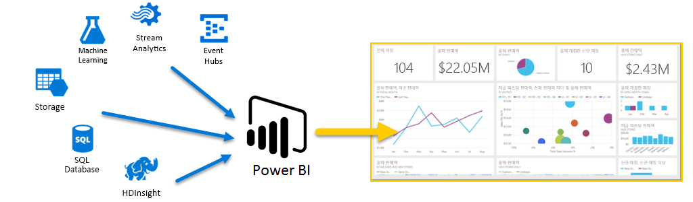
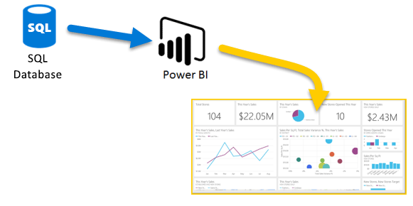
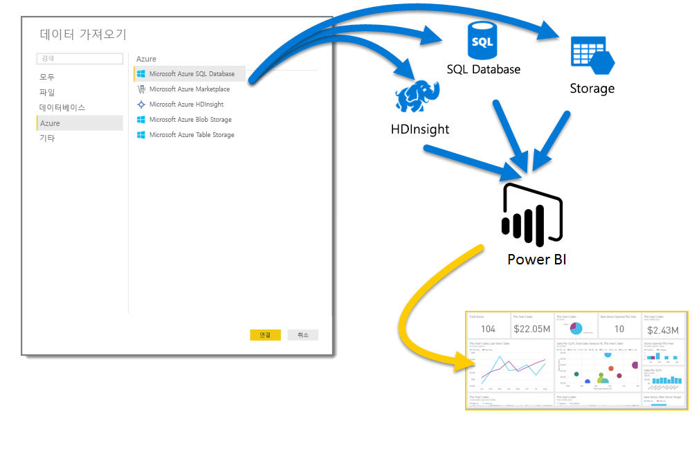
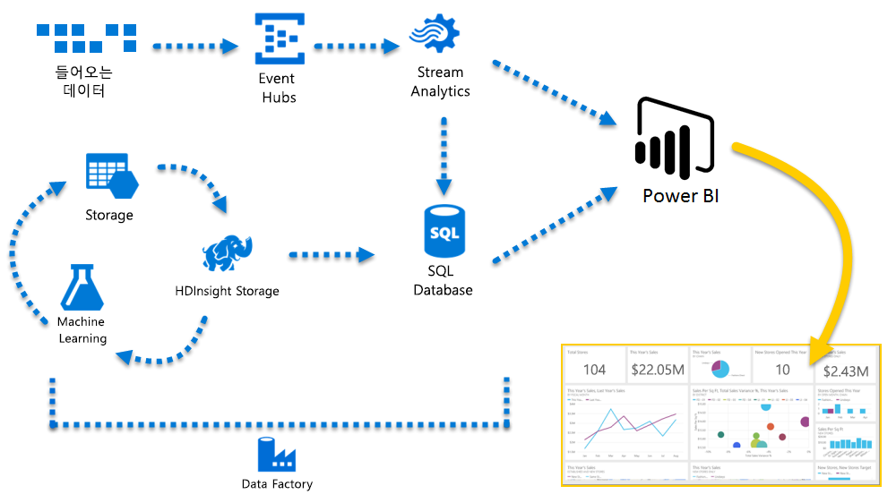

# Azure 및 Power BI
**Azure** 서비스 및 **Power BI**를 사용하면 비즈니스를 실시간으로 파악하는 분석 및 보고서로 데이터 처리 활동을 전환할 수 있습니다. 데이터 처리가 클라우드 기반인지 아니면 온-프레미스인지 여부, 간단한지 복잡한지 여부, 단일 원본에서 얻었는지 아니면 대규모로 확장되었는지 여부, 웨어하우스인지 아니면 실시간인지에 따라 Azure 및 Power BI는 기본 제공 연결 및 통합 비즈니스 인텔리전스 활동에 활기를 불어넣습니다.

Power BI에 사용할 수 있는 여러 Azure 연결이 있으며, 그러한 서비스로 만들 수 있는 비즈니스 인텔리전스 솔루션은 비즈니스만큼 고유합니다. 한 개 또는 소수의 Azure 데이터 소스만 연결한 다음 사용자 지정된 보고서를 작성할 수 있도록 데이터를 구체화할 수 있습니다.

### Azure SQL Database 및 Power BI
Azure SQL Database에 연결을 시작하고 비즈니스의 진행률을 모니터링하는 보고서를 만들 수 있습니다. [Power BI Desktop](desktop-getting-started.md)을 사용하여 비즈니스를 앞으로 이동하는 추세 및 핵심 성과 지표를 식별하는 보고서를 만들 수 있습니다.

[Azure SQL Database](http://azure.microsoft.com/services/sql-database/)에 대해 자세히 알아볼 수 있는 많은 정보가 있습니다.

### 클라우드 데이터 변환, 구체화 및 병합
복잡한 데이터 및 모든 종류의 원본이 있으세요? 그러나 문제가 되지 않습니다. **Power BI Desktop** 과 Azure 서비스를 사용하면 **데이터 가져오기** 대화 상자를 한 번 탭하여 연결할 수 있습니다. 동일한 쿼리 내에서 **Azure SQL Database**, **Azure HDInsight** 데이터 소스 및 **Azure Blob Storage**(또는 **Azure Table Storage**)에 연결한 다음 필요한 각각의 내부 하위 집합만 선택하고 여기서 구체화할 수 있습니다.

동일한 데이터 연결 및 동일한 쿼리를 사용하여 대상마다 다른 보고서를 만들 수 있습니다. 새 보고서 페이지를 작성하고, 각 대상에 대한 시각화를 구체화 하고, 비즈니스를 잘 알고 유지하면 됩니다.

자세한 내용은 다음 리소스를 살펴보세요.

* [Azure SQL Database](http://azure.microsoft.com/services/sql-database/)
* [Azure HDInsight](http://azure.microsoft.com/services/hdinsight/)
* [Azure Storage](http://azure.microsoft.com/services/storage/)(Blob Storage 및 Table Storage)

### Azure 서비스와 Power BI를 사용하여 복잡한(및 미리) 가져오기
Azure와 Power BI를 사용하여 필요한 만큼 확장할 수 있습니다. 다중 소스 데이터 처리 기능을 활용하고, 대규모 실시간 시스템을 사용하고, [Stream Analytics](http://azure.microsoft.com/services/stream-analytics/) 및 [Event Hubs](http://azure.microsoft.com/services/event-hubs/)를 사용하고, 경쟁 우위를 얻을 수 있는 비즈니스 인텔리전스 보고서로 다양한 SaaS 서비스를 병합합니다.

### Power BI API를 사용하여 앱 데이터 연결
Power BI를 사용하여 기존 앱에 대해 파악할 수도 있습니다. Power BI API를 통해 응용 프로그램 개발자는 프로그래밍 방식으로 전체 데이터 집합을 Power BI로 보낼 수 있습니다. 연속 업데이트가 필요하세요? Power BI API를 통해 개발자는 실시간 데이터 업데이트를 보내어 빠르게 시작한 다음 확장 요구 사항을 늘릴 가치가 있는 경우 Azure Stream Analytics 사용을 늘릴 수 있습니다.

[Power BI 개발자 포털](http://dev.powerbi.com)에는 Power BI API에 대한 많은 정보가 있습니다. [Power BI 개발자 블로그](http://blogs.msdn.com/powerbidev)에서 Power BI를 사용하여 프로그래밍 방식으로 수행할 수 있는 작업에 대해서도 알아볼 수 있습니다. 또한 [Power BI 개발 시작하기](https://msdn.microsoft.com/library/dn889824.aspx)에 대한 전용 페이지가 있습니다.

### Azure 및 Power BI로 수행할 수 있는 작업은 무엇인가요?
**Azure** 및 **Power BI**를 결합할 수 있는 모든 종류의 시나리오가 있습니다. 여기서 가능성 및 기회는 비즈니스만큼 고유합니다. **Azure 서비스**에 대한 자세한 내용은 **Azure를 사용한 데이터 분석 시나리오**를 설명하는 이 [개요 페이지](http://go.microsoft.com/fwlink/?LinkId=535031&clcid=0x409)에서 확인하고, 데이터 소스를 인텔리전스로 변환하는 방법을 알아봅니다.

