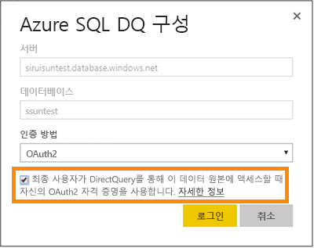
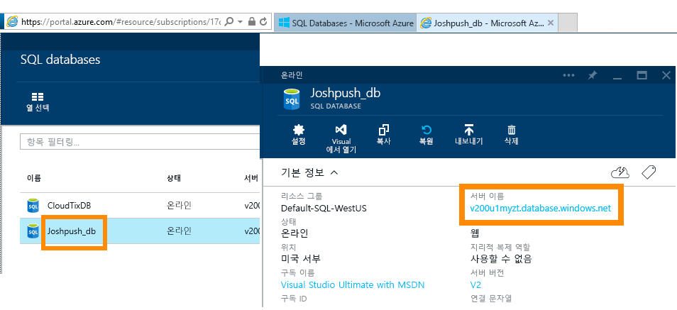

# DirectQuery를 사용한 Azure SQL Database

Azure SQL Database에 직접 연결하고 라이브 데이터를 사용하는 보고서를 작성하는 방법에 대해 알아보세요. Power BI가 아닌 소스에서 데이터를 유지할 수 있습니다.

DirectQuery를 사용할 경우 보고서 뷰에서 데이터를 탐색할 때 쿼리가 Azure SQL Database로 다시 전송됩니다. 이 환경은 연결하는 데이터베이스와 엔터티를 잘 알고 있는 사용자에게 제안됩니다.

**참고:**

* 연결 시 정규화된 서버 이름을 지정합니다(자세한 내용은 아래 참조).
* 데이터베이스에 대한 방화벽 규칙이 "[Azure 서비스에 대한 액세스 허용](https://msdn.microsoft.com/library/azure/ee621782.aspx)"으로 구성되었는지 확인합니다.
* 열 선택 또는 필터 추가와 같은 모든 작업은 쿼리를 다시 데이터베이스로 보냅니다.
* 1시간마다 타일이 새로 고쳐집니다(새로 고침을 예약할 필요가 없음). 연결하는 경우 고급 설정에서 조정될 수 있습니다.
* DirectQuery 데이터 세트에 대해 질문 및 답변을 사용할 수 없습니다.
* 스키마 변경 내용은 자동으로 선택되지 않습니다.

이러한 제한 사항 및 참고는 환경이 계속 향상됨에 따라 변경될 수 있습니다. 연결 단계는 아래에서 자세히 설명합니다.

> [!Important]
> Azure SQL Database에 대한 연결이 향상되었습니다.  Azure SQL Database 데이터 원본에 연결하는 최상의 환경을 위해 Power BI Desktop을 사용합니다.  모델 및 보고서를 빌드하면 Power BI 서비스에 게시할 수 있습니다.  Power BI 서비스에서 Azure SQL Database에 대한 직접 커넥터는 이제 사용되지 않습니다.

## Power BI Desktop 및 DirectQuery

DirectQuery를 사용하여 Azure SQL Database에 연결하려면 Power BI Desktop을 사용해야 합니다. 이 방법은 유연성 및 기능을 추가로 제공합니다. Power BI Desktop를 사용하여 만든 보고서는 Power BI 서비스에 게시할 수 있습니다. Power BI Desktop 내에서 [DirectQuery를 사용하는 Azure SQL Database](desktop-use-directquery.md)에 연결하는 방법에 대해 자세히 확인할 수 있습니다.

## Single Sign-On

서비스에 Azure SQL DirectQuery 데이터 세트를 게시한 후 Azure AD(Azure Active Directory) OAuth2를 통해 최종 사용자의 SSO(Single Sign-On)를 활성화할 수 있습니다.

SSO를 활성화하려면 데이터 세트에 대한 설정으로 이동하여 **데이터 원본** 탭을 열고 SSO 확인란을 선택합니다.

SSO 옵션이 활성화되어 있고 사용자가 데이터 원본을 기반으로 작성된 보고서에 액세스하면 Power BI가 Azure SQL 데이터베이스에 대한 쿼리에 인증된 Azure AD 자격 증명을 보냅니다. 그러면 Power BI가 데이터 원본 수준에서 구성된 보안 설정을 준수할 수 있습니다.

SSO 옵션은 이 데이터 원본을 사용하는 모든 데이터 세트에 적용됩니다. 가져오기 시나리오에 사용되는 인증 방법에는 영향을 주지 않습니다.

> [!Note]
> Azure MFA(Multi-Factor Authentication)는 지원되지 않습니다. Azure SQL DirectQuery와 함께 SSO를 사용하려는 사용자는 MFA에서 제외해야 합니다.

## 매개 변수 값 찾기

정규화된 서버 이름과 데이터베이스 이름은 Azure Portal에서 확인할 수 있습니다.

## 다음 단계

* [Power BI Desktop에서 DirectQuery 사용](desktop-use-directquery.md)  
* [Power BI란?](power-bi-overview.md)  
* [Power BI에 대한 데이터 가져오기](service-get-data.md)  

궁금한 점이 더 있나요? [Power BI 커뮤니티를 이용하세요.](http://community.powerbi.com/)
