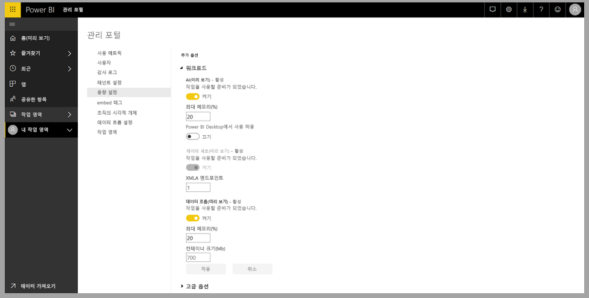
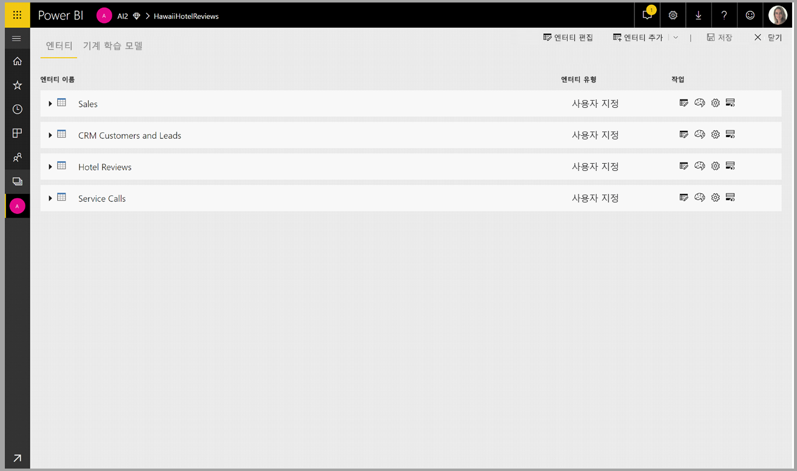
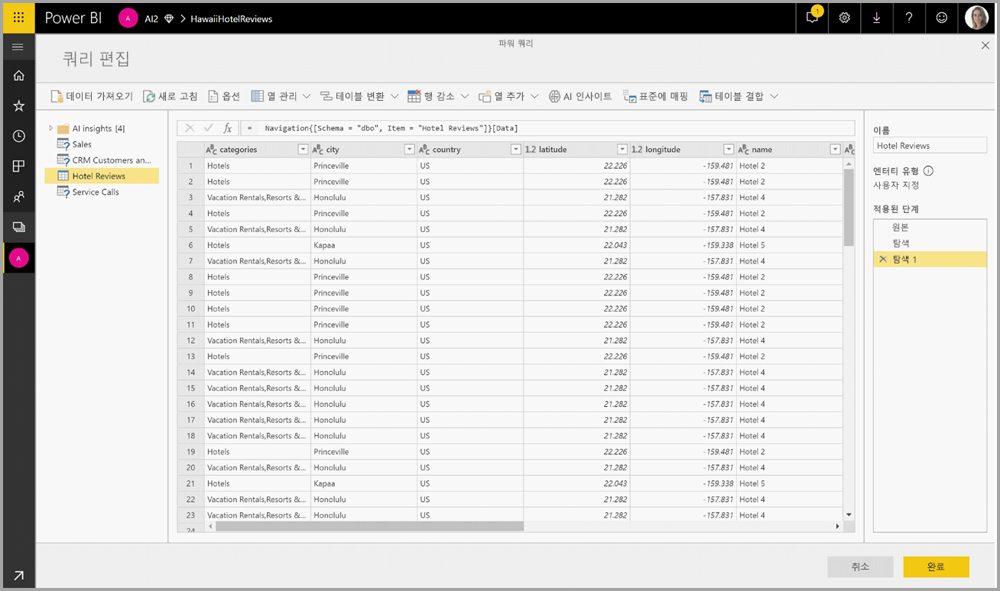
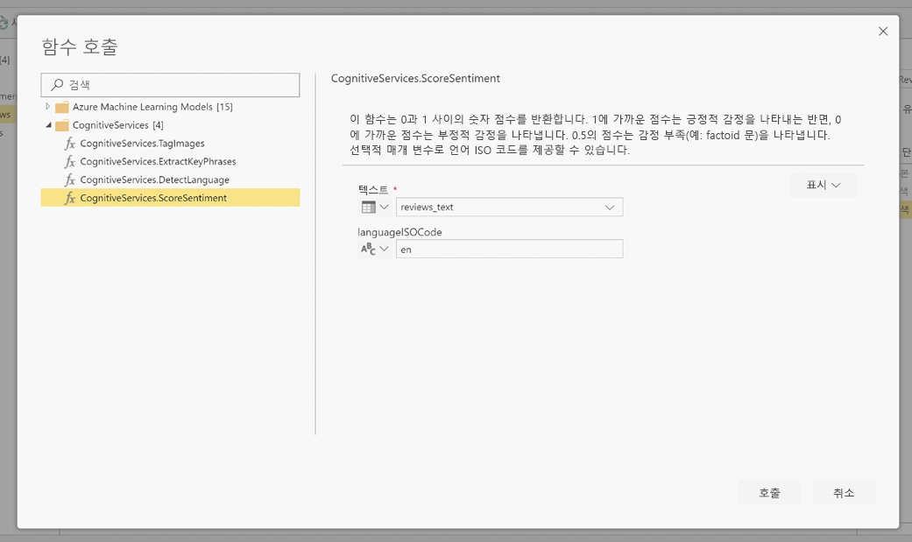
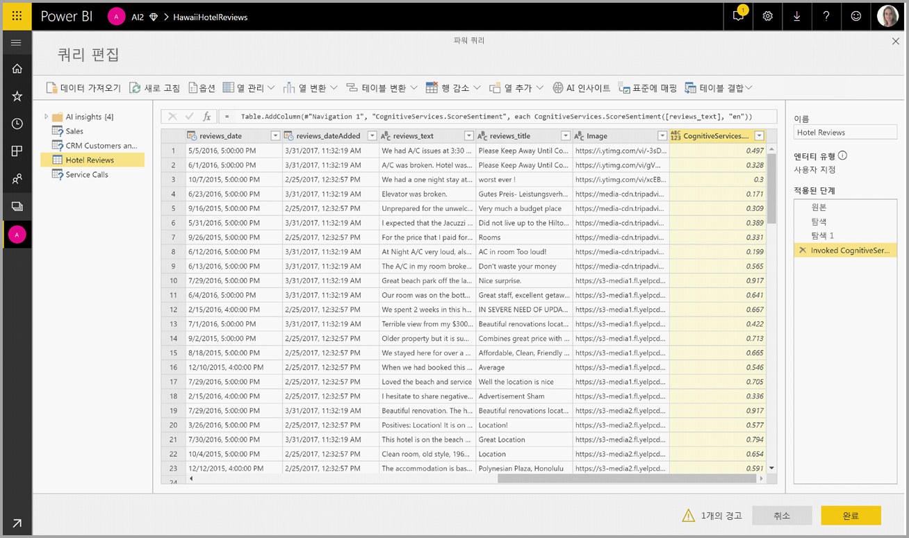
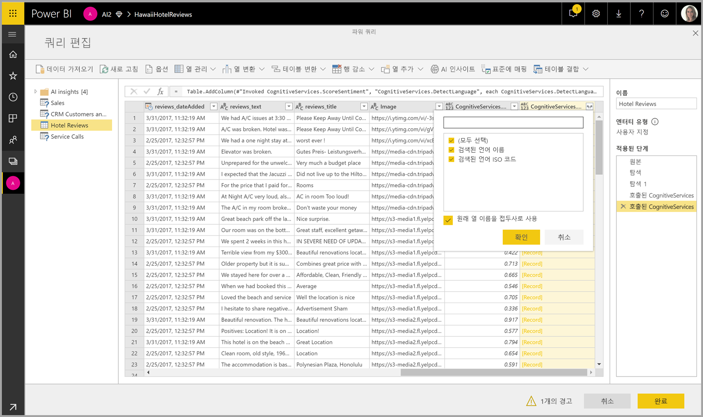

# Power BI에서 Cognitive Services 사용(미리 보기)

Power BI에서 Cognitive Services를 사용하면 [Azure Cognitive Services](https://azure.microsoft.com/services/cognitive-services/)의 다양한 알고리즘을 적용하여 데이터 흐름을 위한 셀프 서비스 데이터 준비에서 데이터를 보강할 수 있습니다.

현재 지원되는 서비스는 [감정 분석](https://docs.microsoft.com/azure/cognitive-services/text-analytics/how-tos/text-analytics-how-to-sentiment-analysis), [핵심 구 추출](https://docs.microsoft.com/azure/cognitive-services/text-analytics/how-tos/text-analytics-how-to-keyword-extraction), [언어 감지](https://docs.microsoft.com/azure/cognitive-services/text-analytics/how-tos/text-analytics-how-to-language-detection) 및 [이미지 태그 지정](https://docs.microsoft.com/azure/cognitive-services/computer-vision/concept-tagging-images)입니다. 변환은 Power BI 서비스에서 실행되므로 Azure Cognitive Services 구독이 필요하지 않습니다. 이 기능을 사용하려면 Power BI Premium이 필요합니다.

## **AI 기능 사용**

Cognitive Services는 프리미엄 용량 노드 EM2, A2 또는 P1 이상에 지원됩니다. 용량의 별도 AI 워크로드가 Cognitive Services를 실행하는 데 사용됩니다. 공개 미리 보기 기간에는 기본적으로 이 워크로드가 사용되지 않도록 설정되어 있습니다. Power BI에서 Cognitive Services를 사용하려면 먼저 관리 포털의 용량 설정에서 AI 워크로드를 사용하도록 설정해야 합니다. 워크로드 섹션에서 AI 워크로드를 설정하고 이 워크로드가 사용하도록 할 최대 메모리 양을 정의할 수 있습니다. 권장되는 메모리 제한율은 20%입니다. 이 제한을 초과하면 쿼리 속도가 저하됩니다.

## **Power BI에서 Cognitive Services 시작하기**

Cognitive Services 변환은 [데이터 흐름을 위한 셀프 서비스 데이터 준비](https://powerbi.microsoft.com/blog/introducing-power-bi-data-prep-wtih-dataflows/)의 일부입니다. Cognitive Services를 사용하여 데이터를 보강하려면 데이터 흐름을 편집하여 시작합니다.

파워 쿼리 편집기의 위쪽 리본에서 **AI 인사이트** 단추를 선택합니다.

팝업 창에서 사용할 함수 및 변환할 데이터를 선택합니다. 이 예제에서는 리뷰 텍스트가 포함된 열의 감정에 대해 점수를 매기려고 합니다.

**Cultureinfo**는 텍스트 언어를 지정하는 선택적 입력입니다. 이 필드에는 ISO 코드를 사용해야 합니다. Cultureinfo 또는 정적 필드에 대한 입력으로 열을 사용할 수 있습니다. 이 예제에서는 전체 열의 언어가 영어(en)로 지정됩니다. 이 필드를 비워 두면 Power BI가 함수를 적용하기 전에 자동으로 언어를 감지합니다. 그런 다음, **호출**을 선택합니다.

함수를 호출하면 결과가 테이블에 새 열로 추가됩니다. 변환도 쿼리의 적용 단계로 추가됩니다.

함수가 여러 출력 필드를 반환하는 경우 함수를 호출하면 여러 출력 필드가 포함된 하나의 레코드가 있는 새 열 하나를 추가합니다.

값을 하나 또는 둘 다 열로 데이터에 추가하려면 확장 옵션을 사용합니다.

## **사용할 수 있는 함수**

이 섹션에서는 Power BI에서 사용할 수 있는 Cognitive Services의 함수를 설명합니다.

### **언어 감지**

언어 감지 함수는 텍스트 입력을 평가하고 각 필드의 언어 이름 및 ISO 식별자를 반환합니다. 이 함수는 언어가 알려지지 않은, 임의 텍스트를 수집하는 데이터 열에 유용합니다. 이 함수에는 텍스트 형식의 데이터가 입력으로 사용되어야 합니다.

Text Analytics에서는 최대 120개의 언어를 인식합니다. 자세한 내용은 [지원되는 언어](https://docs.microsoft.com/azure/cognitive-services/text-analytics/text-analytics-supported-languages)를 참조하세요.

### **핵심 구 추출**

**핵심 구 추출** 함수는 비구조적 텍스트를 평가하여 각 텍스트 필드의 핵심 구 목록을 반환합니다. 함수는 입력으로 텍스트 필드가 있어야 하며 **Cultureinfo**에 대한 선택적 입력을 허용합니다. 이 문서 앞부분에 있는 **시작하기** 섹션을 참조하세요.

핵심 구 추출은 작업하도록 제공하는 텍스트 청크의 크기가 더 큰 경우 가장 효과적으로 이루어집니다. 이와는 대조적으로 감정 분석은 텍스트 블록 크기가 작을수록 더 잘 수행됩니다. 두 작업 모두에서 최상의 결과를 얻으려면 적절하게 입력을 재구성하는 것을 고려해보세요.

### **감정 점수 매기기**

**감정 점수 매기기** 함수는 텍스트 입력을 평가하고 각 문서에 대해 0(부정)에서 1(긍정)까지의 감정 점수를 반환합니다. 이 함수는 소셜 미디어, 고객 리뷰 및 토론 포럼에서 긍정적 감정과 부정적 감정을 감지하는 데 유용합니다.

Text Analytics는 기계 학습 분류 알고리즘을 사용하여 0에서 1 사이의 감정 점수를 생성합니다. 1에 가까운 점수는 긍정적 감정을 나타내고, 0에 가까운 점수는 부정적 감정을 나타냅니다. 모델은 감정 연결을 사용하여 광범위한 텍스트 본문을 미리 학습한 상태입니다. 현재, 고유한 학습 데이터를 제공하는 것은 불가능합니다. 모델은 텍스트 분석 중에 텍스트 처리, 품사 분석, 단어 배치, 단어 연결 등이 조합된 다양한 기술을 사용합니다. 알고리즘에 대한 자세한 내용은 [Text Analytics 소개](https://blogs.technet.microsoft.com/machinelearning/2015/04/08/introducing-text-analytics-in-the-azure-ml-marketplace/)를 참조하세요.

감정 분석은 전체 입력 필드에서 수행되는 반면, 감정 추출은 텍스트의 특정 엔터티에 대해 수행됩니다. 실제로 문서에 크기가 큰 텍스트 블록이 아닌, 한 개 또는 두 개의 문장이 포함된 경우 점수 매기기 정확도가 향상되는 경향이 있습니다. 객관성 평가 단계에서는 하나의 입력 필드 전체가 객관적인지 감정이 포함되어 있는지를 모델이 결정합니다. 대부분 객관적인 입력 필드는 감정 감지 단계로 진행되지 않으며 추가 처리 없이 .50 점수를 받습니다. 파이프라인에서 계속 진행되는 입력 필드는 입력 필드에서 감지된 감정의 정도에 따라 .50을 초과 또는 미달하는 점수를 다음 단계에서 생성합니다.

현재는 영어, 독일어, 스페인어 및 프랑스어가 감정 분석에서 지원됩니다. 다른 언어는 미리 보기 상태입니다. 자세한 내용은 [지원되는 언어](https://docs.microsoft.com/azure/cognitive-services/text-analytics/text-analytics-supported-languages)를 참조하세요.

### **이미지 태그 지정**

**이미지 태그 지정** 함수는 2,000개가 넘는 인식할 수 있는 사물, 생물, 경치 및 동작을 기준으로 태그를 반환합니다. 태그가 모호하거나 누구나 알 수 있는 것이 아닌 경우 출력은 알려진 설정의 컨텍스트에서 태그의 의미를 명확히 설명하는 ‘힌트’를 제공합니다. 태그는 분류로 구성되지 않으며 상속 계층 구조가 존재하지 않습니다. 콘텐츠 태그 컬렉션은 완전한 문장 형식의, 사람이 읽을 수 있는 언어로 표시되는 이미지 ‘설명’의 토대를 구성합니다.

이미지를 업로드하거나 이미지 URL을 지정하면 Computer Vision 알고리즘이 이미지에서 식별된 사물, 생물 및 동작을 기준으로 태그를 출력합니다. 태그 지정은 주요 대상(예: 전경에 있는 인물)으로 제한되지 않으며 설정(실내 또는 옥외), 가구, 도구, 식물, 동물, 액세서리, 장치 등도 포함합니다.

이 함수는 입력으로 이미지 URL 또는 Base 64 필드가 필요합니다. 현재, 이미지 태그 지정에서는 영어, 스페인어, 일본어, 포르투갈어 및 중국어 간체가 지원됩니다. 자세한 내용은 [지원되는 언어](https://docs.microsoft.com/rest/api/cognitiveservices/computervision/tagimage/tagimage#uri-parameters)를 참조하세요.

## 다음 단계

이 문서에서는 Power BI 서비스와 Cognitive Services를 함께 사용하는 방법을 간략하게 살펴봤습니다. 관심을 가질 만한 다른 유용한 문서는 다음과 같습니다. 

* [자습서: Power BI에서 Machine Learning Studio 모델 호출(미리 보기)](service-tutorial-invoke-machine-learning-model.md)
* [Power BI에서 Azure Machine Learning 통합(미리 보기)](service-machine-learning-integration.md)
* [자습서: Power BI에서 Cognitive Services 사용](service-tutorial-use-cognitive-services.md)

데이터 흐름에 대한 자세한 내용은 다음 문서를 참조할 수 있습니다.
* [Power BI에서 데이터 흐름 만들기 및 사용](service-dataflows-create-use.md)
* [Power BI Premium의 계산된 엔터티 사용(미리 보기)](service-dataflows-computed-entities-premium.md)
* [온-프레미스 데이터 원본으로 만든 데이터 흐름 사용(미리 보기)](service-dataflows-on-premises-gateways.md)
* [Power BI 데이터 흐름에 사용할 수 있는 개발자 리소스(미리 보기)](service-dataflows-developer-resources.md)
* [데이터 흐름 및 Azure Data Lake 통합(미리 보기)](service-dataflows-azure-data-lake-integration.md)