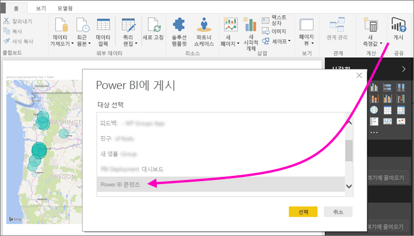
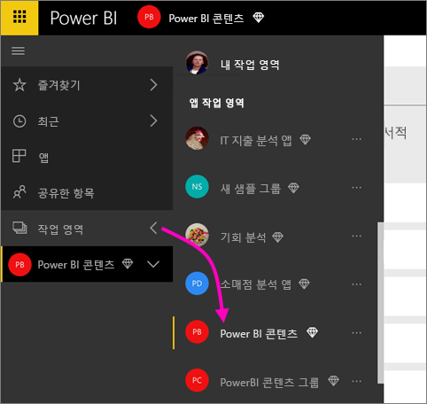
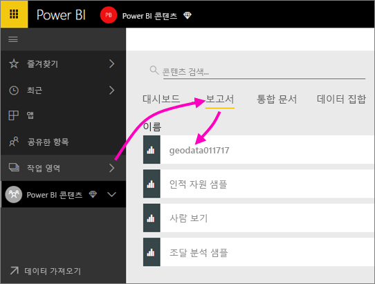
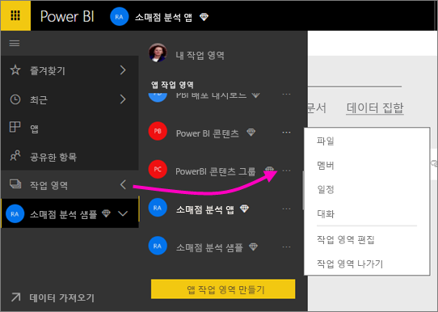
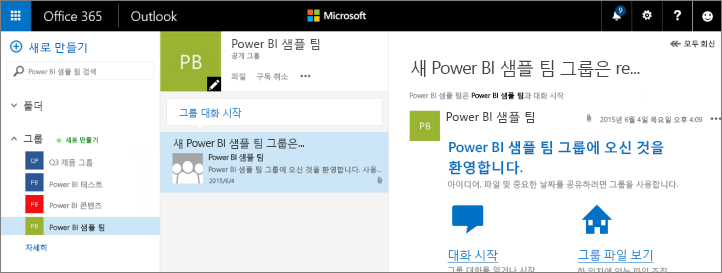
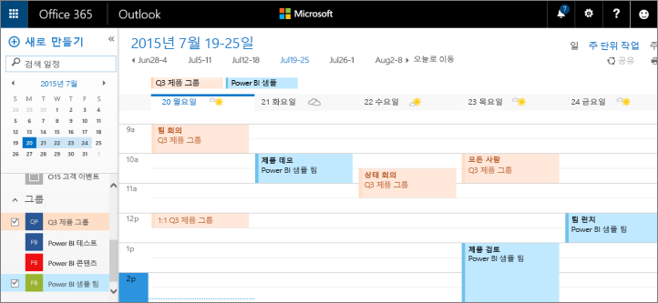

# Power BI 앱 작업 영역에서 공동 작업
Power BI 앱 작업 영역은 동료들과 대시보드, 보고서 및 데이터 세트를 공동 작업하여 *앱*을 만들기에 적합합니다. 협업은 Power BI의 작업 영역에서 그치지 않습니다. Office 365는 비즈니스용 OneDrive에서 파일 공유, Exchange에서 대화, 공유 일정, 작업 등과 같은 다른 그룹 서비스를 제공합니다. [Office 365의 그룹](https://support.office.com/article/Create-a-group-in-Office-365-7124dc4c-1de9-40d4-b096-e8add19209e9)에 대해 자세히 알아보세요.

> [!NOTE]
> 새 작업 영역 환경 미리 보기를 통해 Power BI 작업 영역과 Office 365 그룹 간의 관계를 변경합니다. 새 작업 영역 중 하나를 만들 때마다 Office 365 그룹을 자동으로 만드는 것은 아닙니다. [새 작업 영역 만들기(미리 보기)](service-create-the-new-workspaces.md)를 참고하세요.

앱 작업 영역은 [Power BI Pro 라이선스](service-features-license-type.md)가 있어야만 사용할 수 있습니다.

## 앱 작업 영역에서 Power BI Desktop 파일의 공동 작업
Power BI Desktop 파일을 만든 후 Power BI 앱 작업 영역에 게시하면 작업 영역의 모든 사람이 공동 작업을 할 수 있습니다.

1. Power BI Desktop에서 **홈** 리본의 **게시**를 선택한 다음, **대상 선택** 상자에서 자신의 앱 작업 영역을 선택합니다.
   
    
2. Power BI 서비스에서 작업 영역 옆에 있는 화살표를 선택하고 앱 작업 영역을 선택합니다.
   
    
3. 보고서 탭을 선택한 다음 보고서를 선택합니다.
   
    
   
    여기서부터 Power BI의 다른 보고서와 같습니다. 나와 앱 작업 영역의 다른 사람들은 [보고서를 수정](consumer/end-user-reports.md)하고 타일을 귀하가 선택한 대시보드에 저장할 수 있습니다.

## Office 365에서 공동 작업
Office 365에서 공동 작업은 Power BI의 앱 작업 영역에서 시작됩니다.

1. Power BI 서비스에서 작업 영역 옆에 있는 화살표를 선택하고 작업 영역 이름 옆에 있는 줄임표( **...** )를 선택합니다. 
   
   
2. 이 메뉴에서 몇 가지 방법으로 그룹과 공동 작업할 수 있습니다. 
   
   * [Office 365의 그룹과 대화](service-collaborate-power-bi-workspace.md#have-a-group-conversation-in-office-365)합니다.
   * 앱의 그룹 작업 영역 일정에서 [이벤트를 예약](service-collaborate-power-bi-workspace.md#schedule-an-event-on-the-apps-group-workspace-calendar)합니다.
   
   처음으로 Office 365에서 앱의 그룹 작업 영역으로 이동하는 경우 시간이 걸릴 수 있습니다. 15-30분을 기다린 다음 브라우저를 새로 고칩니다.

## Office 365의 그룹 대화
1. 앱 작업 영역 이름 옆에 있는 줄임표(...) \>**대화**를 선택합니다. 
   
    
   
   Office 365용 Outlook에서 앱의 그룹 작업 영역에 대한 이메일 및 대화 사이트가 열립니다.
   
   
2. [Office 365용 Outlook에서 그룹 대화](https://support.office.com/Article/Have-a-group-conversation-a0482e24-a769-4e39-a5ba-a7c56e828b22)에 대해 자세히 읽으십시오.

## 앱의 그룹 작업 영역 일정에서 이벤트 예약
1. 앱 작업 영역 이름 옆에 있는 줄임표( **...** ) \>**일정**을 선택합니다. 
   
   
   
   그러면 Office 365용 Outlook에서 앱의 그룹 작업 영역의 일정이 열립니다.
   
   
2. [Office 365용 Outlook의 그룹 일정](https://support.office.com/Article/Add-edit-and-subscribe-to-group-events-0cf1ad68-1034-4306-b367-d75e9818376a)에 대해 자세히 알아보세요.

## 앱 작업 영역 관리
앱 작업 영역의 소유자 또는 관리자인 경우 작업 영역 구성원을 추가하거나 제거할 수 있습니다. [Power BI 앱 작업 영역 관리](service-manage-app-workspace-in-power-bi-and-office-365.md)에 대해 자세히 알아보세요.

## 다음 단계
* [Power BI에서 앱 및 앱 작업 영역 만들기](service-create-distribute-apps.md)
* 궁금한 점이 더 있나요? [Power BI 커뮤니티를 이용하세요.](http://community.powerbi.com/)
* 의견이 있으신가요? [Power BI Ideas(영문)](https://ideas.powerbi.com/forums/265200-power-bi)을 방문하세요.

