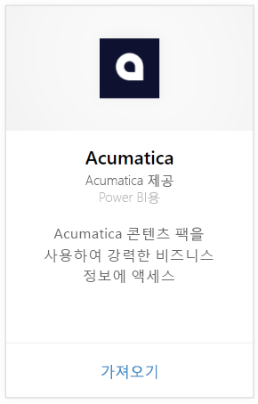
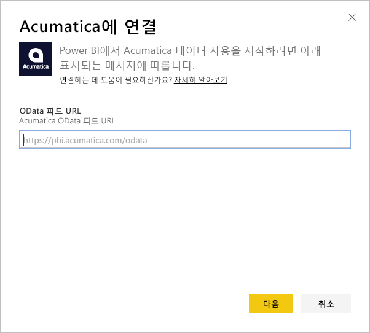
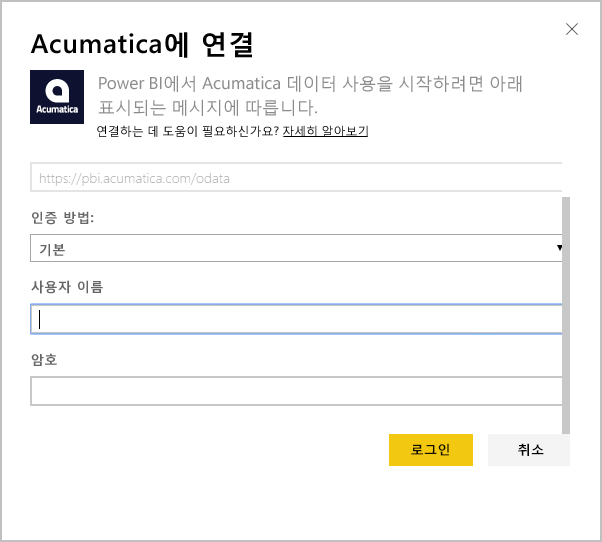
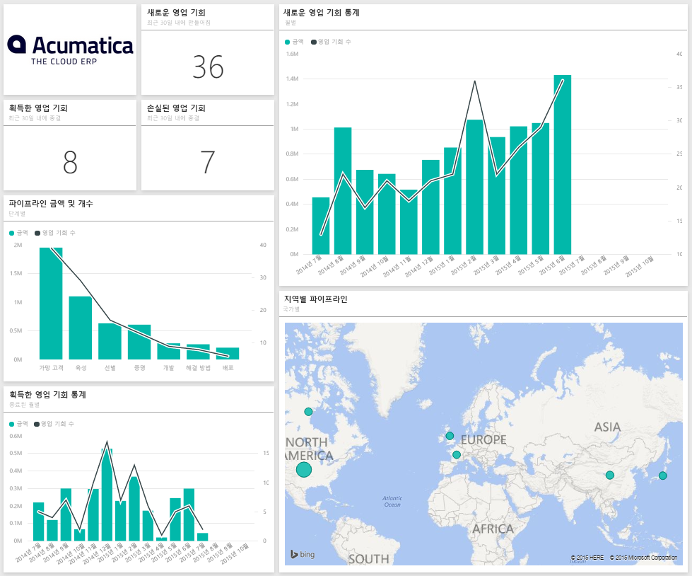
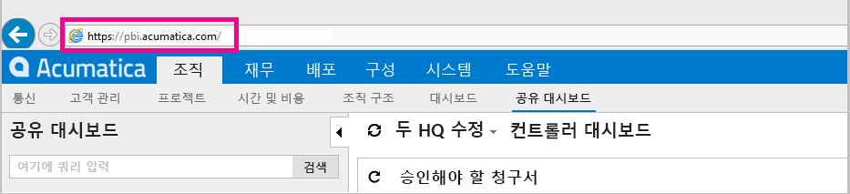
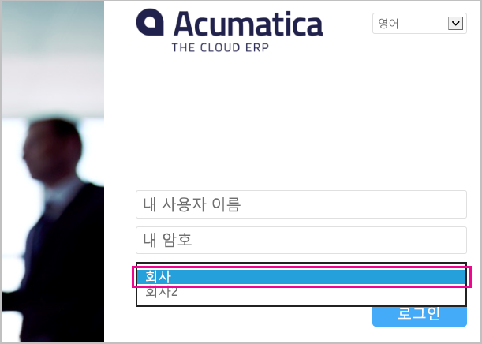

# Power BI로 Acumatica에 연결
Power BI Acumatica 콘텐츠 팩을 사용하면 기회 데이터를 신속하게 파악할 수 있습니다. Power BI는 기회, 계정 및 고객을 포함하여 데이터를 검색한 다음 해당 데이터를 기반으로 하여 기본 대시보드 및 관련 보고서를 작성합니다.

[Acumatica 콘텐츠 팩](https://app.powerbi.com/getdata/services/acumatica)에 연결하거나 Power BI와 [Acumatica 통합](https://powerbi.microsoft.com/integrations/acumatica)에 대해 자세히 알아보세요.

>[!NOTE]
>이 콘텐츠 팩에는 Acumatica v5.2 이상이 필요합니다.

## 연결 방법
1. 왼쪽 탐색 창의 맨 아래에 있는 **데이터 가져오기** 를 선택합니다.
   
   
2. **서비스** 상자에서 **가져오기**를 선택합니다.
   
   
3. **Acumatica** \> **연결**을 선택합니다.
   
   
4. Acumatica OData 엔드포인트를 입력합니다. OData 엔드포인트를 사용하면 외부 시스템이 Acumatica에서 데이터를 요청할 수 있습니다. Acumatica OData 엔드포인트의 형식은 다음과 같고, HTTPS를 사용해야 합니다.
   
     `https://[sitedomain]/odata/[companyname]`
   
   회사 이름은 복수 기업 배포가 있는 경우에만 필요합니다. Acumatica 계정에서 이 매개 변수를 찾는 방법에 대한 자세한 내용은 아래에 포함되어 있습니다.
   
   
5. 인증 방법에 대해서는 **기본**을 선택합니다. Acumatica 계정의 사용자 이름 및 암호를 입력한 다음 **로그인**을 클릭합니다.
   
    
6. Power BI가 데이터를 가져오면 왼쪽 탐색 창에 새 대시보드, 보고서 및 데이터 세트가 표시됩니다. 새 항목은 선택하면 사라지는 노란색 별표 \*로 표시되며, 대시보드를 닫으면 아래와 비슷한 레이아웃이 표시됩니다.
   
    

**다음 단계**

* 대시보드 맨 위에 있는 [질문 및 답변 상자에 질문](consumer/end-user-q-and-a.md)합니다.
* 대시보드에서 [타일을 변경](service-dashboard-edit-tile.md)합니다.
* [타일을 선택](consumer/end-user-tiles.md)하여 원본 보고서를 엽니다.
* 데이터 집합을 매일 새로 고치도록 예약하는 경우 새로 고침 일정을 변경하거나 **지금 새로 고침**을 사용하여 필요할 때 새로 고칠 수 있습니다.

## 시스템 요구 사항
이 콘텐츠 팩에는 Acumatica v5.2 이상이 필요합니다. Acumatica. 관리자에게 버전을 확인하세요.

## 매개 변수 찾기
**Acumatica OData 엔드포인트**

Acumatica OData 엔드포인트의 형식은 다음과 같고, HTTPS를 사용해야 합니다.

    https://[sitedomain]/odata/[companyname]

Acumatica에 로그인한 경우 브라우저의 주소 표시줄에서 애플리케이션 사이트 도메인을 찾을 수 있습니다. 아래 예제에서 사이트 도메인은 `https://pbi.acumatica.com`이므로 제공할 OData 엔드포인트는 `https://pbi.acumatica.com/odata`가 됩니다.

 

회사 이름은 복수 기업 배포가 있는 경우에만 필요합니다. Acumatica 로그인 페이지에서 이 정보를 찾을 수 있습니다.

## 문제 해결
로그인할 수 없는 경우 제공한 Acumatica OData 엔드포인트 형식이 올바른지 확인합니다.

    https://<application site domain>/odata/<company name>

연결하는 데 문제가 있는 경우 Acumatica의 관리자 버전으로 확인하세요. 이 콘텐츠 팩을 사용하려면 버전 5.2 이상이 필요합니다.

## 다음 단계
[Power BI에서 시작](service-get-started.md)

[Power BI에서 데이터 가져오기](service-get-data.md)

