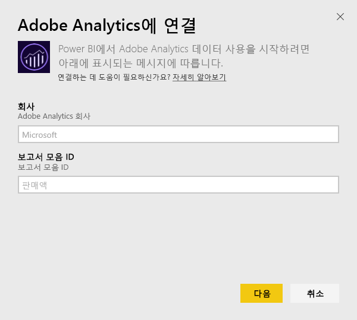
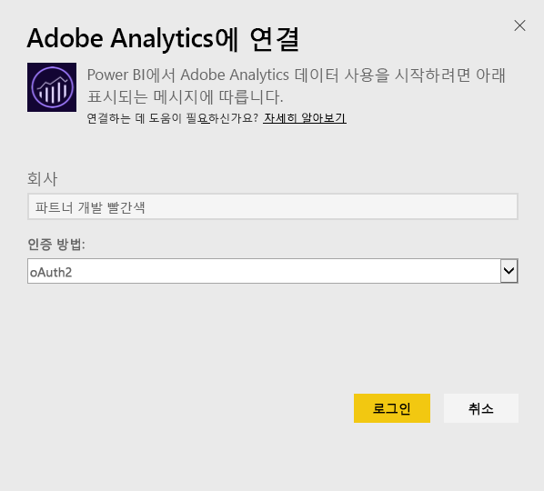
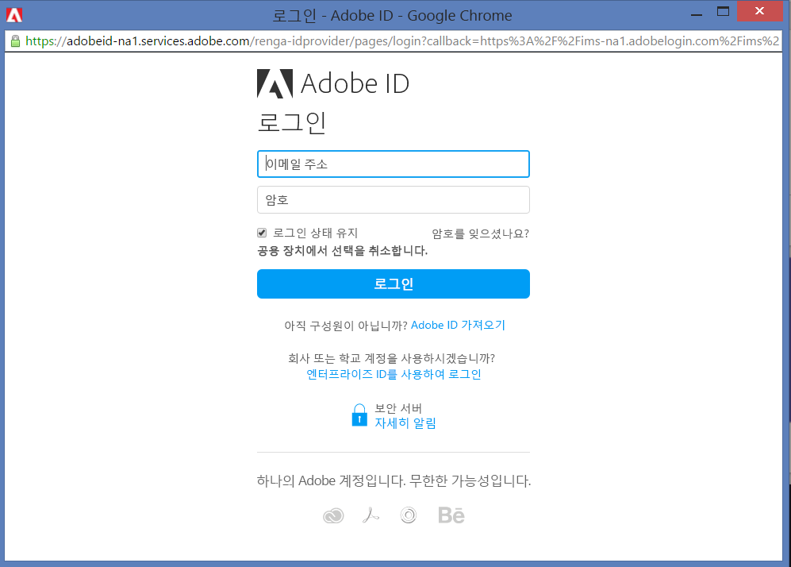
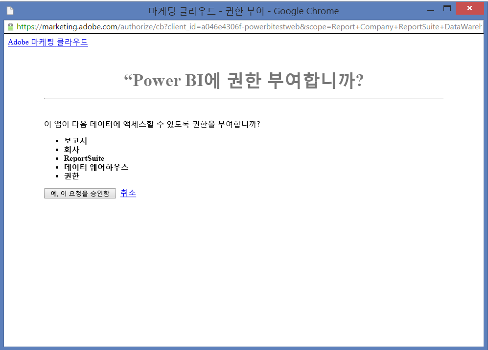
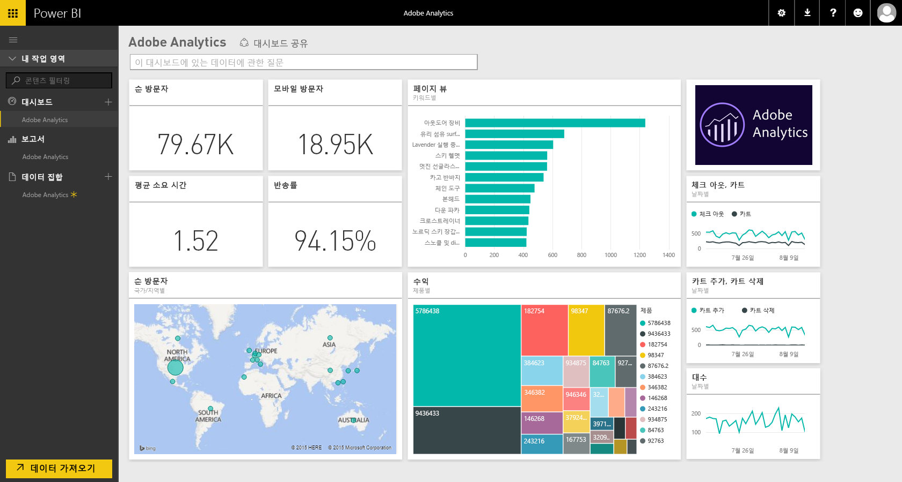
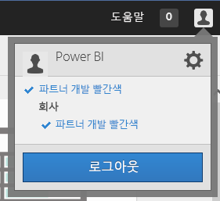
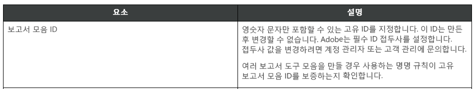

# Power BI로 Adobe Analytics에 연결
Power BI를 통해 Adobe Analytics에 연결하는 경우 먼저 Adobe Analytics Marketing 클라우드 계정에 연결합니다. 사이트 트래픽 및 사용자 차원에 대한 통찰력을 제공하는 Power BI 대시보드 및 Power BI 보고서 집합을 사용하는 앱이 가져옵니다. 하루에 한 번 자동으로 데이터가 새로 고쳐집니다. 대시보드 및 보고서를 조작할 수 있지만 변경 내용을 저장할 수 없습니다.

[Adobe Analytics](https://app.powerbi.com/getdata/services/adobe-analytics)에 연결하거나 Power BI와의 [Adobe Analytics 통합](https://powerbi.microsoft.com/integrations/adobe-analytics)에 대해 자세히 알아보세요.

## 연결 방법
[!INCLUDE [powerbi-service-apps-get-more-apps](./includes/powerbi-service-apps-get-more-apps.md)]

3. **Adobe Analytics** \> **가져오기**를 선택합니다.
   
   
4. Power BI는 특정 Adobe Analytics 회사 및 보고서 모음 ID(보고서 모음 이름 아님)에 연결됩니다. 아래 [이러한 매개 변수 찾기](#FindingParams)에서 세부 정보를 참조하세요.
   
   
5. **인증 방법**에 대해 **oAuth2** \> **로그인**을 선택합니다. 메시지가 표시되면 Adobe Analytics 자격 증명을 입력합니다. 
   
    
   
    
6. **허용** 을 클릭하여 Power BI가 Adobe Analytics 데이터에 액세스할 수 있도록 합니다.
   
   
7. 승인한 후에 가져오기 프로세스가 자동으로 시작됩니다. 

## Adobe Analytics 대시보드 및 보고서 보기
[!INCLUDE [powerbi-service-apps-open-app](./includes/powerbi-service-apps-open-app.md)]

   

[!INCLUDE [powerbi-service-apps-open-app](./includes/powerbi-service-apps-what-now.md)]

## 포함된 내용
Power BI에서는 Adobe Analytics 보고서 API를 사용하여 다음 테이블에 대한 보고서를 정의 및 실행합니다.

| **테이블 이름** | **열 세부 정보** |
| --- | --- |
| Products |elements=  "product" (top 25)   metrics="cartadditions", "cartremovals", "carts", "cartviews", "checkouts", "revenue", "units" |
| 브라우저 |elements= "browser" (top 25)   metrics="bounces", "bouncerate", "visitors", "visits", "uniquevisitors", "totaltimespent", "pageviews" |
| 페이지 |elements= "page" (top 25)   metrics="cartadditions", "cartremovals", "carts", "cartviews", "checkouts", "revenue", "units", "visits", "uniquevisitors", "pageviews", "bounces", "bouncerate", "totaltimespent" |
| JavaScript 사용 |elements=  "javascriptenabled”, “browser” (top 25) |
| 모바일 OS |elements= "mobileos"(top 25)  metrics="bounces", "bouncerate", "visitors", "visits", "uniquevisitors", "totaltimespent", "cartadditions", "cartremovals", "checkouts", "revenue", "units", "pageviews" |
| 검색 엔진 키워드 |elements= "searchengine" "searchenginekeyword"   metrics="bounces", "bouncerate", "visitors", "visits", "entries", "uniquevisitors", "totaltimespent", "cartadditions", "cartremovals", "carts", "cartviews", "checkouts", "revenue", "units", "pageviews" |
| 제품 검색 엔진 |elements= "searchengine", "product"   metrics="bounces", "bouncerate", "visitors", "visits", "entries", "uniquevisitors", "totaltimespent", "cartadditions", "cartremovals", "carts", "cartviews", "checkouts", "revenue", "units", "pageviews" |
| 참조 페이지 |elements= "referrer" (top 15), “page" (top 10)   metrics="bounces", "bouncerate", "visitors", "visits", "entries", "uniquevisitors", "totaltimespent", "cartadditions", "cartremovals", "carts", "cartviews", "checkouts", "revenue", "units", "pageviews" |
| Geocountry 페이지 |elements= "geocountry" (Top 20), "page"   metrics="bounces", "bouncerate", "visitors", "visits", "entries", "uniquevisitors", "totaltimespent", "cartadditions", "cartremovals", "carts", "cartviews", "checkouts", "revenue", "units", "pageviews" |
| Geocountry 제품 |elements= "geocountry" (Top 20), "product"  metrics="bounces", "bouncerate", "visitors", "visits", "entries", "uniquevisitors", "totaltimespent", "cartadditions", "cartremovals", "carts", "cartviews", "checkouts", "revenue", "units" |
| 국가 및 지역 조회 |elements= "geocountry" (Top 200)   metrics="bounces", "bouncerate", "visitors", "visits", "entries", "uniquevisitors", "totaltimespent", "cartadditions", "cartremovals", "carts", "cartviews", "checkouts", "revenue", "units" |
| 언어 |elements= "language", "browser" (Top 25)   metrics="bounces", "bouncerate", "visitors", "visits", "uniquevisitors", "totaltimespent", "pageviews", "cartadditions", "cartremovals", "checkouts", "carts", "cartviews" |
| 검색 엔진 조회 |elements= "searchengine" (top 100)   metrics="bounces", "bouncerate", "visitors", "visits", "entries", "uniquevisitors", "totaltimespent", "cartadditions", "cartremovals", "carts", "cartviews", "checkouts", "revenue", "units" |
| 브라우저 조회 |elements= "browser" (top 25) |

## 시스템 요구 사항
아래 설명된 대로 올바른 매개 변수를 포함하여 [Adobe Analytics](http://www.adobe.com/marketing-cloud/web-analytics.html)에 액세스해야 합니다.

## 매개 변수 찾기
**회사**

로그인하면 회사 값은 계정의 오른쪽 위에서 확인할 수 있습니다. 값이 대/소문자 및 간격을 구분합니다. 계정에 표시된 대로 정확히 입력합니다.

**보고서 모음 ID**

이 모음 ID는 보고서 모음을 만들 때 생성됩니다. 관리자에 문의하여 ID 값을 식별할 수 있습니다. 이 ID는 보고서 모음 이름이 아닙니다.

Adobe [문서](https://marketing.adobe.com/resources/help/en_US/reference/new_report_suite.html)에서:

## 문제 해결
권한이 없음을 나타내는 자격 증명을 입력한 후에 오류가 표시되는 경우 Adobe Analytics API에 액세스할 수 있는 관리자를 확인합니다. 또한 제공되는 Adobe ID가 마케팅 클라우드 조직(Adobe Analytics 회사와 관련됨)에 연결되었는지를 확인합니다.

오류가 발생하기 전에 자격 증명 화면을 성공적으로 통과한 경우 보고서를 완료하는 데 오랜 시간이 걸릴 수 있습니다. 일반적인 오류는 *"Adobe Analytics 보고서에서 데이터를 가져오지 못했습니다. 콘텐츠에 &quot;참조, 페이지&quot;가 포함되며, 대략적인 기간은 xx초입니다."* 형식입니다. “포함된 내용” 섹션을 검토하고 Adobe 인스턴스 크기와 비교하세요. 그러나 오늘 이 제한 시간을 해결할 방법이 없습니다. 그러나 보다 큰 인스턴스를 효과적으로 지원하기 위한 업데이트를 고려하고 있습니다. https://ideas.powerbi.com 에서 Power BI 팀에 피드백을 제공하세요.

## 다음 단계
* [Power BI에서 앱이란?](service-create-distribute-apps.md)
* [Power BI에서 데이터 가져오기](service-get-data.md)
* 궁금한 점이 더 있나요? [Power BI 커뮤니티에 질문합니다.](http://community.powerbi.com/)

