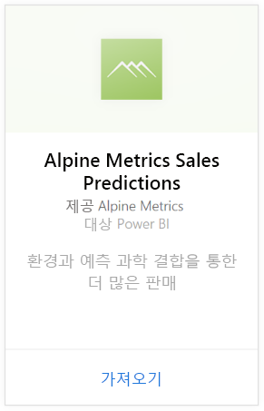
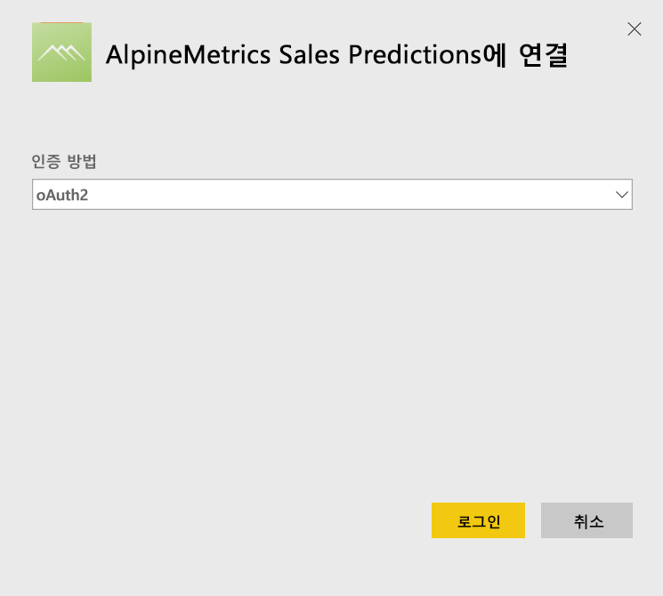
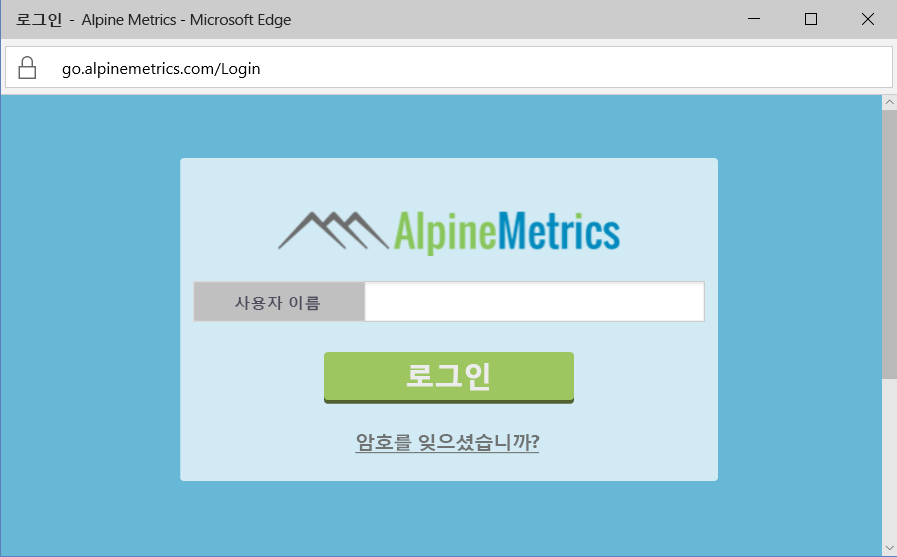
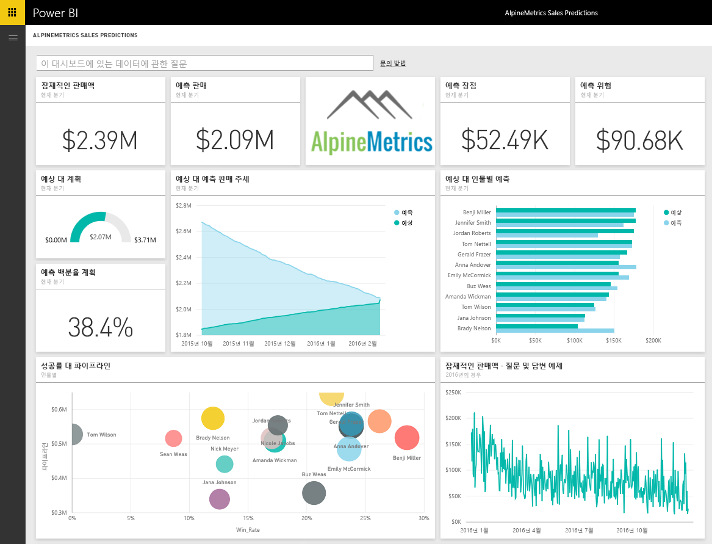

# Power BI로 Alpine Metrics Sales Predictions에 연결
Alpine Metrics에서는 최신 Predictive Sales Process Optimization을 클라우드에서, 그리고 영업 조직 규모에 따라 주문형으로 제공합니다. Power BI용 Alpine Metrics Sales Predictions 콘텐츠 팩에는 잠재적 및 예측된 판매 및 위험과 같은 메트릭을 포함하여 비즈니스의 미래에 대해 깊이 이해할 수 있도록 합니다. 

Power BI용 [Alpine Metrics Sales Predictions 콘텐츠 팩](https://app.powerbi.com/getdata/services/alpine-metrics)에 연결합니다.

## 연결 방법
1. 왼쪽 탐색 창의 맨 아래에 있는 데이터 가져오기를 선택합니다.  
   
    
2. **서비스** 상자에서 **가져오기**를 선택합니다.  
   
    
3. **AlpineMetrics Sales Predictions**을 선택한 다음 **가져오기**를 선택합니다.  
   
    
4. **OAuth 2**, **로그인**을 차례로 선택합니다. 대화 상자가 나타나면 AlpineMetrics 자격 증명을 제공합니다.
   
    
   
    
5. 연결되면 대시보드, 보고서 및 데이터 집합은 자동으로 로드됩니다. 완료되면 타일은 계정의 데이터로 업데이트됩니다.
   
    

**다음 단계**

* 대시보드 맨 위에 있는 [질문 및 답변 상자에 질문](power-bi-q-and-a.md)합니다.
* 대시보드에서 [타일을 변경](service-dashboard-edit-tile.md)합니다.
* [타일을 선택](service-dashboard-tiles.md)하여 원본 보고서를 엽니다.
* 데이터 집합을 매일 새로 고치도록 예약하는 경우 새로 고침 일정을 변경하거나 **지금 새로 고침**을 사용하여 필요할 때 새로 고칠 수 있습니다.

## 포함된 내용
콘텐츠 팩은 다음 테이블의 데이터를 포함합니다.  

    - 계정    
    - 비즈니스    
    - 국가    
    - 업계    
    - 영업 기회  
    - 인물  
    - 예측    
    - 예측 기록    
    - 제품  
    - 지역    

## 시스템 요구 사항
위의 테이블에 대한 권한이 있는 Alpine Metrics 계정은 이 콘텐츠 팩을 인스턴스화하기 위해 필요합니다.

## 다음 단계
[Power BI 시작](service-get-started.md)

[Power BI - 기본 개념](service-basic-concepts.md)

