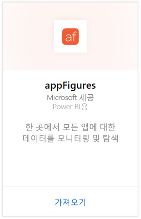
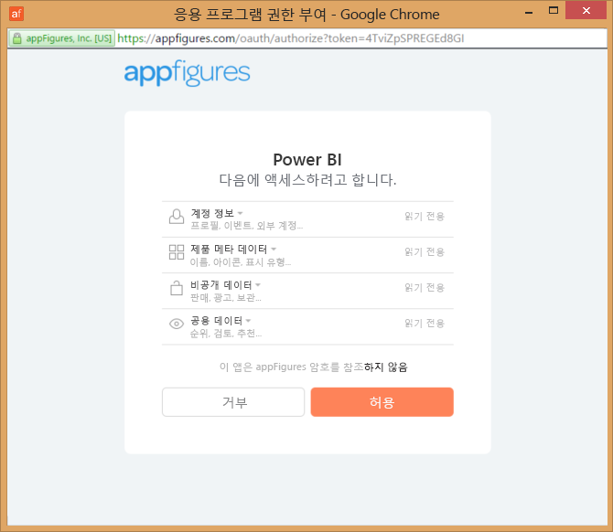
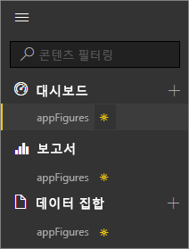
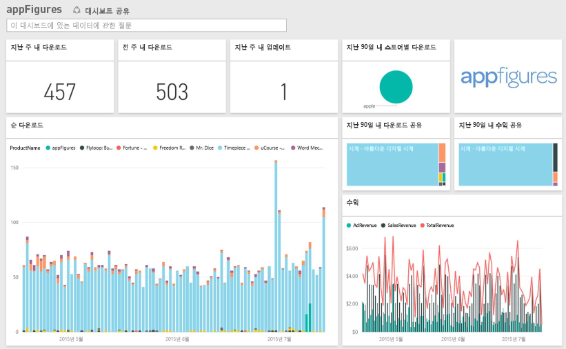
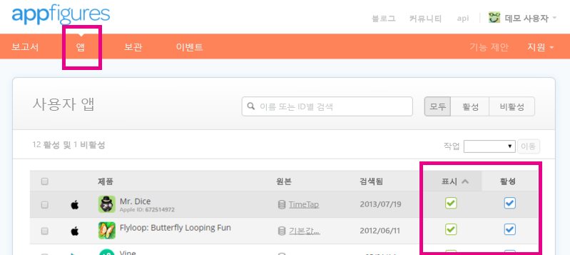

# Power BI로 appFigures에 연결
Power BI 및 appFigures 콘텐츠 팩을 사용하면 앱에 대한 중요한 통계를 쉽게 추적할 수 있습니다. Power BI는 앱 판매, 다운로드 및 광고 통계를 포함하여 데이터를 검색한 다음 해당 데이터를 기반으로 하여 기본 대시보드 및 관련 보고서를 작성합니다.

[appFigures 콘텐츠 팩](https://app.powerbi.com/getdata/services/appfigures)에 연결하거나 Power BI와 [appFigures 통합](https://powerbi.microsoft.com/integrations/appfigures)에 대해 자세히 알아보세요.

## 연결 방법
1. 왼쪽 탐색 창의 맨 아래에 있는 **데이터 가져오기** 를 선택합니다.
   
   
2. **서비스** 상자에서 **가져오기**를 선택합니다.
   
   
3. **appFigures** \> **가져오기**를 선택합니다.
   
   
4. **인증 방법**에 대해 **oAuth2** \> **로그인**을 선택합니다. 메시지가 표시되면 appFigures 자격 증명을 입력하고 appFigures 인증 프로세스를 따릅니다.
   
   처음 연결하는 경우 Power BI에 계정에 대한 읽기 전용 액세스를 허용하라는 메시지가 표시됩니다. **허용** 을 선택하여 가져오기 프로세스를 시작합니다. 이 작업은 계정의 데이터 볼륨에 따라 몇 분 정도 걸릴 수 있습니다.
   
   
5. Power BI가 데이터를 가져오면 왼쪽 탐색 창에 새 대시보드, 보고서 및 데이터 집합이 표시됩니다. 새 항목은 노란색 별표 \*로 표시됩니다.
   
    
6. appFigures 대시보드를 선택합니다. Power BI가 데이터를 표시하기 위해 만든 기본 대시보드입니다. 이 대시보드를 수정하여 원하는 방식으로 데이터를 표시할 수 있습니다.
   
    

**다음 단계**

* 대시보드 맨 위에 있는 [질문 및 답변 상자에 질문](power-bi-q-and-a.md)합니다.
* 대시보드에서 [타일을 변경](service-dashboard-edit-tile.md)합니다.
* [타일을 선택](service-dashboard-tiles.md)하여 원본 보고서를 엽니다.
* 데이터 집합을 매일 새로 고치도록 예약하는 경우 새로 고침 일정을 변경하거나 **지금 새로 고침**을 사용하여 필요할 때 새로 고칠 수 있습니다.

## 포함된 내용
Power BI의 appFigures에서 다음 데이터를 사용할 수 있습니다.

| **테이블 이름** | **설명** |
| --- | --- |
| Countries |이 표에서는 국가 이름 정보를 제공합니다. |
| Dates |이 표에는 오늘부터 appFigures 계정에서 활성 및 표시 상태인 앱의 가장 빠른 PublishDate까지의 날짜가 포함됩니다. |
| Events |이 표에는 매일, 국가별로 각 앱에 대한 다운로드, 판매 및 광고 정보가 포함됩니다. 앱과 앱에서 바로 구매 정보가 모두 이 단일 표에 들어 있습니다. <strong>형식</strong> 열을 사용하여 구분할 수 있습니다. |
| Inapps |이 표에는 appFigures 계정에서 활성, 표시 상태인 앱과 연결된 다양한 유형의 인앱에서 구매에 대한 데이터가 포함됩니다. |
| Products |이 표에는 appFigures 계정에서 활성 및 표시 상태인 다양한 앱에 대한 데이터가 포함됩니다. |

## 문제 해결
일부 앱의 데이터가 Power BI에 표시되지 않는 경우 appFigures 사이트의 **앱** 탭에서 이러한 앱이 표시 및 활성 상태인지 확인합니다.

## 다음 단계
* [Power BI에서 시작](service-get-started.md)
* [Power BI에서 데이터 가져오기](service-get-data.md)

