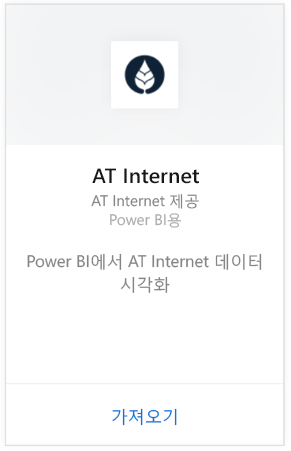
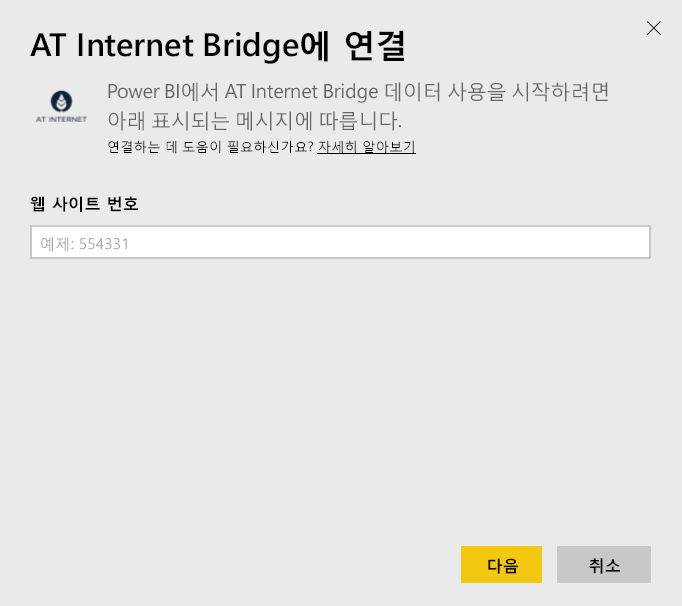
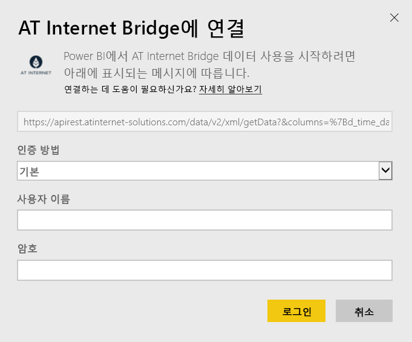

# Power BI로 AT Internet Bridge에 연결
AT Internet을 사용하면 해당 통합 디지털 분석 플랫폼인 Analytics Suite를 통해 데이터에서 즉시 값을 추출할 수 있습니다. Power BI용 AT Internet Bridge 콘텐츠 팩에는 사이트에 대한 방문 횟수, 원본, 지역화 및 장치와 관련된 데이터가 포함됩니다.

Power BI용 [AT Internet Bridge 콘텐츠 팩](https://app.powerbi.com/getdata/services/at-internet-bridge)에 연결합니다.

## 연결 방법
1. 왼쪽 탐색 창의 맨 아래에 있는 **데이터 가져오기** 를 선택합니다.
   
    
2. **서비스** 상자에서 **가져오기**를 선택합니다.
   
    
3. **AT Internet Bridge** \> **가져오기**를 선택합니다.
   
   
4. 연결하려는 AT Internet 웹 사이트 번호를 지정합니다.
   
   
5. 인증 메커니즘으로 **기본** 을 선택하고 AT Internet 사용자 이름과 암호를 입력한 다음 **로그인**을 클릭합니다.
   
   
6. **연결** 을 클릭하여 가져오기 프로세스를 시작합니다. 완료되면 새 대시보드, 보고서 및 모델이 탐색 창에 나타납니다. 대시보드를 선택하여 가져온 데이터를 표시합니다.
   
    

**다음 단계**

* 대시보드 맨 위에 있는 [질문 및 답변 상자에 질문](consumer/end-user-q-and-a.md)합니다.
* 대시보드에서 [타일을 변경](service-dashboard-edit-tile.md)합니다.
* [타일을 선택](consumer/end-user-tiles.md)하여 원본 보고서를 엽니다.
* 데이터 집합을 매일 새로 고치도록 예약하는 경우 새로 고침 일정을 변경하거나 **지금 새로 고침**을 사용하여 필요할 때 새로 고칠 수 있습니다.

## 포함된 내용
이 콘텐츠 팩에는 다음 테이블에 있는 지난 45일 동안의 데이터가 들어 있습니다.  

    - 변환  
    - 장치  
    - 지역화  
    - 원본  
    - 글로벌 방문  

## 다음 단계
[Power BI란?](power-bi-overview.md)

[Power BI - 기본 개념](consumer/end-user-basic-concepts.md)

