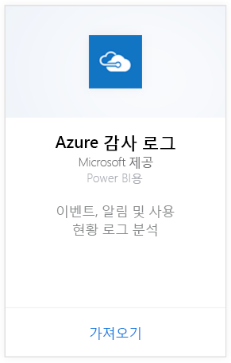
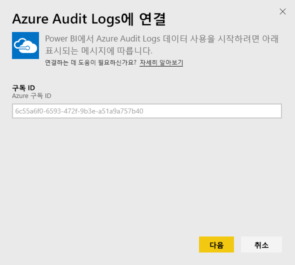
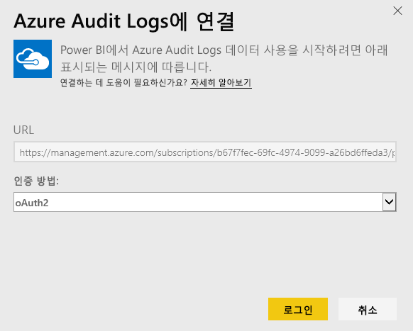
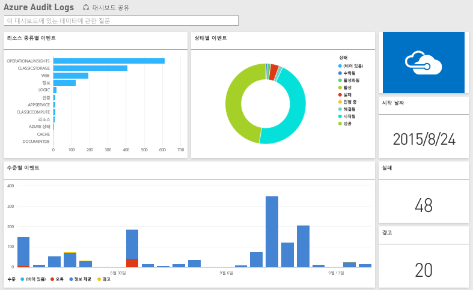

# Power BI로 Azure Audit Logs에 연결
Azure Audit Logs 콘텐츠 팩을 사용하면 감사 로그에 저장된 정보를 분석 및 시각화할 수 있습니다. Power BI는 데이터를 검색하고, 기본 대시보드를 구성한 다음 해당 데이터를 기준으로 보고서를 만듭니다.

[Azure 감사 로그 콘텐츠 팩](https://app.powerbi.com/getdata/services/azure-audit-logs)에 연결하거나 Power BI와의 [Azure 감사 로그 통합](https://powerbi.microsoft.com/integrations/azure-audit-logs)에 대해 자세히 알아보세요.

## 연결 방법
1. 왼쪽 탐색 창의 맨 아래에 있는 **데이터 가져오기** 를 선택합니다.  
   
    
2. **서비스** 상자에서 **가져오기**를 선택합니다.  
   
     
3. **Azure 감사 로그** > **가져오기**를 선택합니다.  
   
   
4. 메시지가 표시되면 **Azure 구독 ID**를 입력합니다. 아래에서 [구독 ID](#FindingParams) 찾기에 대한 자세한 내용을 참조하세요.   
   
    
5. **인증 방법**에 대해 **oAuth2** \> **로그인**을 선택합니다.
   
    
6. 계정 자격 증명을 입력하여 로그인 프로세스를 완료합니다.
   
    
7. Power BI는 Azure Audit Log 데이터를 검색하고 즉시 사용 가능한 대시보드 및 보고서를 만듭니다. 
   
    

**다음 단계**

* 대시보드 맨 위에 있는 [질문 및 답변 상자에 질문](service-q-and-a.md)합니다.
* 대시보드에서 [타일을 변경](service-dashboard-edit-tile.md)합니다.
* [타일을 선택](service-dashboard-tiles.md)하여 원본 보고서를 엽니다.
* 데이터 집합을 매일 새로 고치도록 예약하는 경우 새로 고침 일정을 변경하거나 **지금 새로 고침**을 사용하여 필요할 때 새로 고칠 수 있습니다.

## 시스템 요구 사항
Azure 감사 로그 콘텐츠 팩을 사용하려면 Azure Portal에서 감사 로그에 액세스해야 합니다. 자세한 내용은 [여기](https://azure.microsoft.com/en-us/documentation/articles/insights-debugging-with-events/)에 있습니다.

## 매개 변수 찾기
두 가지 간단한 방법으로 구독 ID를 찾을 수 있습니다.

1. https://portal.azure.com -&gt; 찾아보기 -&gt; 구독 -&gt; 구독 ID에서
2. https://manage.windowsazure.com -&gt; 설정  -&gt; 구독 ID에서

구독 ID는 숫자와 문자의 긴 집합으로, 위 \#4단계의 예와 유사합니다. 

## 문제 해결
잘못된 자격 증명으로 인해 자격 증명 오류나 새로 고침 시도 시 오류가 발생하는 경우, Azure 감사 로그 콘텐츠 팩의 모든 인스턴스를 삭제하고 다시 연결해보세요.

## 다음 단계
[Power BI 시작](service-get-started.md)  
[Power BI - 기본 개념](service-basic-concepts.md)  

