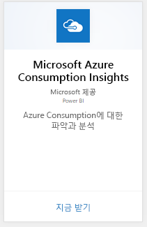
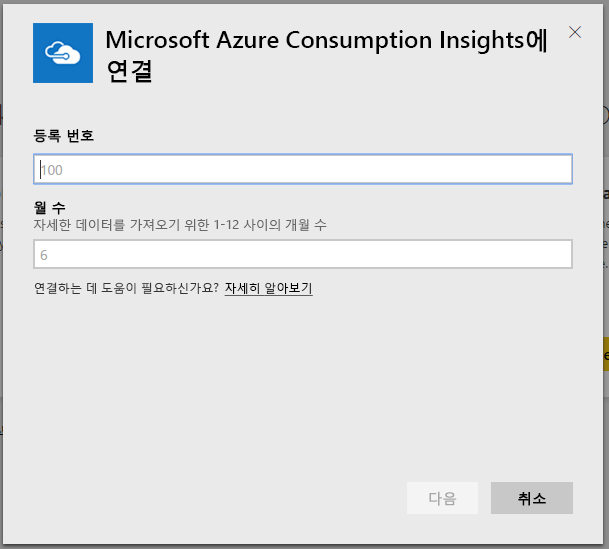
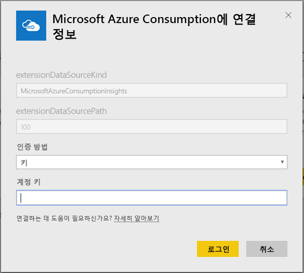
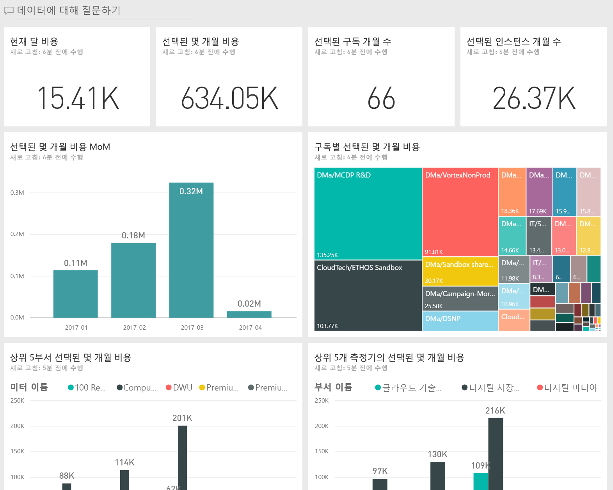
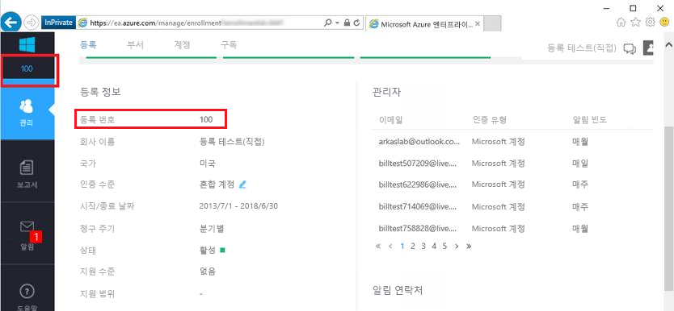
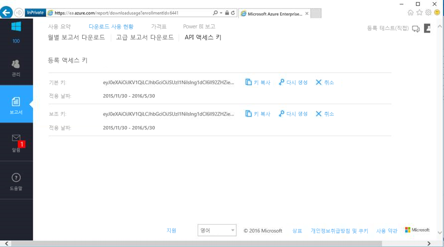

# Power BI로 Microsoft Azure Consumption Insights에 연결
Power BI 콘텐츠 팩을 사용하여 Power BI에서 Microsoft Azure 소비 데이터를 탐색하고 모니터링합니다. 데이터는 하루에 한 번 자동 새로 고쳐집니다.

Power BI용 [Microsoft Azure Consumption Insights 콘텐츠 팩](https://app.powerbi.com/getdata/services/azureconsumption)에 연결합니다.

## 연결 방법
1. 왼쪽 탐색 창의 맨 아래에 있는 **데이터 가져오기** 를 선택합니다.
   
    
2. **서비스** 상자에서 **가져오기**를 선택합니다.
   
   
3. 선택 **Microsoft Azure Consumption Insights** \> **지금**합니다. 
   
   
4. 가져올 데이터의 개월 수를 입력하고 Azure Enterprise 등록 번호를 입력합니다. 아래에서 [해당 매개 변수 찾기](#FindingParams)에 대한 세부 정보를 참조하세요.
   
    
5. 연결할 선택키를 제공합니다. Azure EA 포털에서 등록 키를 찾을 수 있습니다. 
   
    
6. 가져오기 프로세스가 자동으로 시작됩니다. 완료 되 면 새 대시보드, 보고서 및 모델이 탐색 창에 나타납니다. 대시보드를 선택하여 가져온 데이터를 표시합니다.
   
   

**다음 단계**

* 대시보드 맨 위에 있는 [질문 및 답변 상자에 질문](consumer/end-user-q-and-a.md)합니다.
* 대시보드에서 [타일을 변경](service-dashboard-edit-tile.md)합니다.
* [타일을 선택](consumer/end-user-tiles.md)하여 원본 보고서를 엽니다.
* 데이터 집합을 매일 새로 고침 하도록 예약 하는 동안에 새로 고침 일정을 변경 하거나 사용 하 여 요청 고칠 수 있습니다 **지금 새로 고침**

## 포함된 내용
Microsoft Azure Consumption Insights 콘텐츠 팩 월간 연결할 때 제공한 월 범위에 대 한 데이터를 보고 하는 포함 되어 있습니다. 범위는 이동 창 이므로 포함 되는 날짜는 데이터 집합을 새로 고치면 업데이트 됩니다.

## 시스템 요구 사항
콘텐츠 팩에는 Azure portal 내의 엔터프라이즈 기능에 대 한 액세스가 필요합니다. 

## 매개 변수 찾기
Power BI 보고 EA Direct, 파트너 및 청구 정보를 볼 수 있는 간접 고객에 게 제공 됩니다. 각각 연결 흐름이 예상 값을 찾는 데 대 한 자세한 내용은 아래를 읽습니다.

**월 수**

* 오늘의 가져올 하려는 데이터의 월 (1부터 36)의 수입니다.

**등록 번호**

* 찾을 수 있는 Azure Enterprise 등록 번호, 합니다 [Azure Enterprise Portal](https://ea.azure.com/) 아래에 있는 홈 화면 **등록 세부 정보**합니다.
  
    

**선택키**

* Azure Enterprise portal에서의 액세스 키를 찾을 수 **사용량 다운로드** > **API 액세스 키**합니다.
  
    

**추가 도움말**

* Azure Enterprise Power BI 팩 설정은 추가 도움말, 한 Azure Enterprise Portal에 로그인 하 고 아래의 API 도움말 파일과 볼 **도움말**합니다. 추가 지침을 찾을 수도 있습니다 **보고서** -> **사용량 다운로드** -> **API 액세스 키**합니다.

## 다음 단계
[Power BI에서 시작](service-get-started.md)

[Power BI에서 데이터 가져오기](service-get-data.md)

