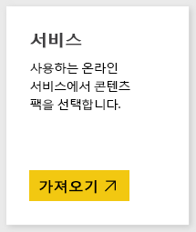
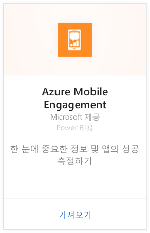
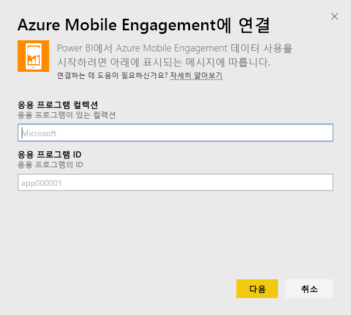
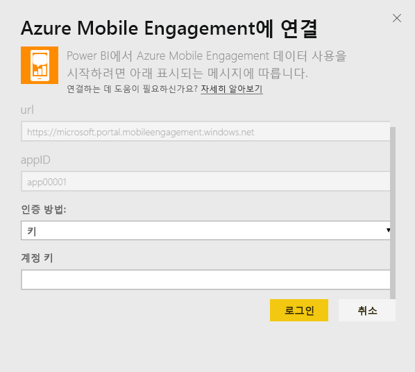
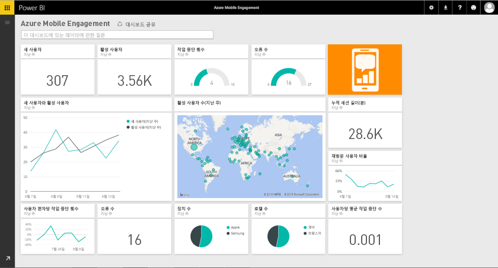

# Power BI로 Azure Mobile Engagement에 연결
Power BI Azure Mobile Engagement 콘텐츠 팩을 사용하면 앱 데이터를 신속하게 파악할 수 있습니다.

Power BI용 [Azure Mobile Engagement 콘텐츠 팩](https://app.powerbi.com/groups/me/getdata/services/azme)에 연결합니다.

## 연결 방법
1. 왼쪽 탐색 창의 맨 아래에 있는 **데이터 가져오기** 를 선택합니다.
   
    
2. **서비스** 상자에서 **가져오기**를 선택합니다.
   
    
3. **Azure Mobile Engagement** \> **가져오기**를 선택합니다.
   
     
4. 앱 컬렉션과 앱 이름을 지정합니다. 이 정보는 Azure Mobile Engagement 계정에서 확인할 수 있습니다.
   
     
5. 인증 방법에 대해 키를 제공한 다음 로그인을 클릭합니다.
   
    
6. Power BI가 데이터를 가져오면 왼쪽 탐색 창에 새 대시보드, 보고서 및 데이터 집합이 표시됩니다. 새 항목이 노란색 별표 \*로 표시되고 다시 선택하면 사라집니다.
   
    

 **다음 단계**

* 대시보드 맨 위에 있는 [질문 및 답변 상자에 질문](power-bi-q-and-a.md)합니다.
* 대시보드에서 [타일을 변경](service-dashboard-edit-tile.md)합니다.
* [타일을 선택](service-dashboard-tiles.md)하여 원본 보고서를 엽니다.
* 데이터 집합을 매일 새로 고치도록 예약하는 경우 새로 고침 일정을 변경하거나 **지금 새로 고침**을 사용하여 필요할 때 새로 고칠 수 있습니다.

## 다음 단계
[Power BI에서 시작](service-get-started.md)

[Power BI에서 데이터 가져오기](service-get-data.md)

