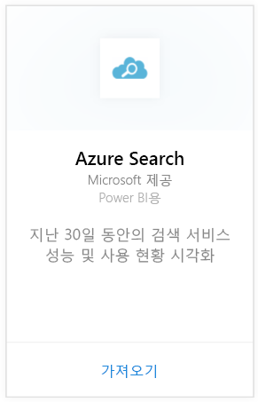
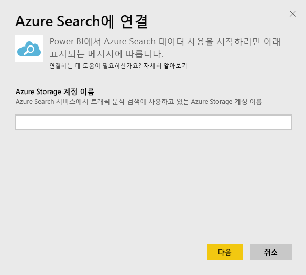
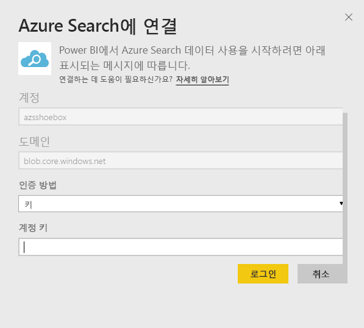
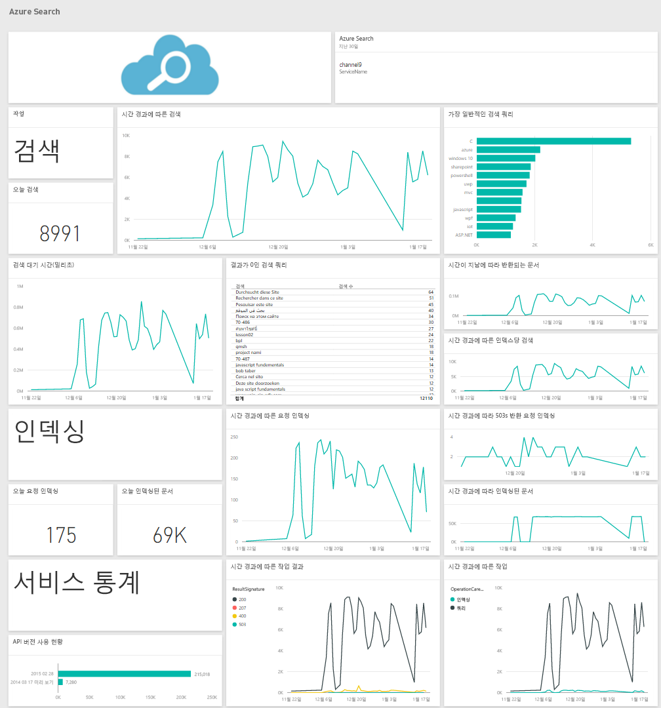

# Power BI로 Azure Search에 연결
Azure Search 트래픽 분석을 사용하면 Azure Search 서비스에 대한 트래픽을 모니터링하고 이해할 수 있습니다. Power BI용 Azure Search 콘텐츠 팩은 지난 30일 동안의 검색, 인덱싱, 서비스 통계 및 대기 시간을 비롯한 검색 데이터를 자세히 제공합니다. 자세한 내용은 [Azure 블로그 게시물](https://azure.microsoft.com/blog/analyzing-your-azure-search-traffic/)에서 찾을 수 있습니다.

[Power BI용 Azure Search 콘텐츠 팩](https://app.powerbi.com/getdata/services/azure-search)에 연결합니다.

## 연결 방법
1. 왼쪽 탐색 창의 맨 아래에 있는 **데이터 가져오기** 를 선택합니다.
   
    
2. **서비스** 상자에서 **가져오기**를 선택합니다.
   
    
3. **Azure Search**\>**가져오기**를 선택합니다.
   
   
4. Azure Search 분석이 저장되는 Table Storage 계정의 이름을 제공합니다.
   
   
5. 인증 메커니즘으로 **키** 를 선택하고 스토리지 계정 키를 제공합니다. **로그인** 을 클릭하여 로드 프로세스를 시작합니다.
   
   
6. 로드가 완료되면 새 대시보드, 보고서 및 모델이 탐색 창에 나타납니다. 대시보드를 선택하여 가져온 데이터를 표시합니다.
   
    

**다음 단계**

* 대시보드 맨 위에 있는 [질문 및 답변 상자에 질문](consumer/end-user-q-and-a.md)합니다.
* 대시보드에서 [타일을 변경](service-dashboard-edit-tile.md)합니다.
* [타일을 선택](consumer/end-user-tiles.md)하여 원본 보고서를 엽니다.
* 데이터 집합을 매일 새로 고치도록 예약하는 경우 새로 고침 일정을 변경하거나 **지금 새로 고침**을 사용하여 필요할 때 새로 고칠 수 있습니다.

## 시스템 요구 사항
Azure Search 콘텐츠 팩을 사용하려면 계정에 대해 Azure Search 트래픽 분석이 사용되도록 설정되어야 합니다.

## 문제 해결
스토리지 계정 이름이 전체 액세스 키와 함께 제공된 경우 올바른지 확인합니다. 스토리지 계정 이름은 Azure Search 트래픽 분석을 사용하여 구성한 계정과 일치해야 합니다.

## 다음 단계
[Power BI란?](power-bi-overview.md)

[Power BI 서비스의 디자이너를 위한 기본 개념](service-basic-concepts.md)

