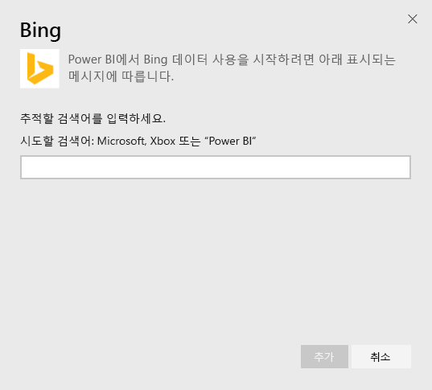
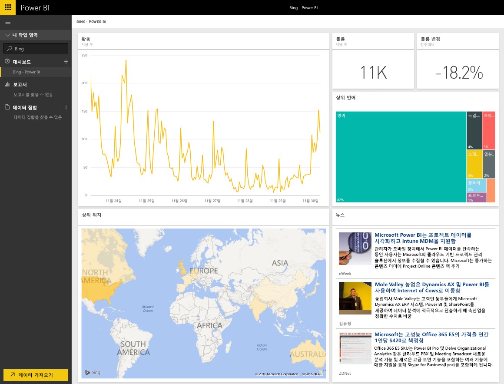

# Power BI로 Bing에 연결
Bing 콘텐츠 팩을 사용하면 사용자가 선택한 용어의 인터넷 검색 작업에 대한 분석을 볼 수 있습니다.

Power BI용 [Bing 콘텐츠 팩](https://app.powerbi.com/groups/me/getdata/services/bing)에 연결합니다.

>[!NOTE]
>Bing 타일은 약 5분마다 자동으로 업데이트되며 선택할 수 있는 유일한 타일은 뉴스 타일로, 이를 통해 해당 뉴스 문서를 볼 수 있습니다. 

>[!NOTE]
>Bing 콘텐츠 팩의 타일은 모바일 응용 프로그램에서 렌더링되지 않습니다. 이 문제를 해결하기 위해 작업 중입니다.

1. 왼쪽 탐색 창의 맨 아래에 있는 **데이터 가져오기** 를 선택합니다.
   
    
2. **서비스** 상자에서 **가져오기**를 선택합니다.
   
    
3. **Bing** > **가져오기**를 선택합니다.
   
    
4. 매개 변수 대화 상자에서 추적하려는 검색 용어를 입력하고 추가를 누릅니다.
   
        
5. 왼쪽의 Bing이라는 대시 보드 목록에 새 항목 및 입력한 검색 용어가 표시됩니다. 이 대시보드와 연결된 데이터 집합 또는 보고서가 없습니다. 타일을 로드하는 데 시간이 걸릴 수 있으며 완료되면 아래와 유사한 레이아웃이 표시됩니다.
   
    

로딩이 완료되면 고정된 타일을 포함하여 계정의 이 대시보드에서 다른 대시보드로 데이터 탐색을 시작할 수 있습니다.

