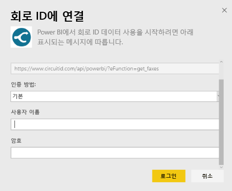
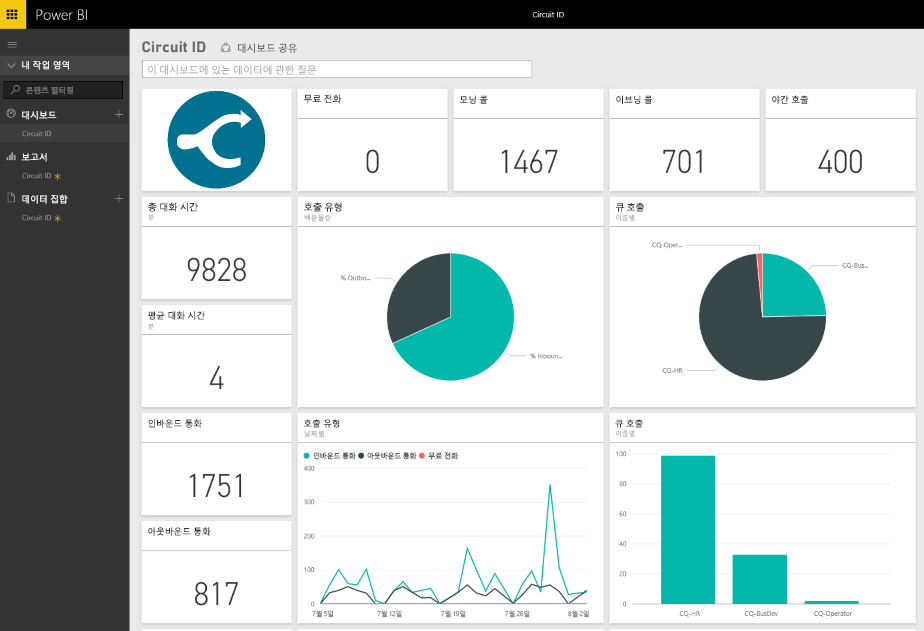

# Power BI로 회로 ID에 연결
Power BI를 사용하면 회로 ID에서 통신 데이터를 쉽게 분석할 수 있습니다. Power BI는 데이터를 검색한 다음 해당 데이터를 기반으로 하여 기본 대시보드 및 관련 보고서를 작성합니다. 연결을 만든 후 데이터를 탐색하고 요구에 맞게 대시보드를 사용자 지정할 수 있습니다. 매일 자동으로 데이터가 새로 고쳐집니다.

Power BI용 [회로 ID 콘텐츠 팩](https://app.powerbi.com/getdata/services/circuitid)에 연결합니다.

## 연결 방법
1. 왼쪽 탐색 창의 맨 아래에 있는 **데이터 가져오기** 를 선택합니다.
   
    
2. **서비스** 상자에서 **가져오기**를 선택합니다.
   
    
3. **ID 회로** \> **가져오기**를 선택합니다.
   
    
4. 인증 방법에 대해 기본을 선택하고 사용자 이름 및 암호를 제공합니다. 그런 다음 로그인을 누릅니다.
   
    
5. Power BI가 데이터를 가져오면 왼쪽 탐색 창에 새 대시보드, 보고서 및 데이터 세트가 표시됩니다. 새 항목은 노란색 별표로 표시됩니다.
   
    

**다음 단계**

* 대시보드 맨 위에 있는 [질문 및 답변 상자에 질문](consumer/end-user-q-and-a.md)합니다.
* 대시보드에서 [타일을 변경](service-dashboard-edit-tile.md)합니다.
* [타일을 선택](consumer/end-user-tiles.md)하여 원본 보고서를 엽니다.
* 데이터 세트를 매일 새로 고치도록 예약하는 경우 새로 고침 일정을 변경하거나 **지금 새로 고침**을 사용하여 필요할 때 새로 고칠 수 있습니다.

## 다음 단계
[Power BI란?](power-bi-overview.md)

[Power BI에 대한 데이터 가져오기](service-get-data.md)

