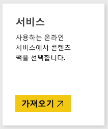
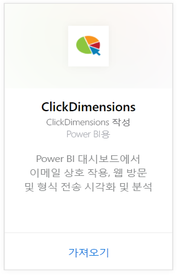
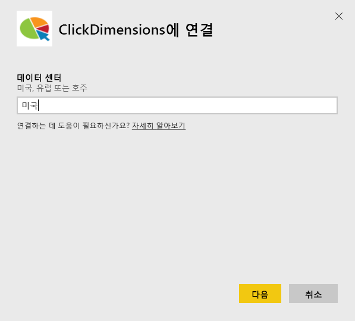
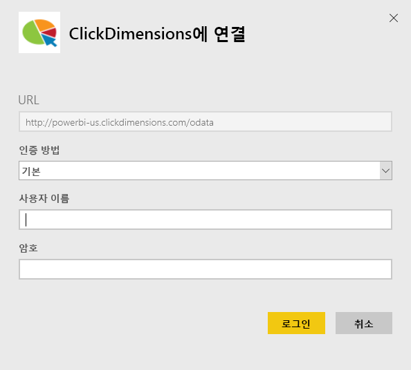
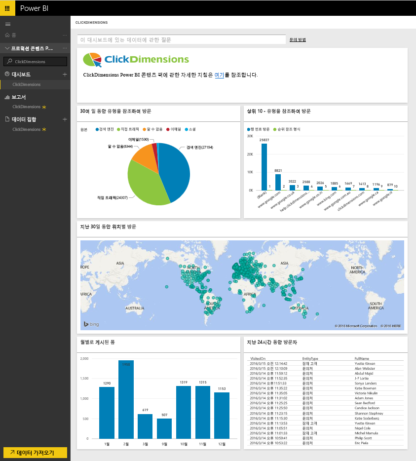
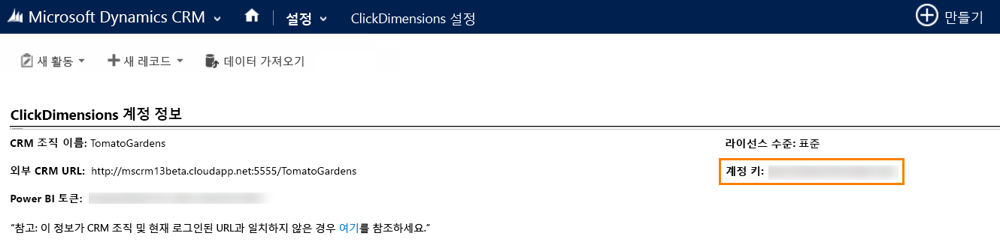
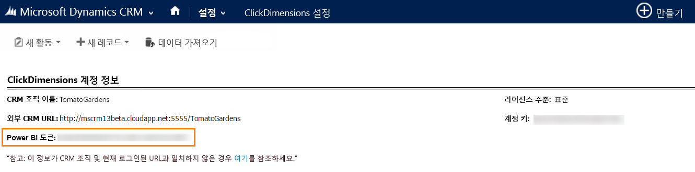

# Power BI로 ClickDimensions에 연결
Power BI용 ClickDimensions 콘텐츠 팩은 Power BI에서 ClickDimensions 마케팅 데이터를 활용하여 판매 및 마케팅 노력이 성공할 수 있도록 관리팀에 추가적인 정보를 제공합니다. Power BI 대시보드 및 보고서에서 전자 메일 상호 작용, 웹 방문 및 형식 전송을 시각화하고 분석합니다.

Power BI용 [ClickDimensions 콘텐츠 팩](https://app.powerbi.com/getdata/services/click-dimensions)에 연결합니다.

## 연결 방법
1. 왼쪽 탐색 창의 맨 아래에 있는 **데이터 가져오기** 를 선택합니다.
   
   
2. **서비스** 상자에서 **가져오기**를 선택합니다.
   
   
3. **ClickDimensions** \> **가져오기**를 선택합니다.
   
   
4. 데이터 센터의 위치(미국, 유럽 또는 AU)를 지정하고 **다음**을 선택합니다.
   
   
5. **인증 방법**에 대해서는 **기본** \> **로그인**을 선택합니다. 메시지가 표시되면 ClickDimensions 자격 증명을 입력합니다. 아래 [이러한 매개 변수 찾기](#FindingParams)에서 세부 정보를 참조하세요.
   
    
6. 승인되면 가져오기 프로세스가 자동으로 시작됩니다. 완료되면 새 대시보드, 보고서 및 모델이 탐색 창에 나타납니다. 대시보드를 선택하여 가져온 데이터를 표시합니다.
   
     

**다음 단계**

* 대시보드 맨 위에 있는 [질문 및 답변 상자에 질문](power-bi-q-and-a.md)합니다.
* 대시보드에서 [타일을 변경](service-dashboard-edit-tile.md)합니다.
* [타일을 선택](service-dashboard-tiles.md)하여 원본 보고서를 엽니다.
* 데이터 집합을 매일 새로 고치도록 예약하는 경우 새로 고침 일정을 변경하거나 **지금 새로 고침**을 사용하여 필요할 때 새로 고칠 수 있습니다.

## 시스템 요구 사항
Power BI 콘텐츠 팩에 연결하려면 사용자 계정에 해당하는 데이터 센터를 제공하고 ClickDimensions 계정으로 로그인해야 합니다. 제공되는 데이터 센터가 확실하지 않은 경우 관리자를 확인하세요.

## 매개 변수 찾기
CRM 설정 \> ClickDimensions 설정 내에서 계정 키가 발견됩니다. ClickDimensions 설정 내에서 계정 키를 복사하고 사용자 이름 필드에 붙여 넣습니다.  

  

ClickDimensions 설정 내에서 Power BI 토큰을 복사하고 암호 필드에 붙여 넣습니다. CRM 설정 \> ClickDimensions 설정 내에서 Power BI 토큰이 발견됩니다.  

  

## 다음 단계
[Power BI에서 시작](service-get-started.md)

[Power BI에서 데이터 가져오기](service-get-data.md)

