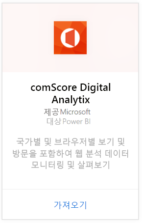
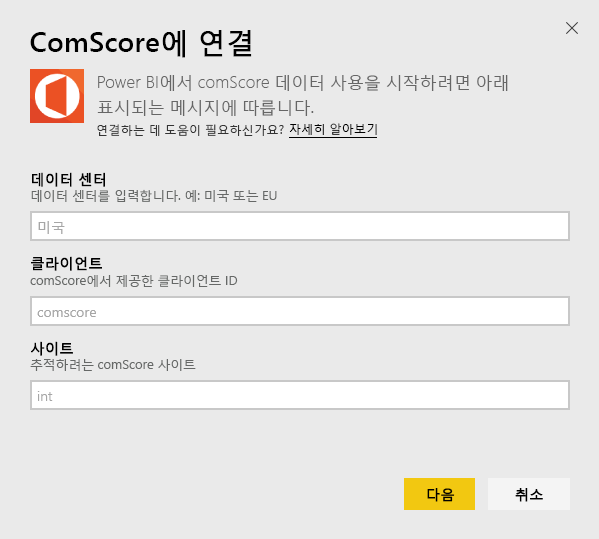
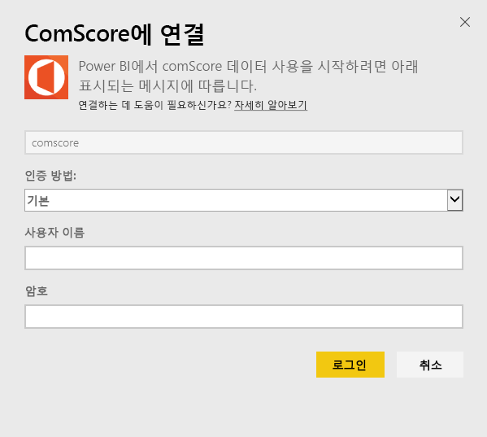
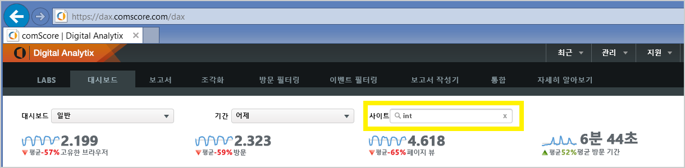

# Power BI로 comScore Digital Analytix에 연결
Power BI 콘텐츠 팩을 사용하여 Power BI에서 comScore Digital Analytix 데이터를 보고 탐색합니다. 하루에 한 번 자동으로 데이터가 새로 고쳐집니다.

[Power BI용 comScore 콘텐츠 팩](https://app.powerbi.com/getdata/services/comscore)에 연결합니다.

>[!NOTE]
>콘텐츠 팩에 연결하려면 comScore DAx 사용자 계정이 필요하고 comScore API 액세스 권한이 있어야 합니다. 아래 [세부 정보](#Requirements)를 참조하세요.

## 연결 방법
1. 왼쪽 탐색 창의 맨 아래에 있는 데이터 가져오기를 선택합니다.
   
   
2. **서비스** 상자에서 **가져오기**를 선택합니다.
   
   
3. **comScore Digital Analytix** \> **가져오기**를 선택합니다.
   
   
4. 연결하려는 데이터 센터, comScore 클라이언트 ID 및 사이트를 제공합니다. 이러한 값을 찾는 방법에 대한 자세한 내용은 아래의 [comScore 매개 변수 찾기](#FindingParams)를 참조하세요.
   
   
5. 연결하려는 comScore 사용자 이름 및 암호를 제공합니다. 아래에서 이 값 찾기에 대한 세부 정보를 참조하세요.
   
   
6. 가져오기 프로세스가 자동으로 시작됩니다. 완료되면 새 대시보드, 보고서 및 모델이 탐색 창에 나타납니다. 대시보드를 선택하여 가져온 데이터를 표시합니다.

**다음 단계**

* 대시보드 맨 위에 있는 [질문 및 답변 상자에 질문](consumer/end-user-q-and-a.md)합니다.
* 대시보드에서 [타일을 변경](service-dashboard-edit-tile.md)합니다.
* [타일을 선택](consumer/end-user-tiles.md)하여 원본 보고서를 엽니다.
* 데이터 집합을 매일 새로 고치도록 예약하는 경우 새로 고침 일정을 변경하거나 **지금 새로 고침**을 사용하여 필요할 때 새로 고칠 수 있습니다.

## 시스템 요구 사항
comScore DAx 사용자 계정과 comScore DAx API에 대한 액세스는 연결되어야 합니다. 계정을 확인하려면 comScore DAx 관리자에게 문의하세요.

## 매개 변수 찾기
각 comScore 매개 변수를 찾는 방법에 대한 세부 정보가 아래에 나와 있습니다.

**데이터 센터**

연결하는 데이터 센터는 comScore에서 이동하는 URL에 의해 결정됩니다.

https://dax.comscore.com을 사용하는 경우 "US"를 입력하고, https://dax.comscore.eu를 사용하는 경우 "EU"를 입력합니다.

 

**클라이언트**

클라이언트는 comScore DAx에 로그인할 때 제공한 동일한 클라이언트입니다.

 

**사이트**

comScore 사이트는 데이터를 보려는 사이트를 결정합니다. comScore 계정에서 사이트 목록을 찾을 수 있습니다.

## 다음 단계
[Power BI에서 시작](service-get-started.md)

[Power BI에서 데이터 가져오기](service-get-data.md)

