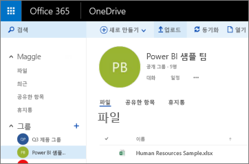
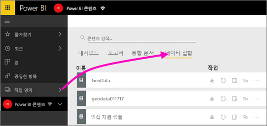
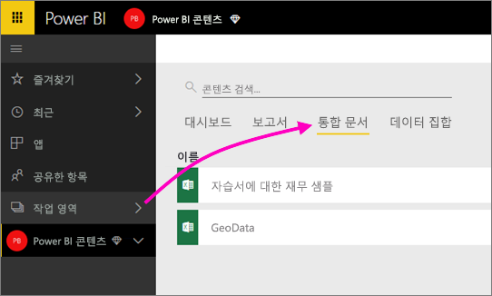

# Power BI 앱 작업 영역에 대해 OneDrive에 저장된 파일에 연결
[Power BI에서 앱 작업 영역을 만들었으므로](service-create-distribute-apps.md) Power BI 앱 작업 영역에 대한 비즈니스용 OneDrive에 Excel, CSV, Power BI Desktop 파일을 저장할 수 있습니다. OneDrive에 저장 한 파일 업데이트를 계속할 수 있습니다. 이러한 업데이트는 Power BI 보고서와 대시보드에 파일을 기반으로 자동으로 반영 됩니다. 

> [!NOTE]
> 새 작업 영역 환경 Power BI 작업 영역 및 Office 365 그룹 간의 관계를 변경합니다. 새 작업 영역 중 하나를 만들 때마다 Office 365 그룹을 자동으로 만들지 합니다. 에 대 한 읽기 [새 작업 영역 만들기](service-create-the-new-workspaces.md)

앱 작업 영역에 파일을 추가하려면 다음의 2단계가 필요합니다. 

1. 먼저 [파일을 앱 작업 영역에 대한 비즈니스용 OneDrive에 업로드](service-connect-to-files-in-app-workspace-onedrive-for-business.md#1-upload-files-to-the-onedrive-for-business-for-your-app-workspace)합니다.
2. 그런 다음 [Power BI에서 해당 파일에 연결](service-connect-to-files-in-app-workspace-onedrive-for-business.md#2-import-excel-files-as-datasets-or-as-excel-online-workbooks)합니다.

> [!NOTE]
> 앱 작업 영역은 [Power BI Pro](service-features-license-type.md)에서만 사용할 수 있습니다.
> 

## 1 파일을 앱 작업 영역에 대한 비즈니스용 OneDrive에 업로드
1. Power BI 서비스에서 작업 영역 옆에 있는 화살표를 선택하고 작업 영역 이름 옆에 있는 줄임표( **...** )를 선택합니다. 
   
   
2. **파일**을 선택하여 Office 365의 앱 작업 영역에 대한 비즈니스용 OneDrive를 엽니다.
   
   > [!NOTE]
   > 그룹 메뉴에 **파일**이 표시되지 않는다면 **멤버**를 선택하여 앱 작업 영역에 대한 비즈니스용 OneDrive를 엽니다. 거기에서 **일**을 선택합니다. Office 365가 앱의 그룹 작업 영역 파일에 대한 OneDrive 저장 위치를 설정합니다. 이 프로세스에는 다소 시간이 걸릴 수 있습니다. 
   > 
   > 
3. 여기서 파일을 앱 작업 영역에 대한 비즈니스용 OneDrive에 업로드할 수 있습니다. **업로드**를 선택하고, 자신의 파일로 이동합니다.
   
   

## 2 Excel 파일을 데이터 세트 또는 Excel 온라인 통합 문서로 가져오기
이제 앱 작업 영역에 대한 비즈니스용 OneDrive에 파일이 있으므로 선택할 수 있는 사항이 있습니다. 다음을 할 수 있습니다. 

* [데이터 집합으로 Excel 통합 문서에서 데이터를 가져올](service-get-data-from-files.md)합니다. 사용 하 여 데이터 빌드 보고서 및 대시보드를 웹 브라우저에서 및 모바일 장치에서 볼 수 있습니다.
* 또는 [Power BI에서 전체 Excel 통합 문서에 연결하고](service-excel-workbook-files.md) Excel Online에 표시된 대로 정확하게 표시합니다.

### 앱 작업 영역의 파일 가져오기 또는 연결
1. Power BI에서 앱 작업 영역으로 전환하여 앱 작업 영역 이름을 왼쪽 위 모서리에 표시합니다. 
2. 왼쪽 탐색 창의 맨 아래에 있는 **데이터 가져오기** 를 선택합니다. 
   
   
3. **파일** 상자에서 **가져오기**를 선택합니다.
   
   
4. **OneDrive** - *앱 작업 영역 이름*을 선택합니다.
   
    
5. 원하는 파일을 선택하고 **연결**을 선택합니다.
   
    결정 하는 시점에서 것인지 [Excel 통합 문서에서 데이터를 가져올](service-get-data-from-files.md), 또는 [전체 Excel 통합 문서에 연결](service-excel-workbook-files.md)합니다.
6. **가져오기** 또는 **연결**을 선택합니다.
   
    
7. **가져오기**를 선택하는 경우 **데이터 세트** 탭에 통합 문서가 나타납니다. 
   
    
   
    **연결**을 선택하는 경우 통합 문서는 **통합 문서** 탭에 있습니다.
   
    

## 다음 단계
* [Power BI에서 앱 및 앱 작업 영역 만들기](service-create-distribute-apps.md)
* [Excel 통합 문서에서 데이터 가져오기](service-get-data-from-files.md)
* [전체 Excel 통합 문서에 연결](service-excel-workbook-files.md)
* 궁금한 점이 더 있나요? [Power BI 커뮤니티를 이용하세요.](http://community.powerbi.com/)
* 의견이 있으신가요? [Power BI Ideas(영문)](https://ideas.powerbi.com/forums/265200-power-bi)을 방문하세요.

