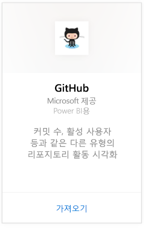
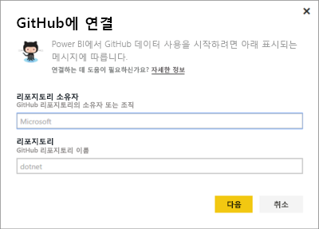
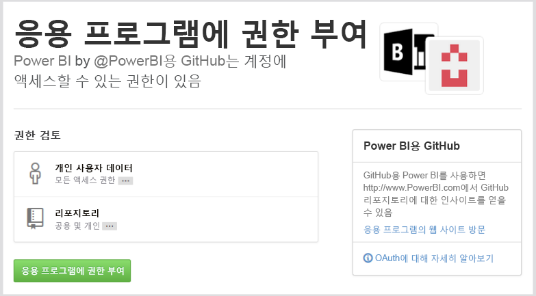
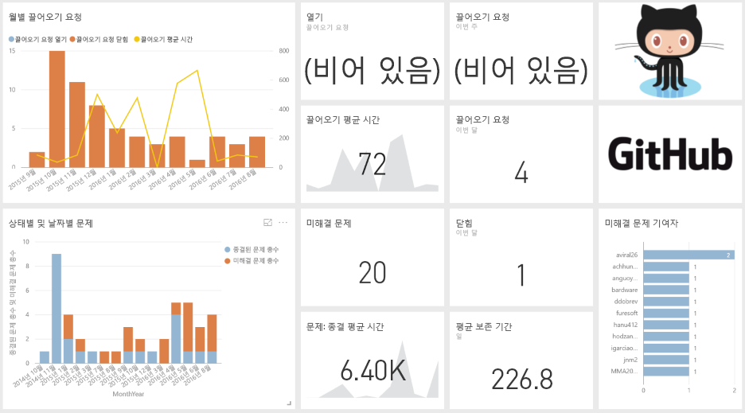
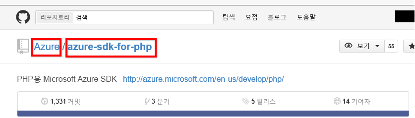

# Power BI로 GitHub에 연결
Power BI용 GitHub 콘텐츠 팩을 사용하면 참여, 문제, 끌어오기 요청 및 활성 사용자와 관련된 데이터가 포함된 GitHub 리포지토리(리포라고도 함)를 파악할 수 있습니다.

[GitHub 콘텐츠 팩](https://app.powerbi.com/getdata/services/github)에 연결하거나 Power BI와의 [GitHub 통합](https://powerbi.microsoft.com/integrations/github)에 대해 자세히 알아보세요.

>[!NOTE]
>콘텐츠 팩에서 리포지토리에 액세스하기 위해서는 GitHub 계정이 필요합니다. 요구 사항에 대한 자세한 내용은 아래에 나와 있습니다.

## 연결 방법
1. 왼쪽 탐색 창의 맨 아래에 있는 **데이터 가져오기** 를 선택합니다.
   
    
2. **서비스** 상자에서 **가져오기**를 선택합니다.
   
    
3. **GitHub** \> **가져오기**를 선택합니다.
   
   
4. 리포지토리의 리포지토리 이름과 리포지토리 소유자를 입력합니다. 아래에서 [해당 매개 변수 찾기](#FindingParams)에 대한 세부 정보를 참조하세요.
   
   
5. Github 자격 증명을 입력합니다(브라우저를 사용하여 이미 로그인한 경우 이 단계를 건너뛸 수 있음). 
6. **인증 방법**에 대해 **oAuth2** \> **로그인**을 선택합니다. 
7. Github 인증 화면을 따릅니다. Power BI용 GitHub 콘텐츠 팩에 GitHub 데이터에 대한 권한을 부여합니다.
   
   
   
   GitHub를 사용하여 Power BI에 연결되고 Power BI가 데이터에 연결할 수 있습니다.  하루에 한 번 데이터가 새로 고쳐집니다.
8. 리포에 연결하면 Power BI에서 데이터를 가져옵니다. 왼쪽 탐색 창에 새 [GitHub 대시보드](https://powerbi.microsoft.com/integrations/github), 보고서 및 데이터 집합이 표시됩니다. 새 항목은 노란색 별표 \*로 표시됩니다.
   
   

**다음 단계**

* 대시보드 맨 위에 있는 [질문 및 답변 상자에 질문](service-q-and-a.md)합니다.
* 대시보드에서 [타일을 변경](service-dashboard-edit-tile.md)합니다.
* [타일을 선택](service-dashboard-tiles.md)하여 원본 보고서를 엽니다.
* 데이터 집합을 매일 새로 고치도록 예약하는 경우 새로 고침 일정을 변경하거나 **지금 새로 고침**을 사용하여 필요할 때 새로 고칠 수 있습니다.

## 포함된 내용
Power BI의 GitHub에서 다음 데이터를 사용할 수 있습니다.     

| 표 이름 | 설명 |
| --- | --- |
| 참여 |참여 표는 참여자가 만든 총 추가, 삭제 및 커밋 수를 주별로 집계하여 제공합니다. 상위 100개의 참가자가 포함됩니다. |
| 문제 |선택한 리포지토리에 대한 모든 문제를 나열하며 문제가 닫힐 때까지의 총 시간과 평균 시간, 열린 총 문제 수, 닫힌 총 문제 수와 같은 계산을 포함합니다. 리포지토리에 문제가 없으면 이 표는 비어 있습니다. |
| 끌어오기 요청 |이 표에는 리포지토리에 대한 모든 끌어오기 요청과 요청을 끌어온 사용자가 포함됩니다. 또한 열린 끌어오기 요청 수, 닫힌 끌어오기 요청 수 및 총 끌어오기 요청 수, 요청을 끌어오는 데 걸린 시간, 끌어오기 요청의 평균 소요 시간과 관련된 계산이 포함됩니다. 리포지토리에 문제가 없으면 이 표는 비어 있습니다. |
| 사용자 |이 표에서는 선택한 리포지토리에 대해 참여했거나, 문제를 신고했거나,끌어오기 요청을 해결한 GitHub 사용자 또는 참여자 목록을 제공합니다. |
| 중요 시점 |선택한 리포지토리에 대한 모든 중요 시점이 포함됩니다. |
| DateTable |이 표에는 GitHub 데이터를 날짜별로 분석할 수 있도록 오늘부터의 날짜와 과거 연도의 날짜가 포함됩니다. |
| ContributionPunchCard |이 표를 선택한 리포지토리에 대한 참여 펀치 카드로 사용할 수 있습니다. 요일 및 시간별로 커밋이 표시됩니다. 이 표는 모델의 다른 표에 연결되어 있지 않습니다. |
| RepoDetails |이 표에서는 선택한 리포지토리에 대한 세부 정보를 제공합니다. |

## 시스템 요구 사항
* 리포지토리에 액세스할 수 있는 GitHub 계정.  
* 처음 로그인하는 동안 GitHub용 Power BI 앱에 부여된 권한. 액세스 권한을 취소에 대한 아래의 세부 정보를 참조하세요.  
* 데이터를 끌어오고 새로 고치는 데 사용할 수 있는 충분한 API 호출.  

### Power BI 권한 부여 취소
Power BI가 GitHub 리포지토리에 연결할 수 없도록 권한 부여를 취소하려면 GitHub에서 액세스 권한을 해지할 수 있습니다. 자세한 내용은 이 [GitHub 도움말](https://help.github.com/articles/keeping-your-ssh-keys-and-application-access-tokens-safe/#reviewing-your-authorized-applications-oauth) 항목을 참조하세요.

## 매개 변수 찾기
GitHub의 리포지토리 자체를 보면 소유자와 리포지토리를 확인할 수 있습니다.

첫 번째 부분 "Azure"는 소유자이고 두 번째 부분 "azure-sdk-for-php"는 리포지토리 자체입니다.  리포지토리의 URL에도 동일한 두 항목이 표시됩니다.

    <https://github.com/Azure/azure-sdk-for-php> .

## 문제 해결
필요한 경우 GitHub 자격 증명을 확인할 수 있습니다.  

1. 다른 브라우저 창에서 GitHub 웹 사이트로 이동한 다음 GitHub에 로그인합니다. GitHub 사이트의 오른쪽 위에서 로그인한 상태를 확인할 수 있습니다.    
2. GitHub에서 Power BI를 통해 액세스하려는 리포지토리의 URL로 이동합니다. 예: https://github.com/dotnet/corefx.  
3. Power BI로 돌아와서 GitHub에 연결을 시도합니다. GitHub 구성 대화 상자에서 동일한 리포지토리의 리포지토리 이름과 리포지토리 소유자를 사용합니다.  

## 다음 단계
* [Power BI 시작](service-get-started.md)
* [데이터 가져오기](service-get-data.md)

