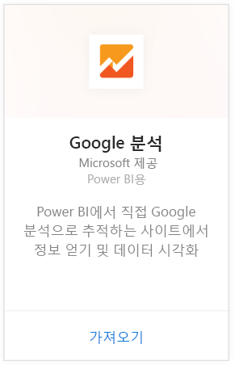
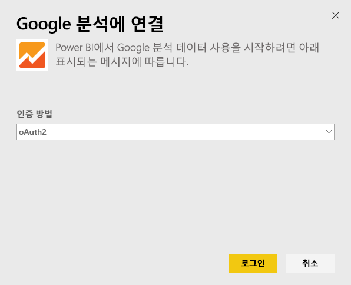
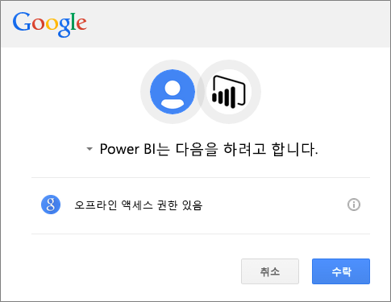
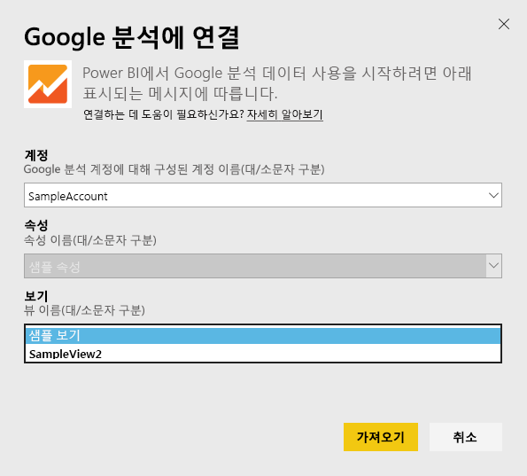
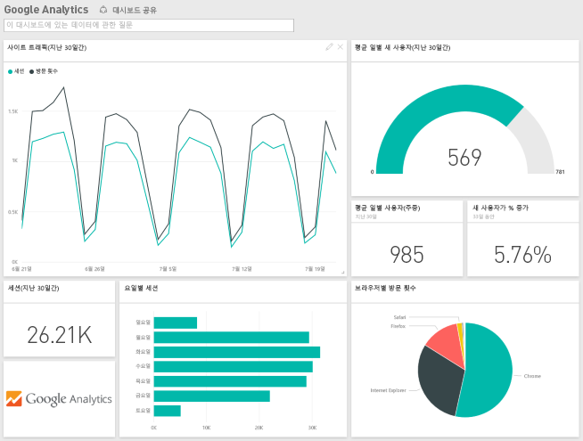
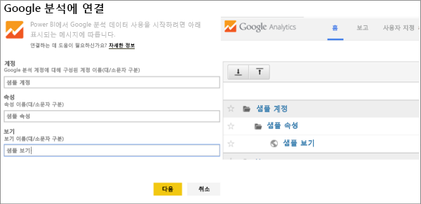

# Power BI로 Google 분석에 연결
Power BI를 통해 Google 분석에 연결하는 경우 먼저 Google 분석 계정에 연결합니다. 사이트 트래픽 및 사용자 차원에 대한 통찰력을 제공하는 Power BI 대시보드 및 Power BI 보고서 집합을 가져옵니다. 대시보드 및 보고서를 조작할 수 있지만 변경 내용을 저장할 수 없습니다. 하루에 한 번 자동으로 데이터가 새로 고쳐집니다.

Power BI용 [Google 웹로그 분석](https://app.powerbi.com/getdata/services/google-analytics)에 연결합니다. Power BI를 사용하여 [Google 웹로그 분석 통합](https://powerbi.microsoft.com/integrations/google-analytics)에 대해 자세히 알아보세요.

Power BI Desktop에서 [Google 웹로그 분석 커넥터](service-google-analytics-connector.md)를 시작하여 사용자 지정 대시보드 및 보고서를 만들 수 있습니다. Google 웹로그 분석 계정으로 연결하고 Power BI 서비스에 게시할 수 있는 사용자 지정 보고서를 만듭니다.

## 연결 방법
[!INCLUDE [powerbi-service-apps-get-more-apps](./includes/powerbi-service-apps-get-more-apps.md)]

1. **Google Analytics** \> **가져오기**를 선택합니다.
   
   
2. 메시지가 표시되면 Google 분석 자격 증명을 입력합니다. **oAuth 2** 를 인증 메커니즘으로 선택하고 **로그인**을 클릭합니다. 구성된 경우 2단계 인증을 포함할 수 있는 Google 인증 흐름을 따릅니다.
   
   
3. **허용** 을 클릭하여 Power BI가 Google 분석 데이터에 액세스할 수 있도록 합니다.
   
   
4. Power BI가 특정 Google 웹로그 분석 뷰에 연결됩니다. 연결하려는 계정 이름, 속성 이름 및 뷰 이름을 선택합니다. 이 정보는 Google 분석 계정의 왼쪽 위 또는 **홈** 탭에서 확인할 수 있습니다. 아래 세부 정보를 참조하세요. 
   
   
5. **연결** 을 클릭하여 가져오기 프로세스를 시작합니다. 

## Google 웹로그 분석 대시보드 및 보고서 보기
[!INCLUDE [powerbi-service-apps-open-app](./includes/powerbi-service-apps-open-app.md)]

      

[!INCLUDE [powerbi-service-apps-open-app](./includes/powerbi-service-apps-what-now.md)]

## 시스템 요구 사항
Power BI를 연결하려면 [Google 웹로그 분석](https://www.google.com/analytics/) 계정이 있어야 합니다. 연결된 Google 분석 계정이 없는 다른 Google 계정에는 인증 오류가 표시됩니다.

## 문제 해결
**자격 증명** Google 계정이 여러 개 있는 경우 연결하는 동안 incognito 또는 개인 브라우저 창을 사용하여 올바른 계정을 사용하도록 합니다.

자격 증명이 올바르지 않다는 것을 나타내는 오류를 받았지만 Google에 로그인할 수 있는 경우 [Google 분석](https://www.google.com/analytics/) 계정을 확인하세요.

**매개 변수** 고유한 이름이 현재 매개 변수에 필요합니다. 선택한 값이 중복되었음을 나타내는 오류가 표시되는 경우 다른 값을 선택하거나 Google 분석의 이름을 변경하여 고유한 이름을 만듭니다. 이를 개선하기 위해 적극적으로 노력하고 있습니다.

>[!NOTE]
>매개 변수는 대/소문자를 구분합니다. Google 분석 계정에 표시된 대로 정확하게 입력합니다.

그래도 문제가 발생하는 경우 지원 티켓을 열어 Power BI 팀에 문의하세요.

* Power BI 앱에 있는 동안 물음표 \> **고객 지원**을 선택합니다.
* 이 문서를 보고 있는 Power BI 지원 사이트에서 페이지의 오른쪽에 있는 **고객 지원** 을 선택합니다.

## 다음 단계
* [Power BI에서 앱이란?](service-install-use-apps.md)
* [Power BI에서 데이터 가져오기](service-get-data.md)
* 궁금한 점이 더 있나요? [Power BI 커뮤니티에 질문합니다.](http://community.powerbi.com/)

