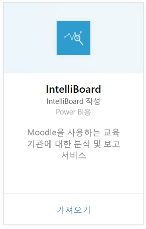
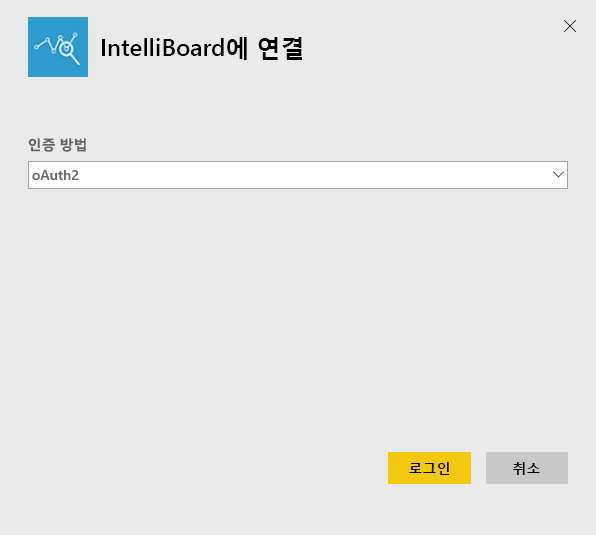
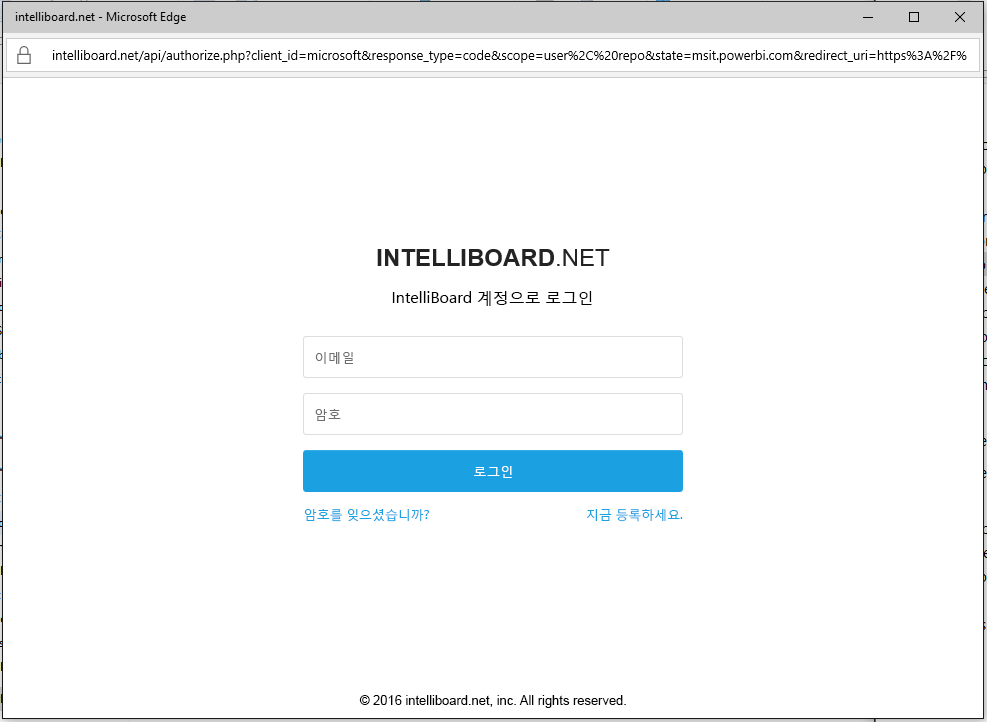

# Power BI로 IntelliBoard에 연결
IntelliBoard는 Reporting Service를 통해 Moodle 학습 관리 시스템에 단순화된 액세스를 제공합니다. Power BI용 IntelliBoard 콘텐츠 팩은 과정에 대한 메트릭, 등록된 사용자, 전반적인 성능 및 LMS 작업을 포함하여 추가 분석을 제공합니다.

Power BI용 [IntelliBoard 콘텐츠 팩](https://app.powerbi.com/getdata/services/intelliboard)에 연결합니다.

## 연결 방법
1. 왼쪽 탐색 창의 맨 아래에 있는 **데이터 가져오기** 를 선택합니다.  
   
    
2. **서비스** 상자에서 **가져오기**를 선택합니다.  
   
    
3. **IntelliBoard**를 선택하고 **가져오기**를 선택합니다.  
   
    
4. **OAuth 2**, **로그인**을 차례로 선택합니다. 대화 상자가 나타나면 IntelliBoard 자격 증명을 제공합니다.
   
    
   
    
5. 연결되면 대시보드, 보고서 및 데이터 세트는 자동으로 로드됩니다. 완료되면 타일은 IntelliBoard 계정의 데이터로 업데이트됩니다.
   
    

**다음 단계**

* 대시보드 맨 위에 있는 [질문 및 답변 상자에 질문](consumer/end-user-q-and-a.md)합니다.
* 대시보드에서 [타일을 변경](service-dashboard-edit-tile.md)합니다.
* [타일을 선택](consumer/end-user-tiles.md)하여 원본 보고서를 엽니다.
* 데이터 세트를 매일 새로 고치도록 예약하는 경우 새로 고침 일정을 변경하거나 **지금 새로 고침**을 사용하여 필요할 때 새로 고칠 수 있습니다.

## 포함된 내용
콘텐츠 팩은 다음 테이블의 데이터를 포함합니다.  

    - 활동  
    - 에이전트  
    - 인증  
    - Countries  
    - CoursesProgress  
    - 등록
    - 언어  
    - 플랫폼  
    - 총계  
    - UsersProgress    

## 시스템 요구 사항
위의 테이블에 대한 권한이 있는 IntelliBoard 계정은 이 콘텐츠 팩을 인스턴스화하기 위해 필요합니다.

## 다음 단계
[Power BI란?](power-bi-overview.md)

[Power BI 서비스의 디자이너를 위한 기본 개념](service-basic-concepts.md)

