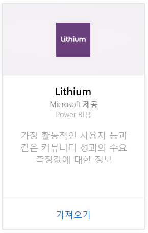
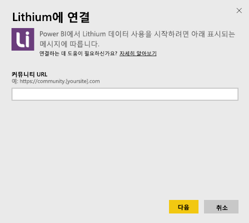
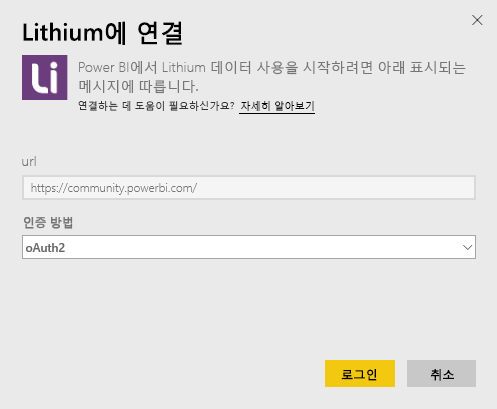
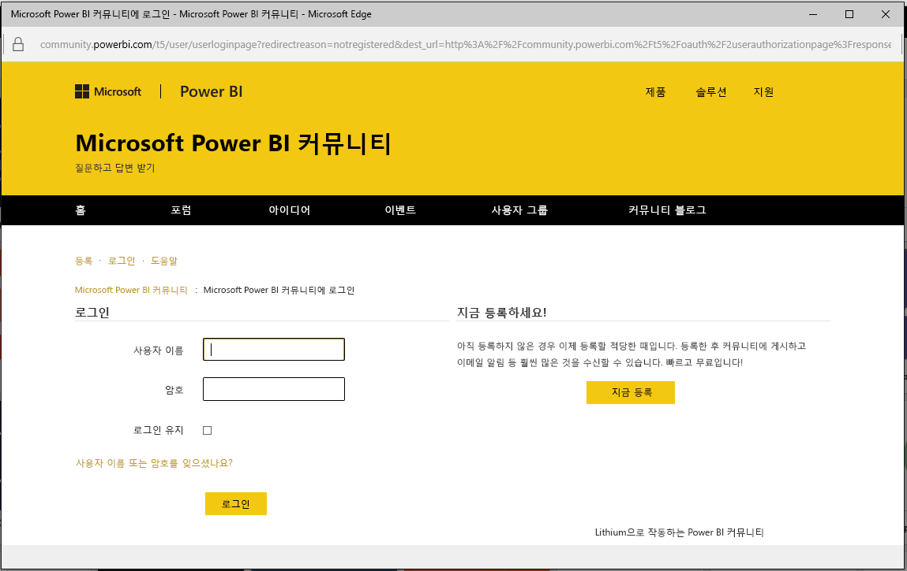
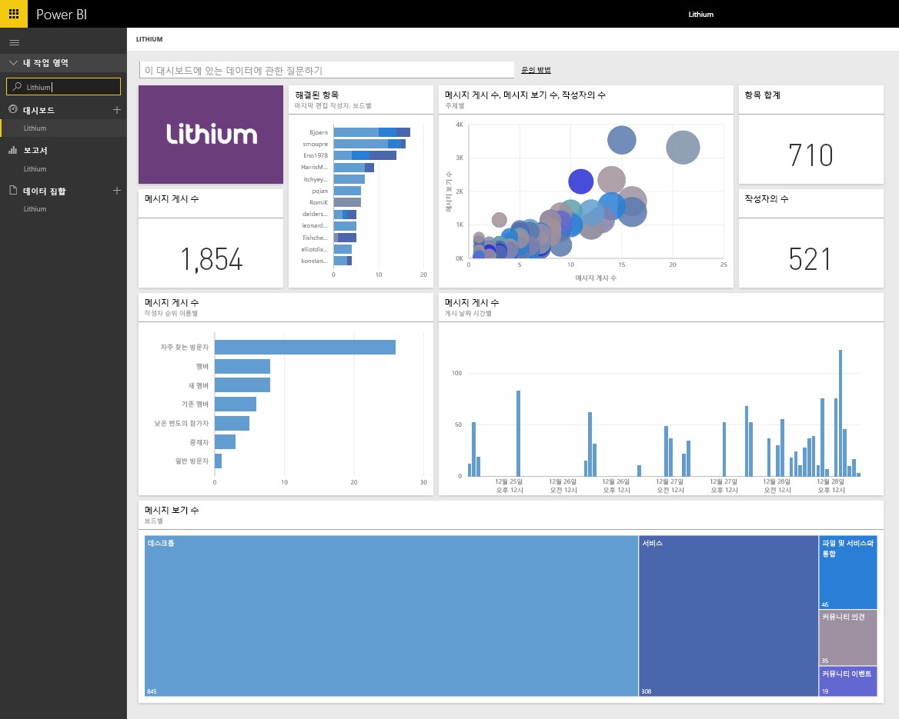

# Power BI로 Lithium에 연결
Lithium에서는 사람들이 질문에 대한 답을 얻고 경험을 공유할 수 있도록 지원하여 세계 최고 브랜드와 고객 간에 신뢰할 수 있는 관계를 형성해 줍니다. Lithium 콘텐츠 팩을 Power BI에 연결하면 온라인 커뮤니티에 대한 주요 메트릭을 측정하여 판매를 촉진하고, 서비스 비용을 절감하며, 고객 충성도를 높일 수 있습니다. 

Power BI용 [Lithium 콘텐츠 팩](https://app.powerbi.com/getdata/services/lithium)에 연결합니다.

>[!NOTE]
>Power BI 콘텐츠 팩에서는 Lithium API를 사용합니다. API를 과도하게 호출하면 Lithium에서 추가 요금을 부과할 수 있습니다. Lithium 관리자에게 확인하세요.

## 연결 방법
1. 왼쪽 탐색 창의 맨 아래에 있는 **데이터 가져오기** 를 선택합니다.
   
    
2. **서비스** 상자에서 **가져오기**를 선택합니다.
   
    
3. **Lithium** \> **가져오기**를 선택합니다.
   
   
4. Lithium 커뮤니티의 URL을 입력합니다. *https://community.yoursite.com* 형태가 됩니다.
   
   
5. 메시지가 표시되면 Lithium 자격 증명을 입력합니다. **oAuth 2** 를 인증 메커니즘으로 선택하고 **로그인** 을 클릭하여 Lithium 인증 흐름을 따릅니다.
   
   
   
   
6. 로그인 흐름이 완료되면 가져오기 프로세스가 시작됩니다. 완료되면 새 대시보드, 보고서 및 모델이 탐색 창에 나타납니다. 대시보드를 선택하여 가져온 데이터를 표시합니다.
   
    

**다음 단계**

* 대시보드 맨 위에 있는 [질문 및 답변 상자에 질문](power-bi-q-and-a.md)합니다.
* 대시보드에서 [타일을 변경](service-dashboard-edit-tile.md)합니다.
* [타일을 선택](service-dashboard-tiles.md)하여 원본 보고서를 엽니다.
* 데이터 집합을 매일 새로 고치도록 예약하는 경우 새로 고침 일정을 변경하거나 **지금 새로 고침**을 사용하여 필요할 때 새로 고칠 수 있습니다.

## 시스템 요구 사항
Lithium 콘텐츠 팩을 사용하려면 Lithium community v15.9 이상이 필요합니다. Lithium 관리자에게 문의하여 확인하세요.

## 다음 단계
[Power BI 시작](service-get-started.md)

[Power BI - 기본 개념](service-basic-concepts.md)

