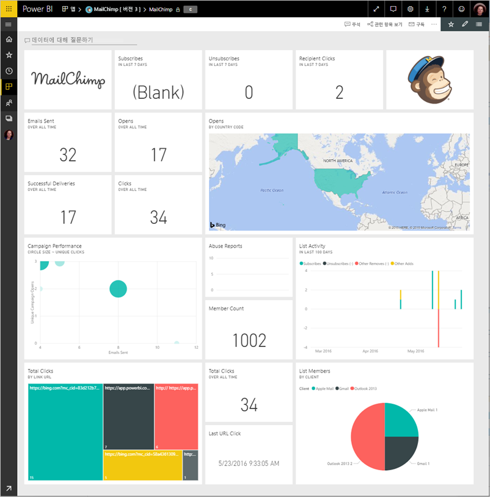
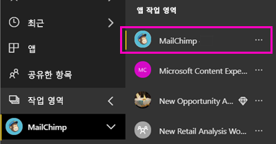
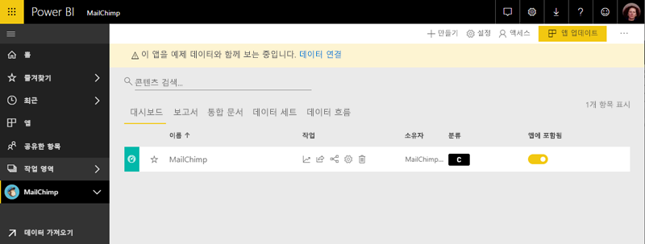

# Power BI로 MailChimp에 연결
이 문서에서는 Power BI 템플릿 앱을 사용 하 여 MailChimp 계정에서 데이터를 끌어오는 안내 합니다. 템플릿 앱 대시보드, 보고서, 집합 및 MailChimp 데이터를 탐색할 수 있도록 데이터 집합을 사용 하 여 작업 영역을 생성 합니다. 분석을 가져와서 [MailChimp 대시보드](https://powerbi.microsoft.com/integrations/mailchimp)를 만들고 캠페인, 보고서 및 개별 구독자의 추세를 빠르게 확인할 수 있습니다. 데이터가 매일 새로 고쳐집니다 모니터링 하는 데이터를 최신 상태로 유지 합니다.

템플릿 앱을 설치한 후에 대시보드 및 보고서를 변경할 수 있습니다. 그런 다음 조직의 동료에 게 앱으로 배포할 수 있습니다.

에 연결 합니다 [MailChimp 템플릿 앱](https://app.powerbi.com/getdata/services/mailchimp) Power BI에 대 한 합니다.

## 연결 방법

[!INCLUDE [powerbi-service-apps-get-more-apps](./includes/powerbi-service-apps-get-more-apps.md)]

3. 선택 **MailChimp** \> **지금**합니다.
4. **Power BI 앱이 설치?** 선택 **설치**합니다.
4. 에 **앱** 창 합니다 **MailChimp** 타일입니다.

    

6. **새 앱을 시작 하세요**를 선택 **데이터 연결**합니다.

    

1. 인증 방법에 대해 **oAuth2** \> **로그인**을 선택합니다.
   
    메시지가 표시되면 MailChimp 자격 증명을 입력하고 인증 프로세스를 따릅니다.
   
    처음 연결하는 경우 Power BI에 계정에 대한 읽기 전용 액세스를 허용하라는 메시지가 표시됩니다. **허용** 을 선택하여 가져오기 프로세스를 시작합니다. 계정에는 데이터 양에 따라 몇 분 걸릴 수 있습니다.
   
    

5. Power BI가 데이터를 가져오면 MailChimp 대시보드가 열립니다.
   
    

## 수정, 앱 배포

MailChimp 템플릿 앱을 설치 했습니다. 즉, MailChimp 앱 작업 영역도 만들었습니다. 작업 영역에서 보고서 및 대시보드를 다음으로 배포를 *앱* 조직의 동료에 게 합니다. 

1. 왼쪽된 탐색 모음에서 새 MailChimp 작업 영역의 모든 콘텐츠를 보려면 선택 **작업 영역** > **MailChimp**합니다. 

    

    이 보기에는 작업 영역 콘텐츠 목록입니다. 오른쪽 위 모서리에 표시 **앱 업데이트**합니다. 동료에 게 앱을 배포할 준비가 있는 경우 시작할 수 있습니다.

    

2. 선택 **보고서** 하 고 **데이터 집합** 작업 영역에서 다른 요소를 확인 합니다. 

    읽어보세요 [앱 배포](service-create-distribute-apps.md) 동료에 게 합니다.

## 다음 단계

* [Power BI에서 새 작업 영역 만들기](service-create-the-new-workspaces.md)
* [Power BI에서 앱 설치 및 사용](consumer/end-user-apps.md)
* [외부 서비스용 Power BI 앱](service-connect-to-services.md)
* 궁금한 점이 더 있나요? [Power BI 커뮤니티에 질문합니다.](http://community.powerbi.com/)

