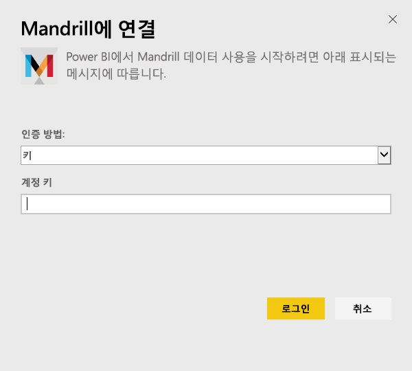
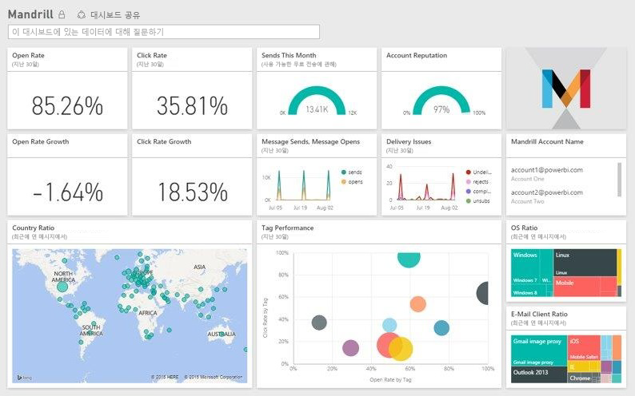

# Power BI로 Mandrill에 연결
Power BI 콘텐츠 팩은 Mandrill 계정에서 데이터를 끌어오고 데이터를 탐색할 수 있게 해주는 대시보드, 일련의 보고서 및 데이터 세트를 생성합니다. Mandrill의 분석을 사용하여 뉴스레터 또는 마케팅 캠페인을 신속하게 파악할 수 있습니다. 데이터가 매일 새로 고쳐지도록 설정되어 모니터링하는 데이터를 최신 상태를 유지합니다.

[!INCLUDE [include-short-name](./includes/service-deprecate-content-packs.md)]

[Power BI용 Mandrill 콘텐츠 팩](http://app.powerbi.com/getdata/services/mandrill)에 연결합니다.

## 연결 방법
1. 왼쪽 탐색 창의 맨 아래에 있는 **데이터 가져오기** 를 선택합니다.
   
    
2. **서비스** 상자에서 **가져오기**를 선택합니다.
   
    
3. **Mandrill** > **가져오기**를 선택합니다.
   
    
4. **인증 방법**에 대한 **키** 를 선택하고 API 키를 제공합니다. Mandrill 대시보드의 **설정** 탭에서 키를 찾을 수 있습니다. **로그인**을 선택하여 가져오기 프로세스를 시작합니다. 이 작업은 계정의 데이터 볼륨에 따라 몇 분 정도 걸릴 수 있습니다.
   
    
5. Power BI가 데이터를 가져오면 왼쪽 탐색 창에 새 대시보드, 보고서 및 데이터 세트가 표시됩니다. Power BI가 데이터를 표시하기 위해 만든 기본 대시보드입니다.
   
    

**다음 단계**

* 대시보드 맨 위에 있는 [질문 및 답변 상자에 질문](consumer/end-user-q-and-a.md)합니다.
* 대시보드에서 [타일을 변경](service-dashboard-edit-tile.md)합니다.
* [타일을 선택](consumer/end-user-tiles.md)하여 원본 보고서를 엽니다.
* 데이터 세트을 매일 새로 고치도록 예약하는 경우 새로 고침 일정을 변경하거나 **지금 새로 고침**을 사용하여 필요할 때 새로 고칠 수 있습니다.

## 다음 단계
[Power BI란?](fundamentals/power-bi-overview.md)

[Power BI 서비스의 디자이너를 위한 기본 개념](service-basic-concepts.md)

