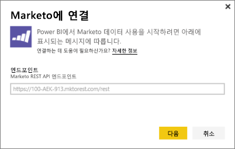
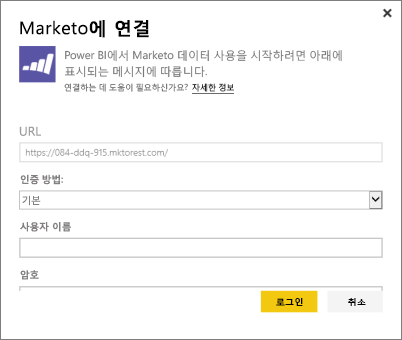
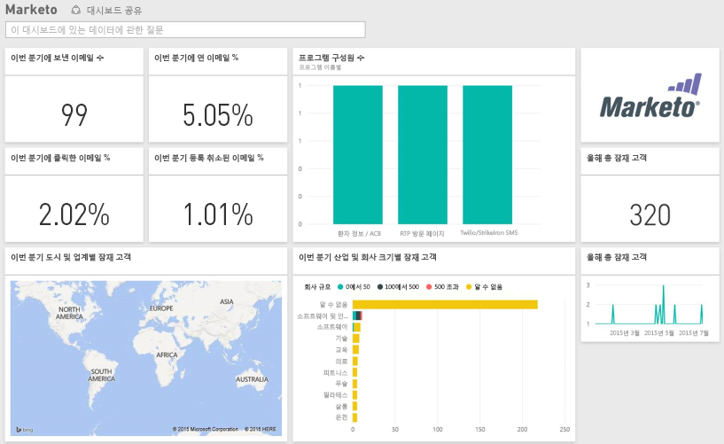

# Power BI로 Marketo에 연결
Power BI용 Marketo 콘텐츠 팩을 사용하면 잠재 고객 및 해당 활동과 관련된 데이터로 Marketo 계정을 파악할 수 있습니다. 이 연결을 만들면 데이터가 검색되고, 해당 데이터를 기반으로 하여 대시보드 및 관련 보고서가 자동으로 제공됩니다.

Power BI용 [Marketo 콘텐츠 팩](https://app.powerbi.com/getdata/services/marketo)에 연결합니다.

## 연결 방법
1. 왼쪽 탐색 창의 맨 아래에 있는 **데이터 가져오기** 를 선택합니다.
   
   
2. **서비스** 상자에서 **가져오기**를 선택합니다.
   
    
3. **Marketo** \> **가져오기**를 선택합니다.
   
   
4. Marketo 또는 Marketo 관리자가 제공한 Marketo REST 엔드포인트를 입력하고 다음을 선택합니다.
   
   
   
   Marketo REST 엔드포인트에 대해 자세히 읽어보세요. [http://developers.marketo.com/documentation/rest/endpoint-url/](http://developers.marketo.com/documentation/rest/endpoint-url/).
5. **기본** 인증 방법을 사용하여 클라이언트 ID를 **사용자 이름** 으로 입력하고 클라이언트 암호를 **암호**로 입력합니다. 클라이언트 ID 및 클라이언트 암호는 Marketo 또는 marketo 관리자([http://developers.marketo.com/documentation/rest/custom-service/](http://developers.marketo.com/documentation/rest/custom-service/))에서 사용할 수 있습니다. 
   
   
   
   이렇게 하면 *Power BI용 Marketo* 콘텐츠 팩에서 [Marketo 분석](https://powerbi.microsoft.com/integrations/marketo) 데이터에 액세스할 수 있으므로, Power BI의 데이터를 분석할 수 있습니다. 하루에 한 번 데이터가 새로 고쳐집니다.
6. Marketo 계정에 연결되면 모든 데이터를 포함하는 대시보드가 로드됩니다.
   
   

**다음 단계**

* 대시보드 맨 위에 있는 [질문 및 답변 상자에 질문](consumer/end-user-q-and-a.md)합니다.
* 대시보드에서 [타일을 변경](service-dashboard-edit-tile.md)합니다.
* [타일을 선택](consumer/end-user-tiles.md)하여 원본 보고서를 엽니다.
* 데이터 집합을 매일 새로 고치도록 예약하는 경우 새로 고침 일정을 변경하거나 **지금 새로 고침**을 사용하여 필요할 때 새로 고칠 수 있습니다.

## 포함된 내용
다음 데이터는 활동이 오늘과 1년 전 사이에 발생한 Power BI의 Marketo에서 제공됩니다.

| 표 이름 | 설명 |
| --- | --- |
| EmailActivities |장치, 범주, 반송된 개수 및 비율, 클릭한 개수 및 비율, 열린 개수 및 비율 및 프로그램 이름에 대한 세부 정보를 포함하여 잠재 고객/연락처로 전송된 메일에 대한 데이터입니다. Power BI에 표시되는 메일 활동은 절대 메일 배달 보고서로, 데이터에 추가 논리를 적용하지 않습니다. 이 때문에 Marketo 클라이언트와 Power BI 간에 일부 다른 결과가 표시될 수도 있습니다. |
| ProgramActivites |상태 변경이 있는 프로그램에 대한 데이터입니다. 이유, 성공, 프로그램 취득 횟수 및 비율, 프로그램 성공 횟수 및 비율과 같은 정보가 포함됩니다. |
| WebPageActivities |검색 에이전트, 사용자 에이전트, 웹 페이지 및 시간을 포함하여 사용자 웹 페이지 방문의 데이터입니다. |
| Datetable |오늘부터의 날짜 및 지난 연도의 날짜입니다.  날짜별로 Marketo 데이터를 분석할 수 있습니다. |
| 잠재 고객 |회사, 수익 크기, 직원 수, 국가, 업계, 잠재 고객 점수 및 잠재 고객 상태와 같은 잠재 고객 정보입니다. 잠재 고객은 메일, 프로그램 및 웹 페이지 활동 데이터의 현재 상태에 따라 검색됩니다. |

모든 날짜는 UTC를 기준으로 합니다. 현재 계정의 표준 시간대에 따라 날짜가 달라질 수 있습니다(Marketo 클라이언트에 표시되는 것과 유사).

## 시스템 요구 사항
* 연결에 사용할 Marketo 계정에 잠재 고객 및 활동에 액세스할 수 있는 권한이 있습니다.
* 데이터에 연결하는 데 사용할 수 있는 충분한 API 호출이 있습니다.  Marketo에 각 계정에 대한 API가 있습니다.  제한에 도달하면 Power BI에 데이터를 로드할 수 없습니다. 

**API 제한 세부 정보**

Marketo에서 데이터 가져오기는 Marketo API를 사용합니다. Marketo의 각 고객은 Marketo API를 사용하는 모든 응용 프로그램 간에 공유되는 총 API 호출 수가 하루에 10,000개로 제한됩니다. Power BI 통합 및 기타 통합에 API를 사용할 수 있습니다. API에 대한 자세한 내용은 다음을 참조하세요. <http://developers.marketo.com/documentation/rest/>.

Power BI가 Marketo에 수행하는 API 호출 수는 Marketo 계정의 데이터 양에 따라 달라집니다. Power BI는 작년의 모든 잠재 고객 및 활동을 가져옵니다. 다음은 가져올 때 Power BI가 사용하는 API 호출 수와 Marketo의 데이터 예제입니다.  

| 데이터 형식 | 행 수 | API 호출 |
| --- | --- | --- |
| 잠재 고객 정보 |15,000 |50 |
| 메일 활동 |150,000 |1,000 |
| 프로그램 활동 |15,000 |100 |
| 웹 활동 |150,000 |1,000 |
| 프로그램 변경 |7,500 |50 |
| **API 호출 총수** | |**2,200** |

## 다음 단계
[Power BI란?](power-bi-overview.md)

[Power BI에 대한 데이터 가져오기](service-get-data.md)

[Power BI 블로그: Power BI를 사용하여 Marketo 데이터 모니터링 및 분석](http://blogs.msdn.com/b/powerbi/archive/2015/03/19/monitor-and-analyze-your-marketo-data-with-power-bi.aspx)

