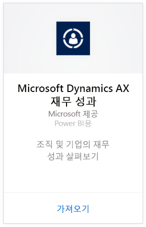
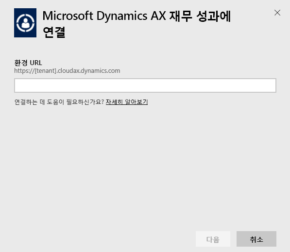
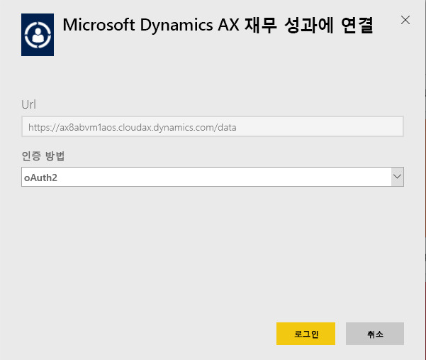
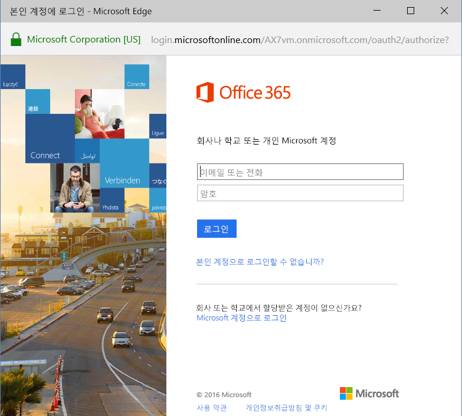
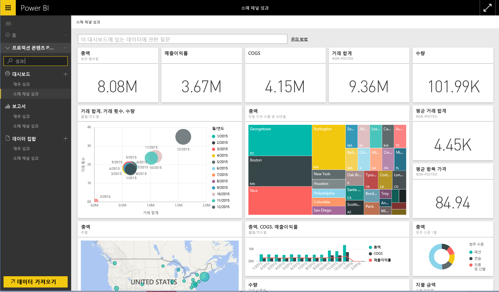

# Power BI로 Microsoft Dynamics AX 콘텐츠 팩에 연결
Microsoft Dynamics AX에는 여러 비즈니스 사용자를 대상으로 하는 세 개의 Power BI 콘텐츠 팩이 있습니다. CFO를 위해 특별히 설계된 재무 성과 콘텐츠 팩은 조직의 회계 실적에 대한 정보에 액세스하도록 해줍니다. 소매 채널 실적 콘텐츠 팩은 소매 및 상용 데이터에서 직접 그리는 방식으로 추세를 예측하고 정보를 파악하는 데 중점을 두는 채널 관리자를 위한 것입니다. 비용 관리는 COO 및 CFO에 대해 설계되고 작업 실적에 대한 세부 정보를 제공합니다.

[!INCLUDE [include-short-name](./includes/service-deprecate-content-packs.md)]

Microsoft Dynamics AX [소매 채널 실적](https://app.powerbi.com/getdata/services/dynamics-ax-retail-channel-performance), [재무 실적](https://app.powerbi.com/getdata/services/dynamics-ax-financial-performance) 또는 Power BI용 [비용 관리](https://app.powerbi.com/getdata/services/dynamics-ax-cost-management)에 연결합니다.

## 연결 방법
1. 왼쪽 탐색 창의 맨 아래에 있는 **데이터 가져오기** 를 선택합니다.
   
   
2. **서비스** 상자에서 **가져오기**를 선택합니다.
   
   
3. Dynamics AX 콘텐츠 팩 중 하나를 선택하고 **가져오기**를 선택합니다.
   
   
4. Dynamics AX 7 환경의 URL을 지정합니다. 아래 [이러한 매개 변수 찾기](#FindingParams)에서 세부 정보를 참조하세요.
   
   
5. **인증 방법**에 대해 **oAuth2** \> **로그인**을 선택합니다. 메시지가 표시되면 Dynamics AX 자격 증명을 입력합니다.
   
    
   
    
6. 승인되면 가져오기 프로세스가 자동으로 시작됩니다. 완료되면 새 대시보드, 보고서 및 모델이 탐색 창에 나타납니다. 대시보드를 선택하여 가져온 데이터를 표시합니다.
   
     

**다음 단계**

* 대시보드 맨 위에 있는 [질문 및 답변 상자에 질문](consumer/end-user-q-and-a.md)합니다.
* 대시보드에서 [타일을 변경](service-dashboard-edit-tile.md)합니다.
* [타일을 선택](consumer/end-user-tiles.md)하여 원본 보고서를 엽니다.
* 데이터 세트를 매일 새로 고치도록 예약하는 경우 새로 고침 일정을 변경하거나 **지금 새로 고침**을 사용하여 필요할 때 새로 고칠 수 있습니다.

## 포함된 내용
콘텐츠 팩은 Dynamics AX 7 OData 피드를 사용하여 각각 소매 채널, 재무 및 비용 관리 실적에 각각 관련된 데이터를 가져옵니다.

## 시스템 요구 사항
이 콘텐츠 팩은 Dynamics AX 7 환경 URL이 필요하고 사용자는 OData 피드에 액세스할 수 있어야 합니다.

## 매개 변수 찾기

Dynamics AX 7 환경 URL은 사용자가 로그인할 때 브라우저에서 찾을 수 있습니다. 루트 Dynamics AX 환경의 URL을 Power BI 대화 상자에 복사해 넣기만 하면 됩니다.

## 문제 해결
인스턴스 크기에 따라 데이터를 로드하는 데 시간이 걸릴 수 있습니다. Power BI 내에서 빈 보고서가 나타나는 경우 보고서에 필요한 OData 테이블에 액세스했는지 확인하세요.

## 다음 단계
[Power BI에서 시작](service-get-started.md)

[Power BI에서 데이터 가져오기](service-get-data.md)

