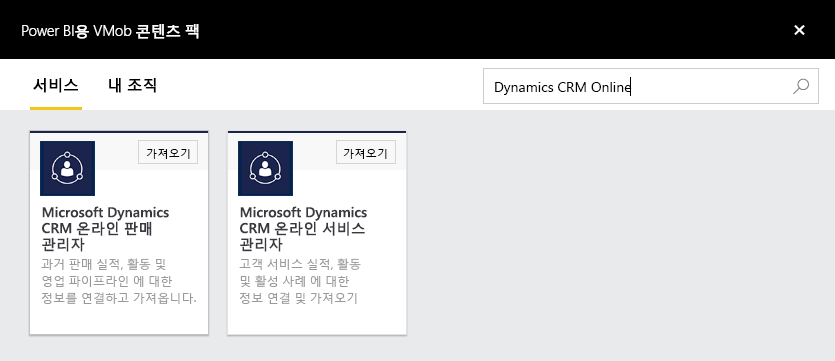
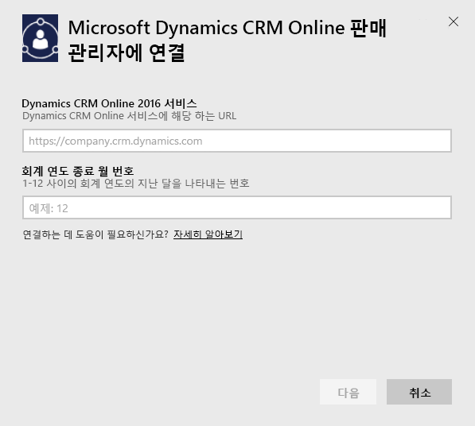
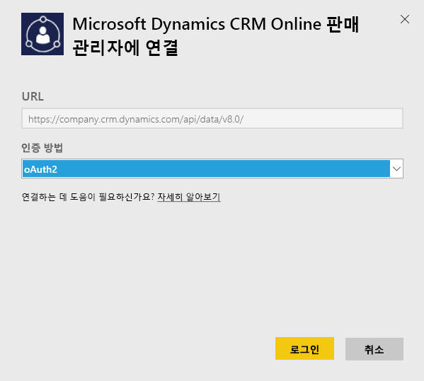
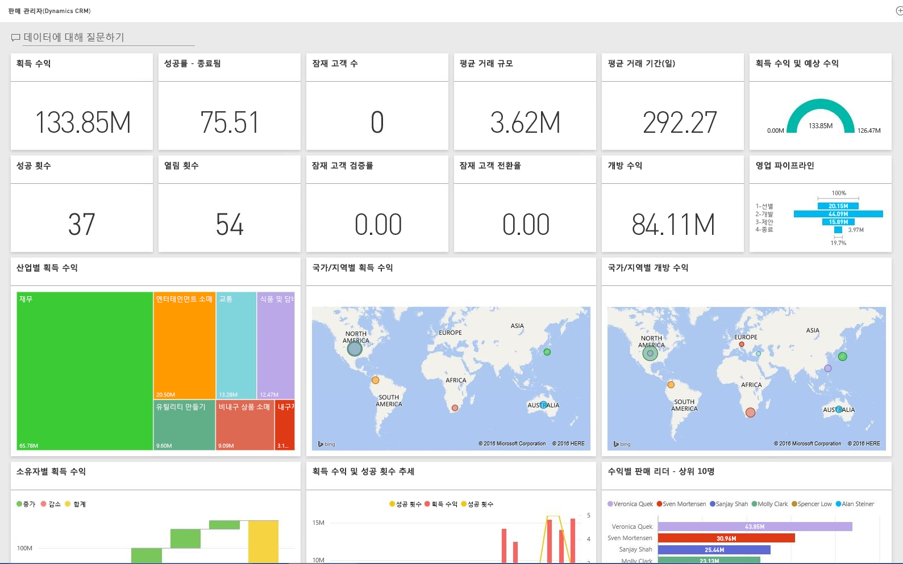

# Power BI로 Microsoft Dynamics CRM에 연결
Power BI용 Microsoft Dynamics CRM Online을 사용하면 데이터에 쉽게 액세스하고 분석할 수 있습니다. Power BI는 OData 피드를 사용하여 계정, 활동, 기회, 제품, 잠재 고객, 사용자 등과 같은 필요한 모든 엔터티 및 조치가 포함된 설명 모델을 만듭니다. 앱을 설치한 후 Power BI 서비스([https://powerbi.com](https://powerbi.com)) 및 Power BI 모바일 앱에서 대시보드 및 보고서를 볼 수 있습니다. 

Dynamics CRM Online [판매 관리자](https://msit.powerbi.com/groups/me/getdata/services/dynamics-crm-sales-manager) 또는 [서비스 관리자](https://msit.powerbi.com/groups/me/getdata/services/dynamics-crm-customer-service)에 연결합니다. Power BI를 사용하여 [Dynamics CRM Online 통합](https://powerbi.microsoft.com/integrations/microsoft-dynamicscrm)에 대해 자세히 알아보세요.

이 연결에는 **Microsoft Dynamics CRM Online 2016 이상**이 필요합니다. [요구 사항](#Requirements)에 대한 자세한 내용은 아래에 나와 있습니다.

## 연결 방법
[!INCLUDE [powerbi-service-apps-get-more-apps](./includes/powerbi-service-apps-get-more-apps.md)]
3. **Microsoft Dynamics CRM 판매 관리자** 또는 **Microsoft Dynamics CRM 서비스 관리자**를 선택하고 **연결**을 클릭합니다.
   
   
4. 계정과 연결된 서비스 URL을 제공합니다.  `https://company.crm.dynamics.com` 형식이며 [아래](#FindingParams)에서 자세한 내용을 확인합니다.
   
   
5. 메시지가 표시되면 자격 증명을 제공합니다(브라우저를 사용하여 이미 로그인한 경우 이 단계를 건너뛸 수 있음). 인증 방법에 대해 **oAuth2**를 입력하고 **로그인**을 클릭합니다.
   
   
6. 연결하면 사용자 고유의 데이터로 채워진, 판매 관리자 또는 서비스 관리자용으로 사용자 지정된 대시보드가 표시됩니다.
   
   

## Microsoft Dynamics CRM 대시보드 및 보고서 보기
[!INCLUDE [powerbi-service-apps-open-app](./includes/powerbi-service-apps-open-app.md)]

[!INCLUDE [powerbi-service-apps-open-app](./includes/powerbi-service-apps-what-now.md)]

## 포함된 내용
아래 섹션에서는 [판매 관리자](#Sales) 및 [서비스 관리자](#Service) 가상 사용자에 포함된 내용에 대해 자세히 설명합니다.

데이터는 Dynamics CRM Online 사용자에게 할당된 보안 역할에 따라 제한됩니다.

대시보드 및 보고서는 팀 또는 그룹에 집중된 단기적인 데이터에 대한 운영 보고를 제공하기 위한 것입니다. 각 쿼리는 Dynamics CRM Online에서 최대 100K의 레코드를 검색하는 것으로 제한됩니다. 조직의 데이터양이 많아 이 제한을 초과하면 데이터 새로 고침 Dynamics CRM Online이 종료됨에 따라 프로비저닝에 실패합니다. 계정이 너무 큰 경우 Power BI Desktop을 통해 연결하여 사용자 지정 솔루션을 구축하는 방법을 고려해 보세요.

### 판매 관리자
대시보드 및 보고서는 다음과 같은 주요 메트릭을 포함합니다.  

* 획득 수익   
* 성공률   
* 개방 수익   
* 상실 수익   
* 예상 수익  
* 평균 거래 규모 및 기타  

또한 다음과 같은 주요 차트도 포함합니다.  

* 획득 및 상실 수익 추세, 획득 수익 및 예상 수익 추세  
* 산업, 영역, 지역과 같은 다양한 차원별 획득 수익   
* 수익, 활동별 판매 리더   
* 최상위 거래처, 최상위 획득/손실 서래    
* 새 잠재 고객 추세, 영업 기회 보유 현황 및 기타   

이러한 메트릭 및 차트를 통해 영업 조직 성능을 파악하고 영업팀 간에 영업 기회 보유 현황을 분석할 수 있습니다.

다음 표에는 이 서비스에서 사용 가능한 CRM 엔터티가 나열되어 있으며 각 엔터티 레코드에 적용된 필터에 대한 세부 정보도 제공합니다.

| CRM 엔터티 | 적용된 필터 |
| --- | --- |
| 계정 |지난 365일 동안 수정된 영업 기회와 관련된 모든 거래처입니다. |
| 활동 |지난 90일 동안 수정된 모든 활동   [modifiedon] > 오늘 - 90일 |
| 사업부 |사용하지 않도록 설정된 모든 사업부   [isdisabled] = false |
| 잠재 고객 |지난 180일 동안 수정된 모든 잠재 고객   [modifiedon] > 오늘 - 180일 |
| 영업 기회 |지난 365일 동안 수정된 모든 영업 기회   [modifiedon] > 오늘 - 365일 |
| 영업 기회 제품 |지난 365일 동안 수정된 모든 영업 기회 제품   [modifiedon] > 오늘 - 365일 |
| 제품 |모든 활성 제품   [statecode] <> 1 |
| 지역 |모든 지역 |
| 사용자 |모든 활성 사용자 및 위임되지 않은 관리자    [isdisabled] = false 및 [accessmode] <> 4 |

### 서비스 관리자
이러한 대시보드 및 보고서는 다음과 같은 주요 메트릭을 포함합니다.  

* CSAT 백분율   
* SLA Met 백분율   
* 에스컬레이션된 케이스 백분율   
* 평균 처리 시간   
* 총 해결된 케이스  
* 총 활성 케이스  
* 케이스에 참조 자료 문서가 사용된 횟수 및 기타    

또한 다음과 같은 주요 차트도 포함합니다.   

* 들어오는 케이스, 해결된 케이스, 에스컬레이션된 케이스에 대한 케이스 볼륨 추세   
* 원본, 위치, 우선 순위, 형식 등 다양한 차원별 케이스 볼륨  
* CSAT 백분율, SLA met 백분율, 활동, 해결된 케이스별 리더  
* 가장 많이 사용되고 가장 많이 본 참조 자료 문서 및 기타  
    이러한 메트릭 및 차트를 통해 지원 조직 성능을 파악하고 서비스 팀 및 서비스 큐 간에 활성 케이스 워크로드를 분석할 수 있습니다.

다음 표에는 이 서비스에서 사용 가능한 CRM 엔터티가 나열되어 있으며 각 엔터티 레코드에 적용된 필터에 대한 세부 정보도 제공합니다.

| CRM 엔터티 | 적용된 필터 |
| --- | --- |
| 계정 |지난 90일 동안 수정된 케이스와 관련된 모든 거래처입니다. |
| 활동 |지난 90일 동안 수정된 모든 활동   [modifiedon] > 오늘 - 90일 |
| 케이스 |지난 90일 동안 수정된 모든 케이스   [modifiedon] > 오늘 - 90일 |
| 케이스 해결 활동 |지난 90일 동안 수정된 모든 케이스 해결 활동   [modifiedon] > 오늘 - 90일 |
| 문의처 |지난 90일 동안 수정된 케이스와 관련된 모든 문의처입니다. |
| 기술 항목 |모든 최신 버전의 기술 항목    [islatestversion] = true |
| 기술 항목 인시던트 |지난 90일 동안 수정된 모든 기술 항목 인시던트   [modifiedon] > 오늘 - 90일 |
| 큐 |모든 활성 큐    [statecode] = 0 |
| 큐 항목 |지난 365일 동안 생성된 모든 케이스 관련 큐 항목    [createdon] > 오늘 - 365일 및   [objecttypecode] = 112 |
| 사용자 |모든 활성 사용자    [isdisabled] = false |

## 시스템 요구 사항
* 유효한 Dynamics CRM Online 2016 이상 인스턴스(Power BI는 온-프레미스 CRM 버전에서 작동하지 않음) 2016 이상이 설치되지 않은 경우:
* 관리자가 사이트 설정에서 OData 엔드포인트를 사용하도록 설정해야 합니다.
* 모든 테이블에 100k 미만의 레코드를 가진 계정. 계정에 100k 이상의 레코드에 대한 액세스가 있는 경우 가져오기가 실패합니다.

## 매개 변수 찾기
인스턴스의 주소는 브라우저의 URL 표시줄에서 찾을 수 있습니다. 일반적으로 형식은 다음과 같습니다. `https://[instance_name].crm.dynamics.com`

Power BI는 Dynamics CRM 2016 엔드포인트만을 지원합니다. 이전 버전의 CRM Online에서 연결이 작동하지 않습니다. Power BI Desktop을 사용하여 계정에 직접 연결합니다.

## 문제 해결
연결하는 데 문제가 있는 경우 다음을 확인하세요.  

* 정확한 인스턴스 URL을 제공하는지(관리자와 확인)  
* 인스턴스가 CRM Online 2016인지  
* OData 엔드포인트가 사용하도록 설정되었는지  

또한 OData URL `https://[instance_name].crm.dynamics.com/api/data/v8.0/`을 사용하여 Power BI Desktop에서 직접 연결해 보세요.

Dynamics CRM Online 2016이 설치되어 있지만 여전히 연결 문제가 있는 경우 CRM 관리자에게 문의하여 모든 사용 가능한 업데이트가 있는지 확인하세요.

CRM Online 2016 이상이 설치되지 않은 경우 Power BI Desktop을 사용하여 계정에 직접 연결합니다.

"100000 레코드라는 최대 한도 초과 쿼리로 데이터 새로 고침 실패" 오류가 표시되는 경우 Power BI Desktop에서 직접 연결하거나 CRM 솔루션 템플릿을 활용하는 방법을 고려하세요.

## 다음 단계
* [Power BI에서 앱이란?](service-create-distribute-apps.md)
* [Power BI에서 데이터 가져오기](service-get-data.md)
* 궁금한 점이 더 있나요? [Power BI 커뮤니티에 질문합니다.](http://community.powerbi.com/)

