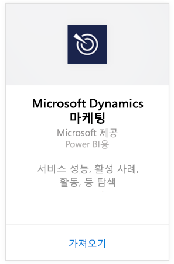
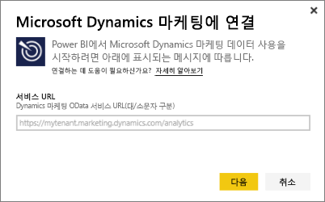
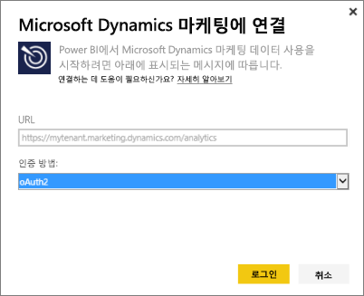
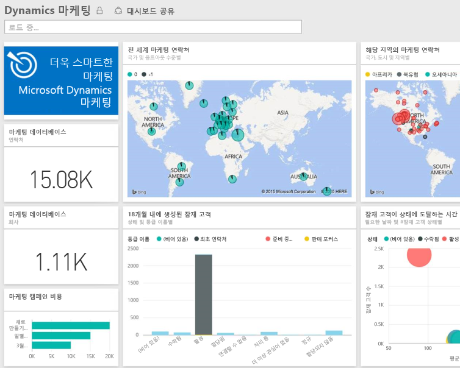

# Power BI로 Microsoft Dynamics Marketing에 연결
Power BI용 Microsoft Dynamics 마케팅 콘텐츠 팩을 사용하면 Dynamics 마케팅의 데이터에 쉽게 액세스하고 분석할 수 있습니다. 콘텐츠 팩은 프로그램, 캠페인, 마케팅 연락처 및 회사, 잠재 고객, 잠재 고객 상호 작용 및 잠재 고객 점수 매기기, 메일 마케팅 메시지 및 웹 사이트, 동작 관찰, 예산, 금융 거래, 성과 KPI 등과 같은 필요한 모든 엔터티 및 측정값이 포함된 OData 피드 기반의 설명 모델을 사용합니다. 

Power BI용 [Dynamics 마케팅 콘텐츠 팩](https://app.powerbi.com/getdata/services/microsoft-dynamics-marketing)에 연결합니다.

>[!NOTE]
>Dynamics 마케팅 인스턴스에 대한 유효한 OData URL을 지정해야 합니다(콘텐츠 팩은 온-프레미스 CRM 버전에서 작동하지 않음). 아래의 추가 요구 사항을 참조하세요.

## 연결 방법
1. 왼쪽 탐색 창의 맨 아래에 있는 데이터 가져오기를 선택합니다.
   
    
2. **서비스** 상자에서 **가져오기**를 선택합니다.
   
    
3. **Microsoft Dynamics 마케팅** \> **가져오기**를 선택합니다.
   
   
4. 계정과 연결된 OData URL을 제공합니다.  "https://[instance\_name].marketing.dynamics.com/analytics" 형식입니다.
   
   
5. 메시지가 표시되면 자격 증명을 제공합니다(브라우저를 사용하여 이미 로그인한 경우 이 단계를 건너뛸 수 있음). 인증 방법에 대해 **oAuth2** 를 입력하고 **로그인**을 클릭합니다.
   
   
6. 연결하면 사용자 고유의 데이터로 채워진 Dynamics 마케팅 대시보드가 표시됩니다. 왼쪽 탐색 창에서 노란색 별표는 새 항목을 표시합니다.
   
   

**다음 단계**

* 대시보드 맨 위에 있는 [질문 및 답변 상자에 질문](power-bi-q-and-a.md)합니다.
* 대시보드에서 [타일을 변경](service-dashboard-edit-tile.md)합니다.
* [타일을 선택](service-dashboard-tiles.md)하여 원본 보고서를 엽니다.
* 데이터 집합을 매일 새로 고치도록 예약하는 경우 새로 고침 일정을 변경하거나 **지금 새로 고침**을 사용하여 필요할 때 새로 고칠 수 있습니다.

## 시스템 요구 사항
* Dynamics 마케팅 인스턴스에 대한 유효한 OData URL을 지정해야 합니다(콘텐츠 팩은 온-프레미스 CRM 버전에서 작동하지 않음).  
* 관리자가 사이트 설정에서 OData 끝점을 사용하도록 설정해야 합니다. **조직 데이터 서비스** 섹션의 **홈 \> 설정 \> 사이트 설정**으로 이동하여 OData 끝점의 주소를 찾을 수 있습니다.  OData URL의 형식은 다음과 같습니다. https://[instance\_name].marketing.dynamics.com/analytics  
* Microsoft Dynamics 마케팅에 액세스하는 데 사용하는 사용자 계정/ID는 Power BI에 사용하기 위해 등록한 것과 같아야 합니다. Microsoft Dynamics 마케팅에 로그인할 때 Power BI에 사용하는 것과 동일한 ID로 자동 로그인됩니다. 다른 계정으로 Microsoft Dynamics 마케팅에 로그인하려는 경우 다른 계정을 사용하는 Power BI 사용자로 등록하세요. 예정된 릴리스에서 이 문제가 해결되기를 바랍니다.   

## 문제 해결
Dynamics CRM 계정에 연결할 때 "로그인 실패" 메시지가 표시되는 경우 CRM Online OData 피드에 액세스하는 데 사용하는 것과 동일한 계정으로 Power BI에 로그인 중인지 확인합니다. 브라우저에서도 피드에 로그인하여 테스트합니다.

관리자에게 올바른 OData URL을 확인하고 OData 끝점이 사용하도록 설정되었는지 확인합니다.

사용 중인 Dynamics 마케팅의 버전을 확인하세요. 18.0 및 18.1 버전에서 추가로 수정되었지만, 여전히 문제가 발생하고 이전 버전을 사용하는 경우, 업그레이드를 고려하세요.

그래도 문제가 발생하는 경우 지원 티켓을 열어 Power BI 팀에 문의하세요.

* Power BI 앱에 있는 동안 물음표 \> **고객 지원**을 선택합니다.
* 이 문서를 보고 있는 Power BI 지원 사이트에서 페이지의 오른쪽에 있는 **고객 지원** 을 선택합니다.

## 다음 단계
[Power BI에 대한 데이터 가져오기](service-get-data.md)

[Power BI 시작](service-get-started.md)

