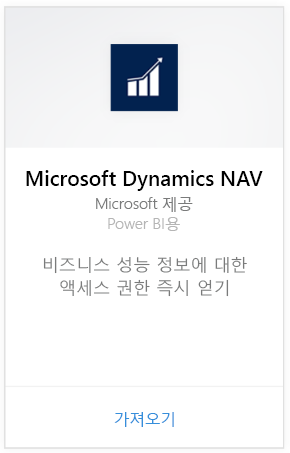
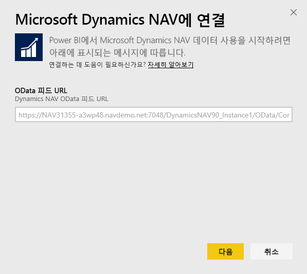
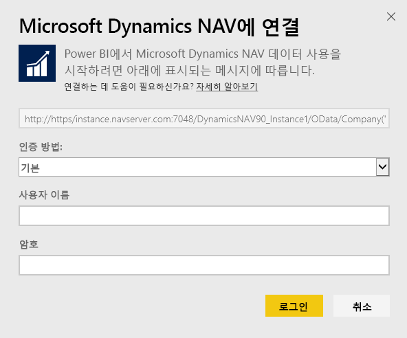
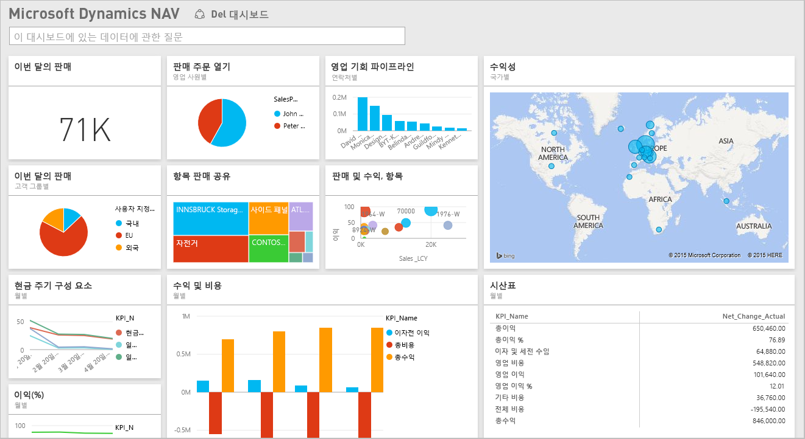

# Power BI로 Microsoft Dynamics NAV에 연결
Power BI를 사용하면 Microsoft Dynamics NAV에 대한 정보를 쉽게 파악할 수 있습니다. Power BI는 영업 및 재무를 검색한 다음 해당 데이터를 기반으로 기본 대시보드 및 보고서를 사용하여 앱을 구축합니다. Power BI는 데이터가 검색되는 원본 테이블(이 경우에 영업 및 재무 데이터)에 대한 사용 권한이 필요합니다. 요구 사항에 대한 자세한 내용은 아래에 나와 있습니다. 앱을 설치한 후 Power BI 서비스([https://powerbi.com](https://powerbi.com)) 및 Power BI 모바일 앱에서 대시보드 및 보고서를 볼 수 있습니다. 

[Power BI용 Microsoft Dynamics NAV에 연결](https://app.powerbi.com/getdata/services/microsoft-dynamics-nav)하거나 Power BI와의 [Dynamics NAV 통합](https://powerbi.microsoft.com/integrations/microsoft-dynamics-nav)에 대해 자세히 알아보세요.

## 연결 방법
[!INCLUDE [powerbi-service-apps-get-more-apps](./includes/powerbi-service-apps-get-more-apps.md)]

3. **Microsoft Dynamics NAV**를 선택하고 **가져오기**를 선택합니다.  
   
4. 대화 상자가 나타나면 Microsoft Dynamics NAV OData URL을 입력합니다. URL은 다음 패턴과 일치해야 합니다.
   
    `https//instance.navserver.com:7048/DynamicsNAV90_Instance1/OData/Company('CRONUS%20International%20Ltd.')`
   
   * NAV 서버 이름이 있는 "instance.navserver.com"
   * NAV 서버 인스턴스 이름이 있는 "DynamicsNAV90\_Instance1"
   * NAV 회사 이름이 있는 "Company('CRONUS%20International%20Ltd.')"
     
     이 URL을 구하는 간편한 방법은 Dynamics NAV에서 웹 서비스로 이동하여 powerbifinance 웹 서비스를 찾고 OData URL을 복사하는 것입니다. 하지만 URL 문자열에서 “/powerbifinance”은 제외합니다.  
     
5. **기본**을 선택하고 Microsoft Dynamics NAV 자격 증명을 입력합니다.
   
    관리자 자격 증명(또는 Microsoft Dynamics NAV 계정에 대해 영업 및 재무 데이터 권한 이상)이 필요합니다.  기본(사용자 이름 및 암호) 인증이 현재 지원됩니다.
   
    
6. Power BI가 Microsoft Dynamics NAV 데이터를 검색하고 즉시 사용 가능한 대시보드 및 보고서를 만듭니다.   
   

## 대시보드 및 보고서 보기
[!INCLUDE [powerbi-service-apps-open-app](./includes/powerbi-service-apps-open-app.md)]

[!INCLUDE [powerbi-service-apps-open-app](./includes/powerbi-service-apps-what-now.md)]

## 포함된 내용
대시보드 및 보고서에는 다음 테이블(대/소문자 구분)의 데이터가 포함됩니다.  

* ItemSalesAndProfit  
* ItemSalesByCustomer  
* powerbifinance  
* SalesDashboard  
* SalesOpportunities  
* SalesOrdersBySalesPerson  
* TopCustomerOverview  

## 시스템 요구 사항
Microsoft Dynamics NAV 데이터를 Power BI에 가져오려면 데이터를 검색할 원본 영업 및 재무 데이터 테이블에 대한 권한이 필요합니다(위에 나열됨). 테이블에도 일부 데이터가 있어야 하므로 현재 빈 테이블을 가져오는 데 실패합니다.

## 문제 해결
Power BI는 Microsoft Dynamics NAV의 웹 서비스를 사용하여 데이터를 검색합니다. Microsoft Dynamics NAV 인스턴스에 데이터가 많이 있는 경우 웹 서비스 사용에 미치는 영향을 최소화하려면 새로 고침 빈도를 변경합니다. 다른 방법은 모든 관리자가 자체 앱을 만드는 대신 한 관리자가 앱을 만들어 공유하는 것입니다.

**"매개 변수 유효성 검사를 하지 못했습니다. 모든 매개 변수가 유효한지 확인하세요."**  
Microsoft Dynamics NAV URL 입력 후에 이 오류가 표시되면 다음 요구 사항이 충족되었는지 확인합니다.

* URL은 정확하게 이 패턴을 따릅니다.
  
    `https//instance.navserver.com:7048/DynamicsNAV90_Instance1/OData/Company('CRONUS%20International%20Ltd.')`
  
  * NAV 서버 이름이 있는 "instance.navserver.com"
  * NAV 서버 인스턴스 이름이 있는 "DynamicsNAV90\_Instance1"
  * NAV 회사 이름이 있는 "Company('CRONUS%20International%20Ltd.')"
* 모든 문자가 소문자인지 확인합니다.  
* URL이 'https'인지 확인합니다.  
* URL의 끝에 슬래시가 없는지 확인합니다.

**"로그인하지 못했습니다."**  
로그인하기 위해 Microsoft Dynamics NAV 자격 증명을 사용한 후에 "로그인 실패" 오류가 발생하는 경우 다음 중 하나의 문제일 수 있습니다.

* 사용 중인 계정은 계정에서 Microsoft Dynamics NAV 데이터를 검색할 권한이 없습니다. 관리자 계정인지 확인하고 다시 시도하세요.
* 연결하려는 Dynamics NAV 인스턴스에는 유효한 SSL 인증서가 없습니다. 이 경우 보다 자세한 오류 메시지가 표시됩니다.("신뢰할 수 있는 SSL 관계를 설정할 수 없음")  자체 서명 인증서는 지원되지 않습니다.

**"Oops"**  
인증 대화 상자를 전달한 후에 "Oops" 오류 대화 상자가 표시되면 콘텐츠 팩에 대한 데이터를 로드하는 동안 Power BI에 문제가 발생합니다.

* URL가 위에서 지정한 패턴을 따르는지 확인합니다. 일반적인 실수를 지정합니다.
  
    `https//instance.navserver.com:7048/DynamicsNAV90\_Instance1/OData`
  
    그러나 NAV 회사 이름을 가진 'Company('CRONUS%20International%20Ltd.')' 섹션을 포함해야 합니다.
  
    `https//instance.navserver.com:7048/DynamicsNAV90\_Instance1/OData/Company('CRONUS%20International%20Ltd.')`

## 다음 단계
* [Power BI에서 앱이란?](service-create-distribute-apps.md)
* [Power BI에서 데이터 가져오기](service-get-data.md)
* 궁금한 점이 더 있나요? [Power BI 커뮤니티에 질문합니다.](http://community.powerbi.com/)

