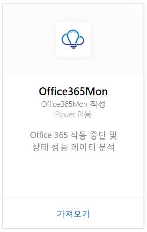
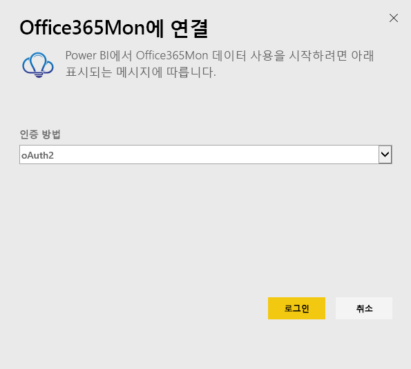
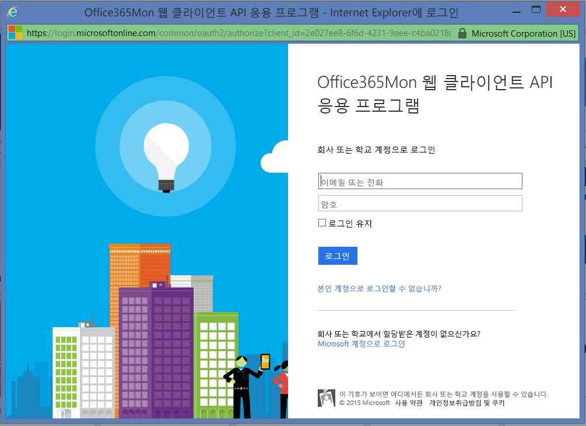
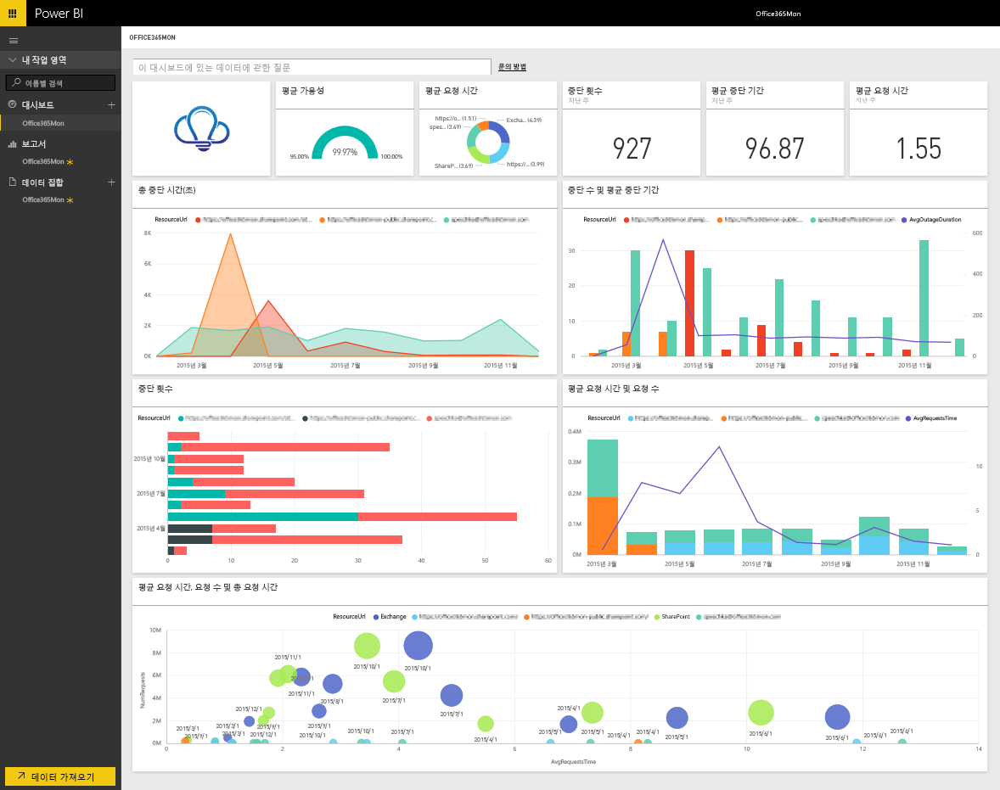

# Power BI로 Office365Mon에 연결
Power BI와 Office365Mon 콘텐츠 팩을 사용하면 Office 365 작동 중단 및 상태 성능 데이터를 간편하게 분석할 수 있습니다. Power BI는 작동 중단 및 상태 프로브를 비롯한 데이터를 검색한 다음 해당 데이터를 기반으로 기본 대시보드 및 보고서를 작성합니다.

Power BI용 [Office365Mon 콘텐츠 팩](https://app.powerbi.com/groups/me/getdata/services/office365mon)에 연결하세요.

>[!NOTE]
>Power BI 콘텐츠 팩을 연결하여 로드하려면 Office365Mon 관리자 계정이 필요합니다.

## 연결 방법
1. 왼쪽 탐색 창의 맨 아래에 있는 **데이터 가져오기** 를 선택합니다.
   
   
2. **서비스** 상자에서 **가져오기**를 선택합니다.
   
    
3. **Office365Mon** \> **가져오기**를 선택합니다.
   
   
4. 인증 방법에 대해 **oAuth2** \> **로그인**을 선택합니다.
   
   메시지가 표시되면 Office365Mon 관리자 자격 증명을 입력하고 인증 프로세스를 따릅니다.
   
   
   
   
5. Power BI가 데이터를 가져오면 왼쪽 탐색 창에 새 대시보드, 보고서 및 데이터 집합이 표시됩니다. 새 항목은 노란색 별표 \*가 표시됩니다. Office365Mon 항목을 선택하세요.
   
   

**다음 단계**

* 대시보드 맨 위에 있는 [질문 및 답변 상자에 질문](power-bi-q-and-a.md)합니다.
* 대시보드에서 [타일을 변경](service-dashboard-edit-tile.md)합니다.
* [타일을 선택](service-dashboard-tiles.md)하여 원본 보고서를 엽니다.
* 데이터 집합을 매일 새로 고치도록 예약하는 경우 새로 고침 일정을 변경하거나 **지금 새로 고침**을 사용하여 필요할 때 새로 고칠 수 있습니다.

## 문제 해결
Office365Mon 구독 자격 증명을 사용하여 로그인한 후에 **“로그인하지 못했습니다.”** 오류가 표시되면 사용 중인 계정에 사용자 계정에서 Office365Mon 데이터를 검색할 권한이 없는 것입니다. 관리자 계정인지 확인하고 다시 시도하세요.

## 다음 단계
[Power BI 시작](service-get-started.md)

[Power BI에 대한 데이터 가져오기](service-get-data.md)

