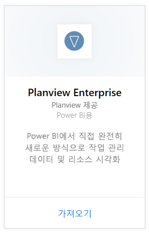
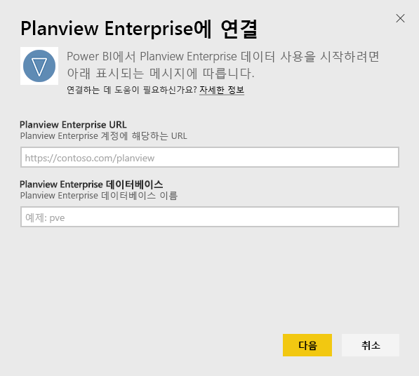
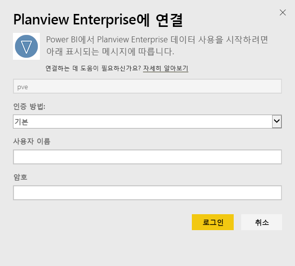
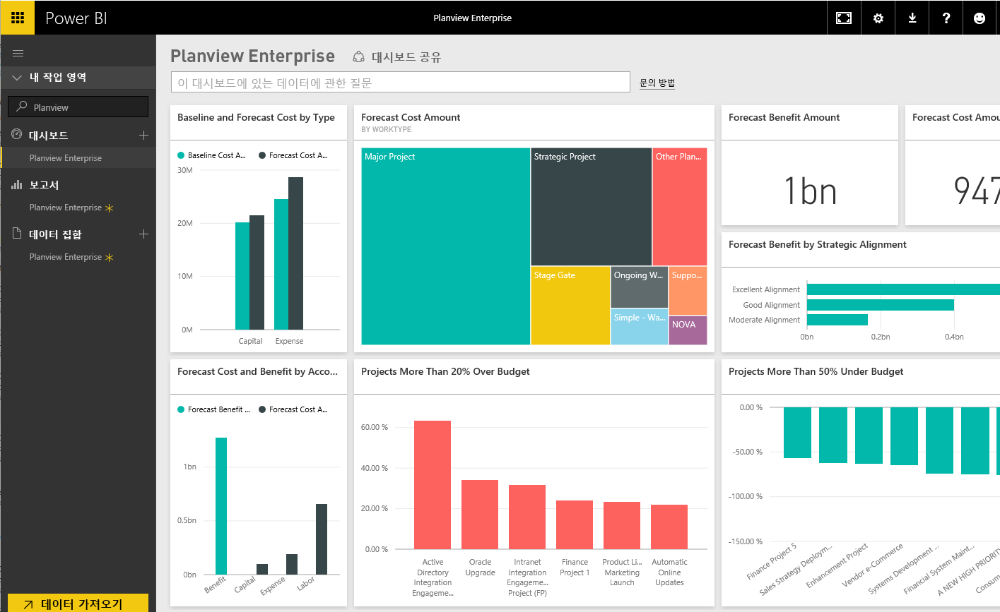

# Power BI로 Planview Enterprise에 연결
Power BI용 Planview Enterprise 콘텐츠 팩을 사용하여 리소스를 시각화하고 관리 데이터를 완전히 새로운 방식으로 작동시킬 수 있습니다. Planview Enterprise 로그인 자격 증명을 사용하여 대화형으로 포트폴리오 투자 비용을 확인하고 예산 초과 및 미달인지 이해하며 프로젝트가 기업 전략 우선에 얼마나 잘 맞는지 알 수 있습니다. 또한 기본 대시보드 및 보고서를 확장하여 가장 중요한 통찰력을 얻을 수 있습니다.

[Power BI의 Planview Enterprise 콘텐츠 팩](https://app.powerbi.com/getdata/services/planview-enterprise)에 연결

>[!NOTE]
>Power BI로 Planview Enterprise 데이터를 가져오려면 역할에 사용할 수 있는 보고 포털 뷰어가 있는 Planview Enterprise 사용자여야 합니다. 아래의 추가 요구 사항을 참조하세요.

## 연결 방법
1. 왼쪽 탐색 창의 맨 아래에 있는 **데이터 가져오기** 를 선택합니다.
   
    
2. **서비스** 상자에서 **가져오기**를 선택합니다.
   
    
3. Power BI 페이지에서 **Planview Enterprise**를 선택한 다음 **가져오기**를 선택합니다.  
    
4. Planview Enterprise URL 텍스트 상자에 사용하려는 Planview Enterprise 서버에 대한 URL을 입력합니다. Planview Enterprise 데이터베이스 텍스트 상자에 Planview Enterprise 데이터베이스의 이름을 입력하고 다음을 클릭합니다.  
    
5. 인증 방법 목록에서 아직 선택되지 않은 경우 **기본** 을 선택합니다. 계정에 **사용자 이름** 및 **암호** 를 입력하고 **로그인**을 선택합니다.  
   
6. 왼쪽된 창에서 대시보드 목록에서 Planview Enterprise를 선택합니다.  
     Power BI는 대시보드에 Planview Enterprise 데이터를 가져옵니다. 데이터를 로드하는 데 약간 시간이 걸릴 수 있습니다.  
    

**다음 단계**

* 대시보드 맨 위에 있는 [질문 및 답변 상자에 질문](power-bi-q-and-a.md)합니다.
* 대시보드에서 [타일을 변경](service-dashboard-edit-tile.md)합니다.
* [타일을 선택](service-dashboard-tiles.md)하여 원본 보고서를 엽니다.
* 데이터 집합을 매일 새로 고치도록 예약하는 경우 새로 고침 일정을 변경하거나 **지금 새로 고침**을 사용하여 필요할 때 새로 고칠 수 있습니다.

## 시스템 요구 사항
Power BI로 Planview Enterprise 데이터를 가져오려면 역할에 사용할 수 있는 보고 포털 뷰어가 있는 Planview Enterprise 사용자여야 합니다. 아래의 추가 요구 사항을 참조하세요.

이 절차에서는 Power BI 계정을 사용하여 Microsoft Power BI 홈 페이지에 이미 로그인했다고 가정합니다. Power BI 계정이 없는 경우 Power BI 홈 페이지에서 새로운 무료 Power BI 계정을 만들고 데이터 가져오기를 클릭합니다.

## 다음 단계:

[Power BI 시작](service-get-started.md)

[Power BI에 대한 데이터 가져오기](service-get-data.md)