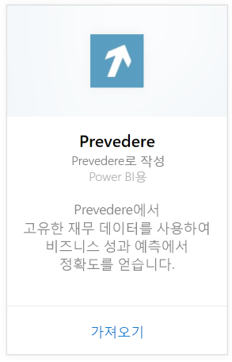
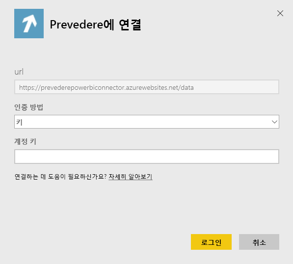
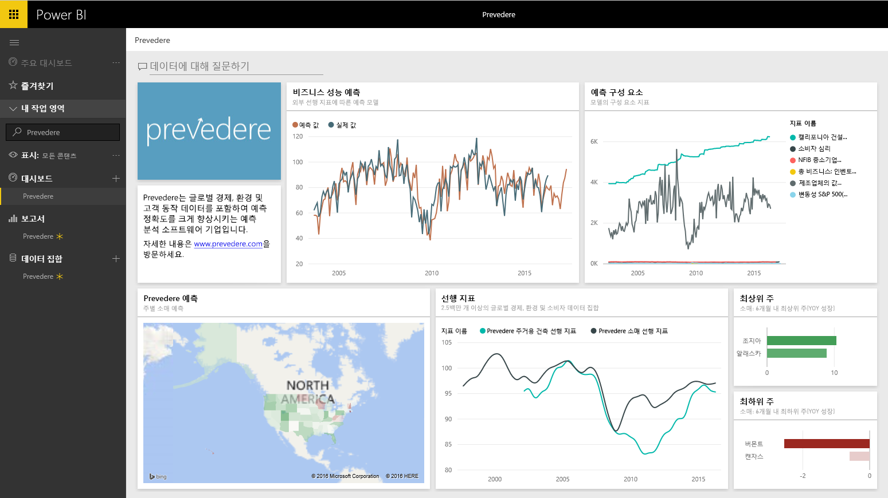

# Power BI로 Prevedere에 연결
배타적이고 중요한 재무 정보에 액세스하여 향후 비즈니스를 사전에 자신 있게 향상시킵니다.

Power BI용 [Prevedere 콘텐츠 팩](https://app.powerbi.com/getdata/services/prevedere)에 연결합니다.

>[!NOTE]
>기존 Prevedere 사용자가 아닌 경우 [샘플 키](https://prevederepowerbiconnector.azurewebsites.net/static/learnmore.html)를 사용하여 시도해 보세요.

## 연결 방법
1. 왼쪽 탐색 창의 맨 아래에 있는 **데이터 가져오기** 를 선택합니다.
   
   
2. **서비스** 상자에서 **가져오기**를 선택합니다.
   
   
3. **Prevedere**를 선택한 후 **가져오기**를 선택합니다.
   
   
4. **인증 방법**에 대한 **키**를 선택하고 Prevedere API 키를 입력합니다.
   
    
5. **로그인**을 선택하여 가져오기 프로세스를 시작합니다. 완료되면 새 대시보드, 보고서 및 모델이 탐색 창에 나타납니다. 대시보드를 선택하여 가져온 데이터를 표시합니다.
   
     

**다음 단계**

* 대시보드 맨 위에 있는 [질문 및 답변 상자에 질문](power-bi-q-and-a.md)합니다.
* 대시보드에서 [타일을 변경](service-dashboard-edit-tile.md)합니다.
* [타일을 선택](service-dashboard-tiles.md)하여 원본 보고서를 엽니다.
* 데이터 집합을 매일 새로 고치도록 예약하는 경우 새로 고침 일정을 변경하거나 **지금 새로 고침**을 사용하여 필요할 때 새로 고칠 수 있습니다.

## 포함된 내용
콘텐츠 팩에는 소매 예측, 예측 모델, 선행 지표 및 기타에 대한 정보가 들어 있습니다.

## 시스템 요구 사항
이 콘텐츠 팩을 사용하려면 Prevedere API 키 또는 샘플 키(아래 참조)에 액세스해야 합니다.

## 매개 변수 찾기

기존 고객은 자신의 API 키를 사용하여 데이터에 액세스할 수 있습니다. 아직 고객이 아닌 경우 데이터 샘플을 보고 [샘플 키](https://prevederepowerbiconnector.azurewebsites.net/static/learnmore.html)를 사용하여 분석할 수 있습니다.

## 문제 해결
인스턴스 크기에 따라 데이터를 로드하는 데 시간이 걸릴 수 있습니다.

## 다음 단계
[Power BI에서 시작](service-get-started.md)

[Power BI에서 데이터 가져오기](service-get-data.md)

