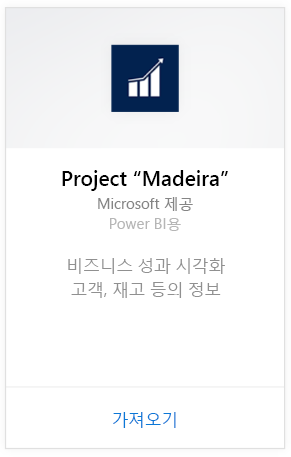
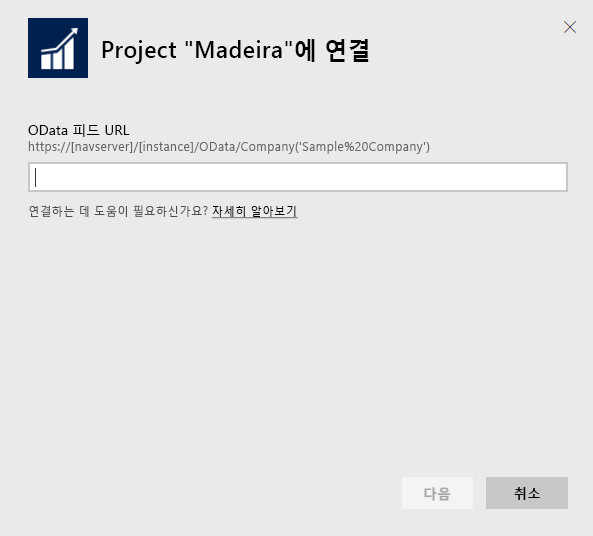
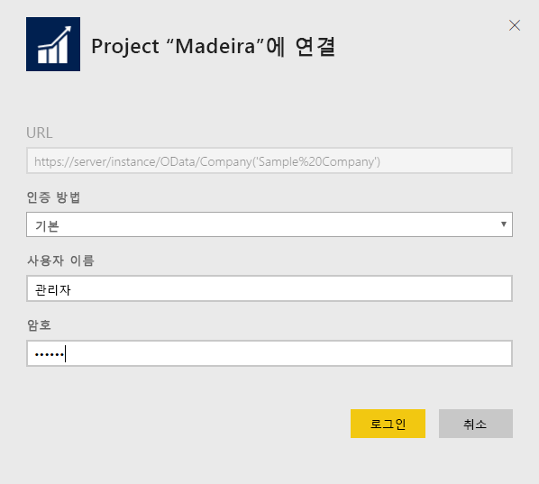
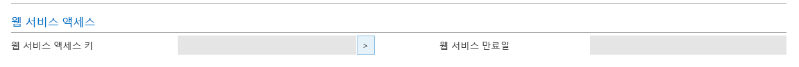
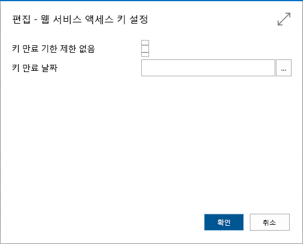
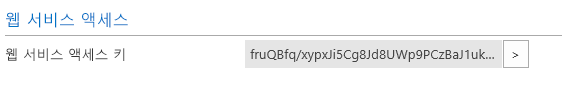

# Power BI로 Project "Madeira"에 연결
Power BI와 Project "Madeira" 콘텐츠 팩을 통해 Project "Madeira" 데이터에 유용한 정보를 쉽게 가져올 수 있습니다. Power BI는 영업 및 재무 데이터를 모두 검색한 다음 해당 데이터를 기반으로 기본 대시보드 및 보고서를 작성합니다.
Power BI용 Project "Madeira" 콘텐츠 팩에 연결하거나 Power BI와의 Project "Madeira" 통합에 대해 자세히 알아보세요.

>[!NOTE]
>이 콘텐츠 팩을 사용하려면 데이터가 검색되는 원본 테이블(이 경우 영업 및 재무 데이터)에 대한 권한이 필요합니다. [요구 사항](#Requirements)에 대한 자세한 내용은 아래에 나와 있습니다.

Power BI용 [Project "Madeira" Analytics 콘텐츠 팩](https://app.powerbi.com/getdata/services/project-madeira)에 연결합니다.

## 연결 방법
1. 왼쪽 탐색 창의 맨 아래에 있는 **데이터 가져오기** 를 선택합니다.  
    
2. **서비스** 상자에서 **가져오기**를 선택합니다.  
    
3. **Project "Madeira"**를 선택한 다음 **가져오기**를 선택합니다.  
    
4. 대화 상자가 나타나면 Project "Madeira" URL을 입력합니다. URL은 Project “Madeira” 회사 이름을 포함한 https://mycronusus.projectmadeira.com:7048/NAV/OData/Company('CRONUS%20US') 패턴을 정확하게 따라야 합니다. 끝에 슬래시가 없고 연결이 https이어야 합니다. [아래](#FindingParams)에서 URL 찾기에 대한 세부 정보를 참조하세요.  
   
    
5. 대화 상자가 나타나면 인증 방법으로 기본을 선택하고 Project “Madeira” 전자 메일 주소를 사용자 이름으로 입력한 다음 프로젝트 “Madeira” 계정에 대한 암호로 웹 서비스 선택키를 입력합니다. 브라우저에서 Project “Madeira”에 이미 로그인한 경우 자격 증명을 묻는 메시지가 표시되지 않을 수도 있습니다. [아래](#FindingParams)에서 이 선택키를 생성하는 데 대한 자세한 내용을 봅니다.  
   
    >[!NOTE]
    >Project "Madeira"의 superuser이어야 합니다.
   
    
6. 연결되면 대시보드, 보고서 및 데이터 집합은 자동으로 로드됩니다. 완료되면 타일은 계정의 데이터로 업데이트됩니다.  
   
    

**다음 단계**

* 대시보드 맨 위에 있는 [질문 및 답변 상자에 질문](power-bi-q-and-a.md)합니다.
* 대시보드에서 [타일을 변경](service-dashboard-edit-tile.md)합니다.
* [타일을 선택](service-dashboard-tiles.md)하여 원본 보고서를 엽니다.
* 데이터 집합을 매일 새로 고치도록 예약하는 경우 새로 고침 일정을 변경하거나 **지금 새로 고침**을 사용하여 필요할 때 새로 고칠 수 있습니다.

## 시스템 요구 사항
Project “Madeira” 데이터를 Power BI에 가져오려면 데이터를 검색할 원본 영업 및 재무 데이터 테이블에 대한 권한이 필요합니다. 콘텐츠 팩에 필요한 모든 테이블(대/소문자 구분)에는 다음이 포함됩니다.  

    - ItemSalesAndProfit  
    - ItemSalesByCustomer  
    - powerbifinance  
    - SalesDashboard  
    - SalesOpportunities  
    - SalesOrdersBySalesPerson  
    - TopCustomerOverview  

## 매개 변수 찾기
**올바를 URL 가져오기** 이 URL을 구하는 간편한 방법은 Project “Madeira”에서 웹 서비스로 이동하여 powerbifinance 웹 서비스를 찾고 Odata URL을 복사(마우스 오른쪽 단추를 클릭하고 바로 가기를 복사)하는 것입니다. 하지만 URL문자열의 “/powerbifinance…”은 제외합니다.

**웹 서비스 선택키** Project "Madeira"에서 데이터를 사용하려면 사용자 계정에 대한 웹 서비스 선택키를 만들어야 합니다. Project "Madeira"에서 사용자 페이지를 검색한 다음 사용자 계정에 대한 카드를 엽니다. 여기서 새 웹 서비스 선택키를 생성하고 Power BI 연결 페이지에서 암호 필드에 복사할 수 있습니다.

앞으로에서 사용해야 하는 웹 서비스 선택키를 사용하기 시작하려면 팝업되는 메시지에서 확인을 선택합니다.
키를 만들 경우 특정 날짜에 만료할지를 선택할 수 있습니다.

확인을 선택하면 키가 만들어지므로 Power BI 연결 페이지에서 암호 필드에 복사할 수 있습니다.

## 문제 해결
Power BI 대시보드는 위에 나열된 게시된 웹 서비스를 사용하고 현재 재무 솔루션에서 데이터를 가져오는 경우 데모 회사 또는 고유한 회사의 데이터를 표시합니다. 그러나 문제가 발생할 경우 이 섹션에서는 가장 일반적인 문제에 대한 문제 해결을 제공합니다.

**"매개 변수 유효성 검사를 하지 못했습니다. 모든 매개 변수가 유효한지 확인하세요."** Project "Madeira" URL을 입력한 후에 이 오류가 표시되는 경우 다음 요구 사항이 충족되었는지 확인합니다.  

    - URL은 정확하게 이 패턴을 따릅니다. https://*mycronusus*.projectmadeira.com:7048/NAV/OData/Company('*CRONUS%20US*')  
    - 괄호의 회사 이름 다음의 모든 텍스트를 삭제합니다.  
    - URL의 끝에 슬래시가 없는지 확인합니다.  
    - URL은 https로 시작하는 URL에서 표시한 대로 보안 연결을 사용해야 합니다.  

**"로그인하지 못했습니다."** Project "Madeira" 자격 증명을 사용하여 대시보드에 로그인할 때 "로그인하지 못했습니다."라는 오류를 받게 되면 다음 문제 중 하나가 원인일 수 있습니다.  

    - 사용 중인 계정에는 계정에서 Project "Madeira" 데이터를 읽을 수 있는 권한이 없습니다. Project "Madeira"의 사용자 계정을 확인하고 올바른 웹 서비스 선택키를 암호로 사용했는지 확인한 다음 다시 시도합니다.  
    - 연결하려고 하는 Project "Madeira" 인스턴스에는 유효한 SSL 인증서가 없습니다. 이 경우 보다 자세한 오류 메시지가 표시됩니다.("신뢰할 수 있는 SSL 관계를 설정할 수 없음")  자체 서명 인증서는 지원되지 않습니다.  

**"Oops"** 인증 대화 상자를 전달한 후에 "Oops" 오류 대화 상자가 표시되는 경우 콘텐츠 팩에 대한 데이터에 연결하는 문제가 가장 자주 발생합니다. URL이 앞서 지정된 패턴을 따르는지를 확인합니다.  
    https://*mycronusus*.projectmadeira.com:7048/NAV/OData/Company('*CRONUS%20US*')

가장 흔한 실수는 특정 웹 서비스에 대한 전체 URL을 지정한 경우입니다.  
    https://*mycronusus*.projectmadeira.com:7048/NAV/OData/Company('*CRONUS%20US*')/powerbifinance

또는 회사 이름을 지정하는 것을 잊었을 수도 있습니다.   
    https://*mycronusus*.projectmadeira.com:7048/NAV/OData/

## 다음 단계
[Power BI 시작](service-get-started.md)

[Power BI - 기본 개념](service-basic-concepts.md)

