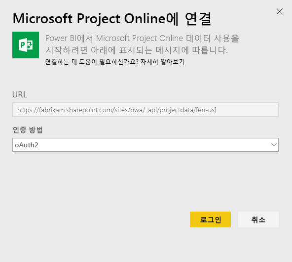
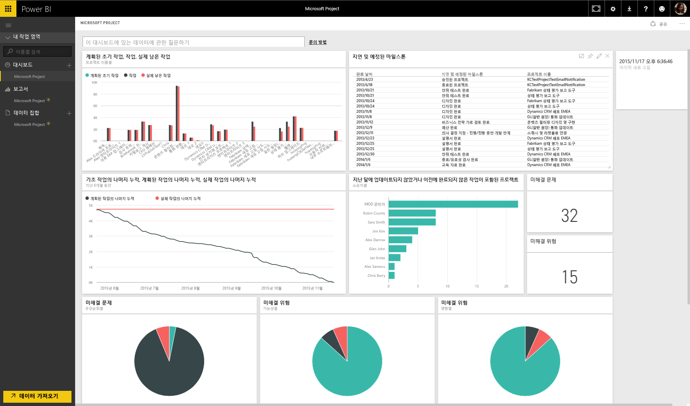

# Power BI로 Project Online에 연결
Microsoft Project Online은 프로젝트 포트폴리오 관리(PPM) 및 일상 업무에 대한 유연한 온라인 솔루션입니다. Project Online을 사용하면 조직이 프로젝트 포트폴리오 투자를 시작하고 우선 순위를 지정할 수 있으며 의도한 비즈니스 가치를 제공할 수 있습니다. Power BI용 Project Online 콘텐츠 팩을 사용하면 프로젝트, 포트폴리오 및 리소스를 관리할 수 있도록 Project Online에서 인사이트의 잠금을 해제할 수 있습니다.

Power BI용 [Project Online 콘텐츠 팩](https://app.powerbi.com/getdata/services/project-online)에 연결합니다.

## 연결 방법
1. 왼쪽 탐색 창의 맨 아래에 있는 **데이터 가져오기** 를 선택합니다.
   
    
2. **서비스** 상자에서 **가져오기**를 선택합니다.
   
   
3. **Microsoft Project Online** \> **가져오기**를 선택합니다.
   
   
4. **프로젝트 웹앱 URL** 텍스트 상자에서 연결하려는 PWA(Project Web Add)에 URL을 입력하고 **다음**을 누릅니다. 사용자 지정 도메인이 있는 경우 예제와 달라질 수 있습니다. **PWA 사이트 언어** 텍스트 상자에서 PWA 사이트 언어에 해당하는 번호를 입력합니다. 영어에는 단일 숫자 '1'을 입력하고, 프랑스어에는 '2'를 입력하고, 독일어에는 '3'을 입력하고, 포르투갈어(브라질)에는 '4'를 입력하고, 포르투갈어(포르투갈)에는 '5'를 입력하고 스페인어에는 '6'을 입력합니다. 
   
    
5. 인증 방법에 대해 **oAuth2** \> **로그인**을 선택합니다. 메시지가 표시되면 Project Online 자격 증명을 입력하고 인증 프로세스를 따릅니다.
   
    
    
연결 중인 프로젝트 웹앱에 대한 포트폴리오 뷰어, 포트폴리오 관리자 또는 관리자 권한이 필요합니다.

6. 데이터를 로드하는 것을 나타내는 알림이 표시됩니다. 사용자의 계정 크기에 따라 다소 시간이 걸릴 수 있습니다. Power BI가 데이터를 가져오면 왼쪽 탐색 창에 새 대시보드, 13개의 보고서 및 데이터 세트가 표시됩니다. Power BI가 데이터를 표시하기 위해 만든 기본 대시보드입니다. 이 대시보드를 수정하여 원하는 방식으로 데이터를 표시할 수 있습니다.

   

7. 대시보드 및 보고서가 준비되면 계속해서 Project Online 데이터를 탐색하기 시작합니다. 콘텐츠 팩은 포트폴리오 개요(6개의 보고서 페이지), 리소스 개요(5개의 보고서 페이지) 및 프로젝트 상태(2개의 보고서 페이지)에 대한 풍부하고 세부적인 13개의 보고서를 제공합니다. 

   
   
   
   
   

**다음 단계**

* 대시보드 맨 위에 있는 [질문 및 답변 상자에 질문](consumer/end-user-q-and-a.md)합니다.
* 대시보드에서 [타일을 변경](service-dashboard-edit-tile.md)합니다.
* [타일을 선택](consumer/end-user-tiles.md)하여 원본 보고서를 엽니다.
* 데이터 세트를 매일 새로 고치도록 예약하는 경우 새로 고침 일정을 변경하거나 **지금 새로 고침**을 사용하여 필요할 때 새로 고칠 수 있습니다.

**콘텐츠 팩 확장**

[GitHub PBIT 파일](https://github.com/OfficeDev/Project-Power-BI-Content-Packs)을 다운로드하여 콘텐츠 팩을 추가로 사용자 지정하고 업데이트합니다.

## 다음 단계
[Power BI에서 시작](service-get-started.md)

[Power BI에서 데이터 가져오기](service-get-data.md)

