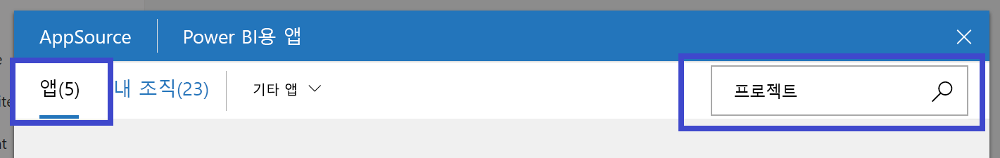
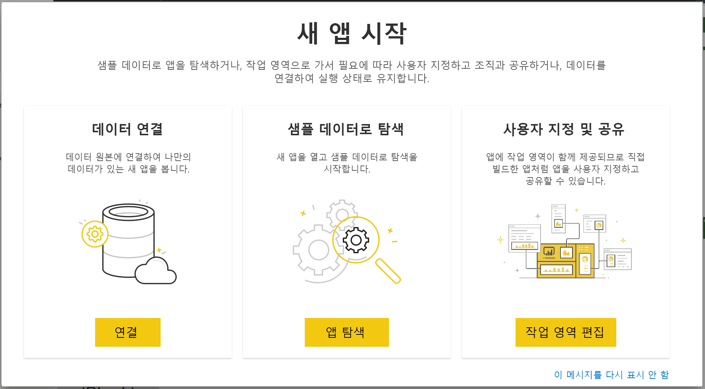
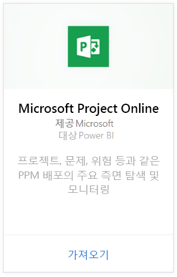
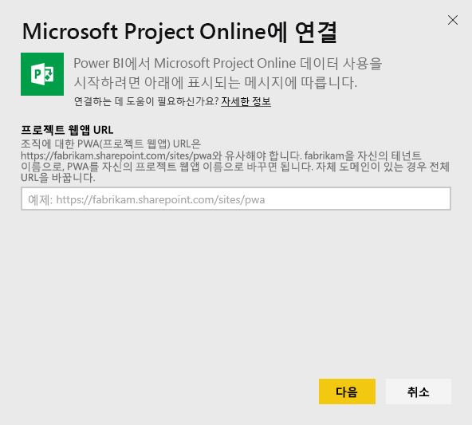
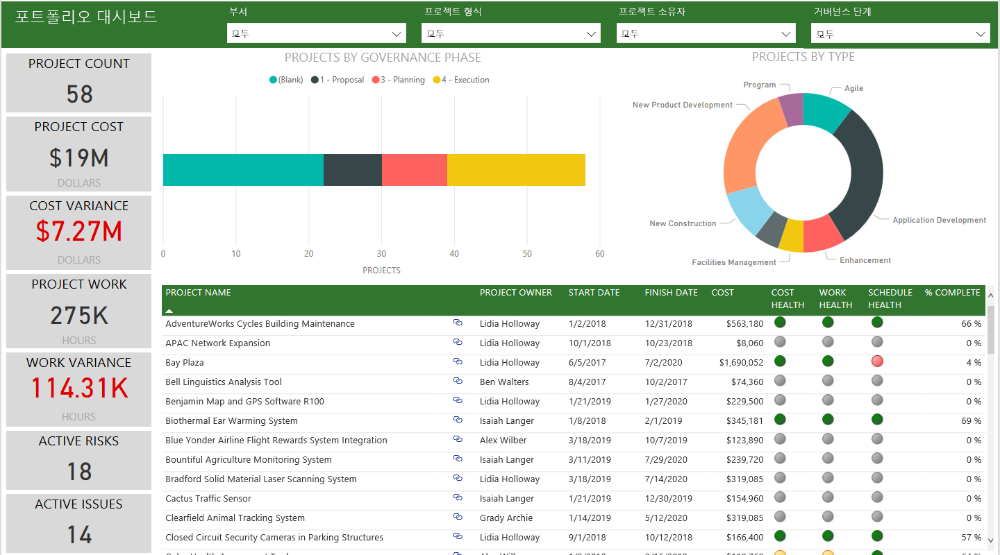
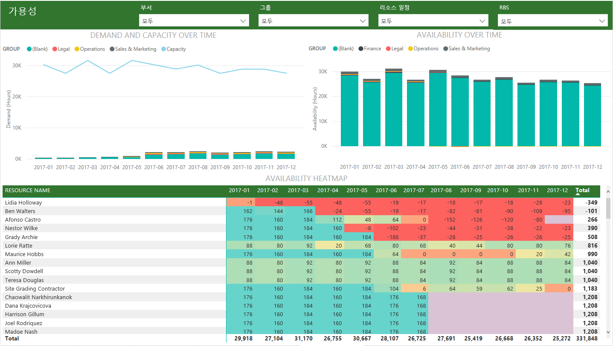
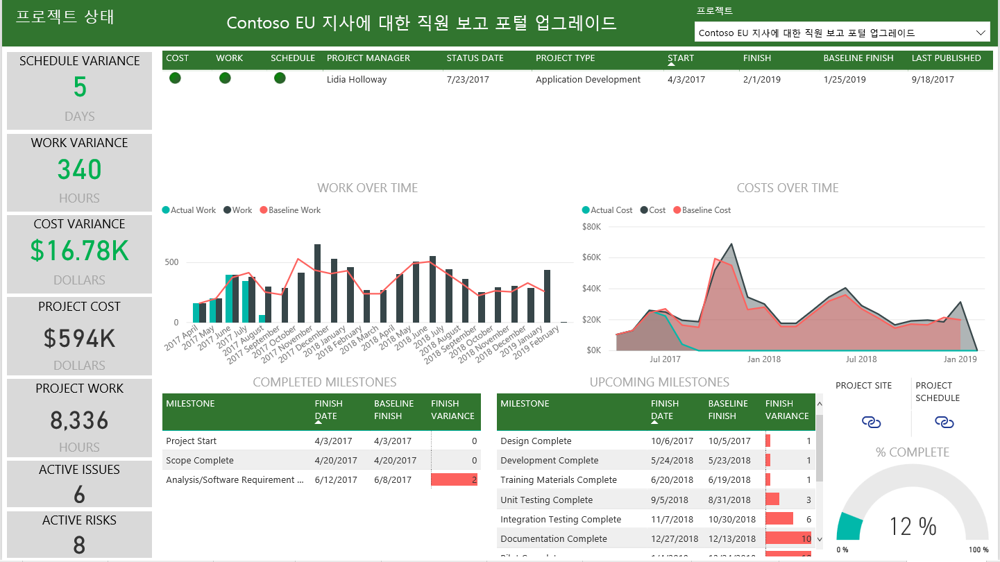

# Power BI를 사용하여 Project Web App에 연결
Microsoft Project Web App은 PPM(프로젝트 포트폴리오 관리) 및 일상 업무를 위한 유연한 온라인 솔루션입니다. Project Web App을 사용하면 조직이 프로젝트 포트폴리오 투자를 시작하고 우선순위를 지정할 수 있으며 의도한 비즈니스 가치를 제공할 수 있습니다. Power BI용 Project Web App 템플릿 앱을 사용하면 프로젝트, 포트폴리오 및 리소스를 관리할 수 있도록 Project Web App에서 인사이트의 잠금을 해제할 수 있습니다.

Power BI용 [Project Web App 템플릿 앱](https://appsource.microsoft.com/product/power-bi/pbi_msprojectonline.pbi-microsoftprojectwebapp)에 연결합니다.

## 연결 방법

1. 탐색 창에서 **앱**을 선택하고 오른쪽 위에서 **앱 가져오기**를 선택합니다.

    

2. **서비스** 상자에서 **가져오기**를 선택합니다.
   
   
3. AppSource에서 **앱** 탭을 선택하고 **Microsoft Project Web App**을 검색/선택합니다.
   
4. **이 Power BI 앱을 설치하시겠습니까?** 라는 메시지가 표시되면 **설치**를 선택합니다. 

   
5. **앱** 창에서 **Microsoft Project Web App** 타일을 선택합니다. 
   
   
6. **새 앱 시작**에서 **데이터 연결**을 선택합니다.
   
   
7. **Project Web App URL** 텍스트 상자에서 연결하려는 PWA(Project Web Add)의 URL을 입력합니다.  사용자 지정 도메인이 있는 경우 예제와 달라질 수 있습니다. **PWA 사이트 언어** 텍스트 상자에서 PWA 사이트 언어에 해당하는 번호를 입력합니다. 영어에는 단일 숫자 '1'을 입력하고, 프랑스어에는 '2'를 입력하고, 독일어에는 '3'을 입력하고, 포르투갈어(브라질)에는 '4'를 입력하고, 포르투갈어(포르투갈)에는 '5'를 입력하고 스페인어에는 '6'을 입력합니다. 
   
   
8. 인증 방법에 대해 **oAuth2** \> **로그인**을 선택합니다. 메시지가 표시되면 Project Web App 자격 증명을 입력하고 인증 프로세스를 따릅니다.

    > [!NOTE]
    > 연결 중인 프로젝트 웹앱에 대한 포트폴리오 뷰어, 포트폴리오 관리자 또는 관리자 권한이 필요합니다.

9. 데이터를 로드하는 것을 나타내는 알림이 표시됩니다. 사용자의 계정 크기에 따라 다소 시간이 걸릴 수 있습니다. Power BI 데이터를 가져오면 새 작업 영역의 콘텐츠가 표시됩니다. 최신 업데이트를 얻으려면 데이터 세트를 새로 고쳐야 할 수 있습니다. 

    Power BI가 데이터를 가져오면 탐색 창에 13개의 페이지로 구성된 보고서와 데이터 세트가 표시됩니다. 

10. 보고서가 준비되면 계속해서 Project Web App 데이터를 탐색하기 시작합니다. 템플릿 앱은 포트폴리오 개요(6개의 보고서 페이지), 리소스 개요(5개의 보고서 페이지) 및 프로젝트 상태(2개의 보고서 페이지)에 대한 풍부하고 세부적인 13개의 보고서를 제공합니다. 

    
   
    
   
    

**다음 단계**

* 데이터 세트를 매일 새로 고치도록 예약하는 동시에 새로 고침 일정을 변경하거나 **지금 새로 고침**을 사용하여 요청 시 새로 고칠 수 있습니다.

**템플릿 앱 확장**

[GitHub PBIT 파일](https://github.com/OfficeDev/Project-Power-BI-Content-Packs)을 다운로드하여 콘텐츠 팩을 추가로 사용자 지정하고 업데이트합니다.

## 다음 단계
[Power BI에서 시작](service-get-started.md)

[Power BI에서 데이터 가져오기](service-get-data.md)

