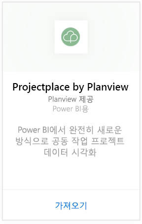
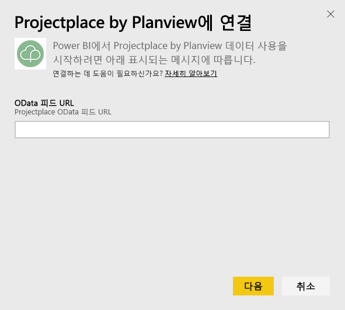
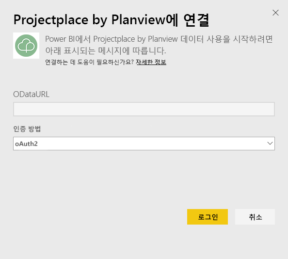
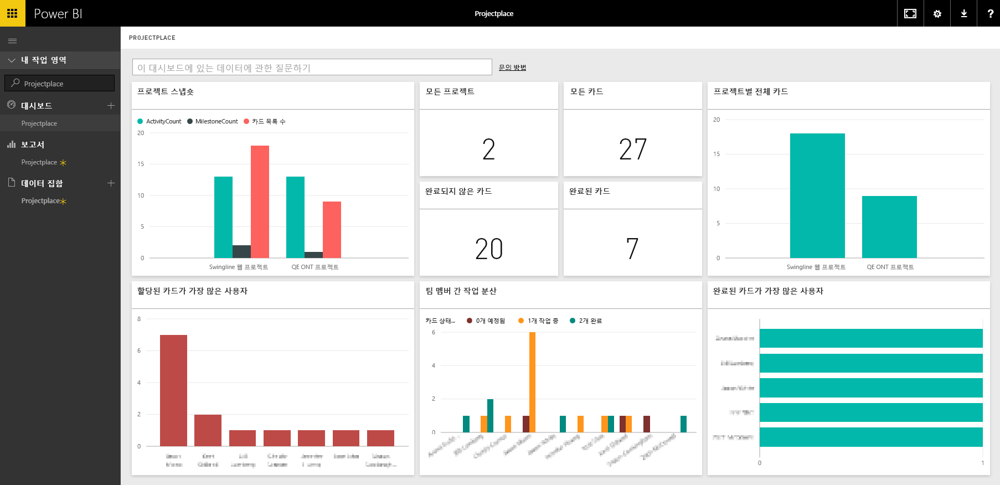

# Power BI로 Projectplace by Planview에 연결
Projectplace by Planview 콘텐츠 팩을 사용하여 Power BI에서 공동 작업 프로젝트 데이터를 완전히 새로운 방식으로 시각화할 수 있습니다. Projectplace 로그인 자격 증명을 사용하여 키 프로젝트 통계를 확인하며 가장 활발하고 생산적인 팀 구성원들을 찾고 Projectplace 계정의 프로젝트에서 위험할 가능성이 있는 카드 및 활동을 식별합니다. 또한 기본 대시보드 및 보고서를 확장하여 가장 중요한 통찰력을 얻을 수 있습니다.

[Power BI에서 Projectplace 콘텐츠 팩에 연결](https://app.powerbi.com/getdata/services/projectplace)

>[!NOTE]
>Projectplace 데이터를 Power BI로 가져오려면 Projectplace 사용자여야 합니다. 아래의 추가 요구 사항을 참조하세요.

## 연결 방법
1. 왼쪽 탐색 창의 맨 아래에 있는 **데이터 가져오기** 를 선택합니다.
   
    
2. **서비스** 상자에서 **가져오기**를 선택합니다.
   
    
3. Power BI 페이지에서 **Projectplace by Planview**를 선택한 다음 **가져오기**를 선택합니다.  
   
    
4. 다음 그림처럼 OData 피드 URL 텍스트 상자에 사용하려는 Projectplace OData 피드에 URL을 입력합니다.
   
    
5. 인증 방법 목록에서 아직 선택되지 않은 경우 **OAuth** 을 선택합니다. **로그인** 을 누르고 로그인 흐름을 따릅니다.  
   
   
6. 왼쪽된 창에서 대시보드 목록에서 **Projectplace** 를 선택합니다. Power BI는 대시보드에 Projectplace 데이터를 가져옵니다. 데이터를 로드하는 데 약간 시간이 걸릴 수 있습니다.  
   
    대시보드는 Projectplace 데이터베이스에서 데이터를 표시하는 타일을 포함합니다. 다음 그림은 Power BI에서 기본 Projectplace 대시보드의 예를 보여줍니다.
   
    

**다음 단계**

* 대시보드 맨 위에 있는 [질문 및 답변 상자에 질문](consumer/end-user-q-and-a.md)합니다.
* 대시보드에서 [타일을 변경](service-dashboard-edit-tile.md)합니다.
* [타일을 선택](consumer/end-user-tiles.md)하여 원본 보고서를 엽니다.
* 데이터 세트를 매일 새로 고치도록 예약하는 경우 새로 고침 일정을 변경하거나 **지금 새로 고침**을 사용하여 필요할 때 새로 고칠 수 있습니다.

## 시스템 요구 사항
Projectplace 데이터를 Power BI로 가져오려면 Projectplace 사용자여야 합니다. 이 절차에서는 Power BI 계정을 사용하여 Microsoft Power BI 홈 페이지에 이미 로그인했다고 가정합니다. Power BI 계정이 없는 경우 [powerbi.com](https://powerbi.microsoft.com/get-started/)으로 이동하여  **Power BI - 클라우드 공동 작업 및 공유**에서 **무료 체험**을 선택합니다. 그런 다음, **데이터 가져오기**를 클릭합니다.

## 다음 단계
[Power BI란?](power-bi-overview.md)

[Power BI - 기본 개념](consumer/end-user-basic-concepts.md)

