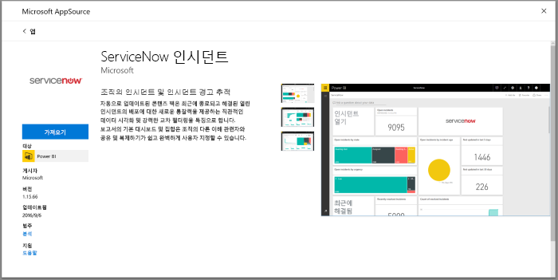
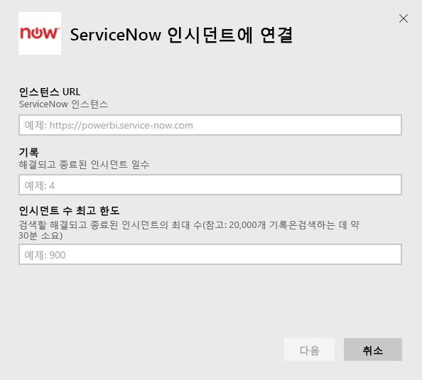
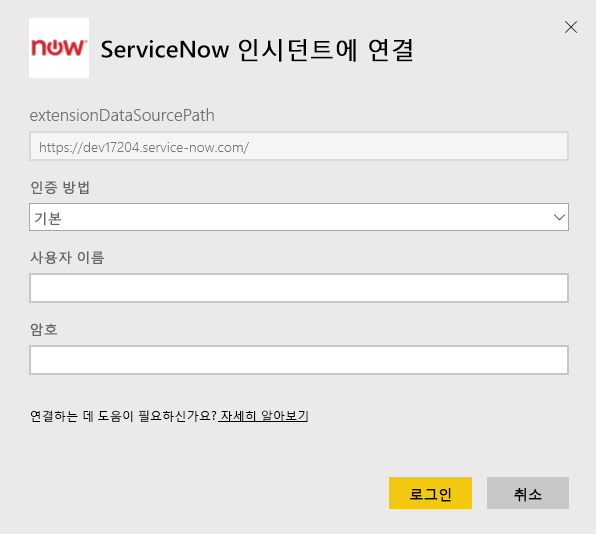
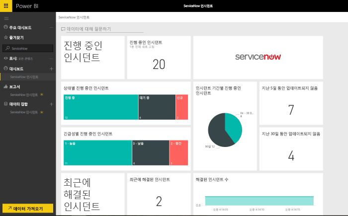

# 인시던트 보고를 위해 Power BI로 ServiceNow에 연결
ServiceNow에서는 비즈니스, 운영 및 IT 관리를 비롯하여 비즈니스를 개선하기 위한 여러 제품과 솔루션을 제공합니다. 이 콘텐츠 팩에는 개시된 인시던트, 최근에 해결된 인시던트, 최근에 닫은 인시던트에 대한 다양한 정보 및 보고서가 포함되어 있습니다.  

[ServiceNow 인시던트](https://app.powerbi.com/getdata/services/servicenow)용 Power BI 콘텐츠 팩에 연결하세요.

## 연결 방법
1. 왼쪽 탐색 창의 맨 아래에 있는 **데이터 가져오기** 를 선택합니다.
   
    
2. **서비스** 상자에서 **가져오기**를 선택합니다.
   
    
3. **ServiceNow 인시던트** \> **가져오기**를 선택합니다.
   
   
4. 가져올 ServiceNow 인스턴스의 URL 및 일/레코드 범위를 제공합니다. 한도에 도달하는 즉시 가져오기가 중지됩니다.
   
   
5. 메시지가 표시되면 ServiceNow **기본** 자격 증명을 입력합니다. 현재 Single Sign-On은 지원되지 않으며, 자세한 내용은 아래 시스템 요구 사항을 참조하세요.
   
   
6. 로그인 흐름이 완료되면 가져오기 프로세스가 시작됩니다. 완료되면 새 대시보드, 보고서 및 모델이 탐색 창에 나타납니다. 대시보드를 선택하여 가져온 데이터를 표시합니다.
   
    

**다음 단계**

* 대시보드 맨 위에 있는 [질문 및 답변 상자에 질문](consumer/end-user-q-and-a.md)합니다.
* 대시보드에서 [타일을 변경](service-dashboard-edit-tile.md)합니다.
* [타일을 선택](consumer/end-user-tiles.md)하여 원본 보고서를 엽니다.
* 데이터 세트을 매일 새로 고치도록 예약하는 경우 새로 고침 일정을 변경하거나 **지금 새로 고침**을 사용하여 필요할 때 새로 고칠 수 있습니다.

## 시스템 요구 사항
연결하려면 다음이 필요합니다.  

* 기본 인증을 사용하여 yourorganization.service-now.com에 액세스할 수 있는 계정(이 버전에서는 Single Sign-On이 지원되지 않음)  
* 계정에는 rest_service 역할과 인시던트 테이블에 대한 읽기 액세스 권한이 있어야 합니다.  

## 문제 해결
로드하는 동안 자격 증명 오류가 발생하면 위의 액세스 요구 사항을 검토하세요. 올바른 사용 권한이 있어도 계속 문제가 발생하는 경우는 ServiceNow 관리자에게 문의하여 사용자 지정 인스턴스에 필요한 추가 사용 권한이 있는지 확인하세요.

로드 시간이 긴 경우는 연결 중에 지정한 인시던트 수와 일 수를 검토하여 줄이는 것을 고려해 보세요.

## 다음 단계
[Power BI란?](power-bi-overview.md)

[Power BI 서비스의 디자이너를 위한 기본 개념](service-basic-concepts.md)

