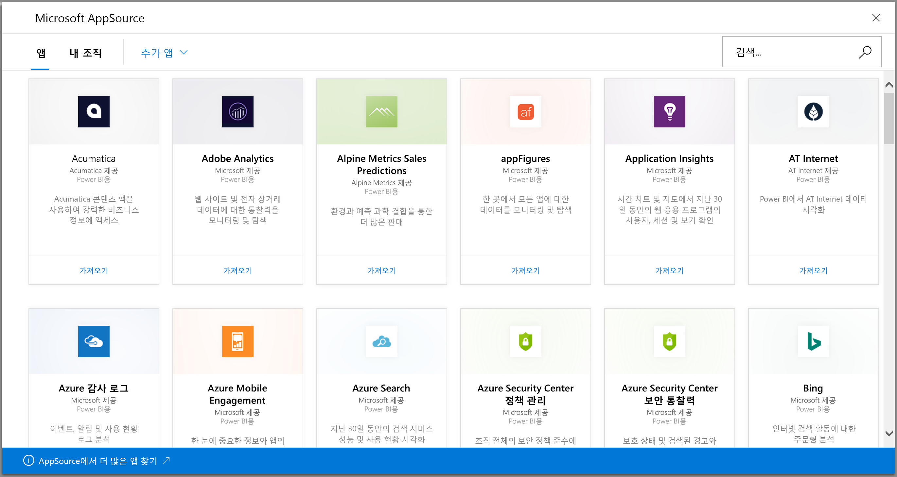
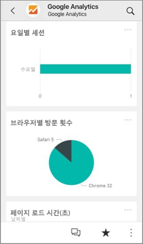
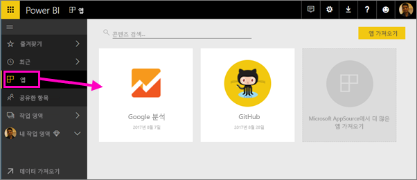
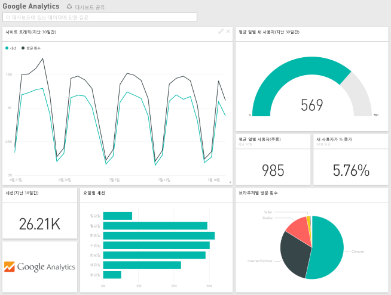
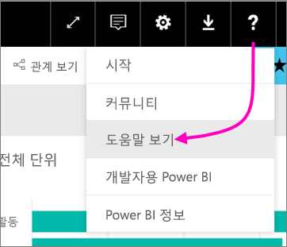

# Power BI로 사용하는 서비스에 연결
Power BI를 통해 비즈니스 운영에 사용하는 다양한 서비스(예: Salesforce, Microsoft Dynamics, Google 애널리틱스)에 연결할 수 있습니다. Power BI는 자격 증명을 사용하여 서비스에 연결하면 시작됩니다. 자동으로 데이터를 표시하고 비즈니스에 대한 시각적 인사이트를 제공하는 대시보드를 포함한 Power BI *작업 영역* 및 Power BI 보고서 집합을 만듭니다.

>[!IMPORTANT]
>서비스 콘텐츠 팩이 [템플릿 앱](https://docs.microsoft.com/power-bi/service-template-apps-overview)으로 바뀝니다. 2019년 9월 25일부터 많은 콘텐츠 팩이 이미 사용되지 않습니다. 설치한 사용되지 않는 콘텐츠 팩은 계정에 그대로 남아 있지만, 설명서나 지원이 제공되지 않거나 다시 설치할 수 없습니다.

[연결할 수 있는 Power BI](https://app.powerbi.com/getdata/services)를 모두 보려면 Power BI에 로그인합니다. 

앱을 설치한 후 앱 및 Power BI 서비스([https://app.powerbi.com](https://app.powerbi.com))의 작업 영역에서 대시보드 및 보고서를 볼 수 있습니다. Power BI 모바일 앱에서 볼 수도 있습니다. 작업 영역에서 대시보드 및 보고서를 수정하여 조직의 요구 사항을 충족한 다음, 동료에게 *앱*으로 배포할 수 있습니다. 

## 시작
[!INCLUDE [powerbi-service-apps-get-more-apps](./includes/powerbi-service-apps-get-more-apps.md)]

## 대시보드 및 보고서 편집
가져오기가 완료되면 새 앱이 앱 페이지에 표시됩니다.

1. 탐색 창에서 **앱**을 선택하고 앱을 선택합니다.
   
     
2. 질문 및 답변 상자에서 입력하여 질문하고 타일을 클릭하여 기본 보고서를 열 수 있습니다. 
   
    
   
    조직의 필요에 맞게 대시보드 및 보고서를 변경합니다. 그런 다음, [동료에게 앱을 배포합니다](service-create-distribute-apps.md).

## 포함된 내용
서비스에 연결한 후에 대시보드, 보고서 및 데이터 세트를 사용하여 새로 만든 앱 및 작업 영역을 볼 수 있습니다. 서비스의 데이터는 특정 시나리오에 초점을 맞추고 서비스의 모든 정보가 포함되어 있지는 않습니다. 하루에 한 번 자동으로 데이터가 새로 고쳐지도록 예약됩니다. 데이터 세트를 선택하여 일정을 제어할 수 있습니다.

[Power BI Desktop에서 Google 애널리틱스 등의 다양한 서비스에 연결](desktop-data-sources.md)하고, 사용자 지정된 고유한 대시보드 및 보고서를 만들 수 있습니다.  

특정 서비스에 연결하는 방법에 대한 자세한 내용은 개별 도움말 페이지를 참조하세요.

## 문제 해결
**빈 타일**  
Power BI가 서비스에 먼저 연결되어 있는 동안 대시보드에 빈 타일 집합이 표시될 수 있습니다. 2시간 후에 빈 대시보드가 계속 나타나면 연결하지 못한 것입니다. 문제를 해결하는 방법에 대한 정보가 포함된 오류 메시지가 표시되지 않는 경우 지원 티켓을 제출하세요.

* 오른쪽 위 모퉁이에서 물음표 아이콘( **?** ) > **도움말 보기**를 선택합니다.
  
    

**누락된 정보**  
대시보드 및 보고서에는 특정 시나리오에 초점을 맞춘 서비스의 콘텐츠가 포함되어 있습니다. 앱에서 특정 메트릭을 찾으려고 하지만 찾을 수 없는 경우 [Power BI 지원](https://support.powerbi.com/forums/265200-power-bi) 페이지에서 아이디어를 추가하세요.

## 서비스 제안
Power BI 앱에 제안하려는 서비스를 사용하나요? [Power BI 지원](https://support.powerbi.com/forums/265200-power-bi) 페이지로 이동하여 의견을 알려 주세요.

직접 배포할 템플릿 앱을 만드는 데 관심이 있는 경우, [Power BI에서 템플릿 앱 만들기](service-template-apps-create.md)를 참조하세요. Power BI 파트너는 코딩이 거의 없거나 전혀 없는 Power BI 앱을 빌드하여 고객에게 배포할 수 있습니다. 

## 다음 단계
* [동료에게 앱 배포](service-create-distribute-apps.md)
* [Power BI에서 새 작업 영역 만들기](service-create-the-new-workspaces.md)
* 궁금한 점이 더 있나요? [Power BI 커뮤니티에 질문합니다.](https://community.powerbi.com/)

