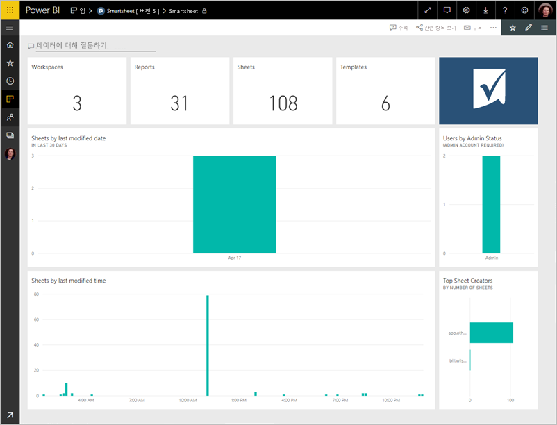
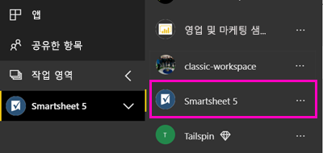
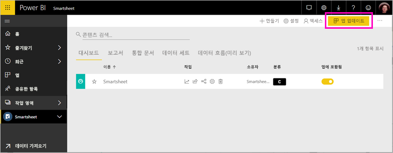

# Power BI로 Smartsheet에 연결
이 문서에서는 Power BI 템플릿 앱을 사용 하 여 Smartsheet 계정에서 데이터를 끌어오는 안내 합니다. Smartsheet는 간편하게 협업하고 파일을 공유할 수 있는 플랫폼을 제공합니다. Power BI 용 Smartsheet 템플릿 앱 대시보드, 보고서 및 Smartsheet 계정의 개요를 표시 하는 데이터 집합을 제공 합니다. 사용할 수도 있습니다 [Power BI Desktop](desktop-connect-to-data.md) 계정의 개별 시트에 직접 연결 합니다. 

템플릿 앱을 설치한 후에 대시보드 및 보고서를 변경할 수 있습니다. 그런 다음 조직의 동료에 게 앱으로 배포할 수 있습니다.

에 연결 합니다 [Smartsheet 템플릿 앱](https://app.powerbi.com/groups/me/getdata/services/smartsheet) Power BI에 대 한 합니다.

>[!NOTE]
>Smartsheet 관리자 계정을 연결 하 고 추가 액세스가 Power BI 템플릿 앱을 로드 하기 위한 기본 설정 된 경우

## 연결 방법

[!INCLUDE [powerbi-service-apps-get-more-apps](./includes/powerbi-service-apps-get-more-apps.md)]

3. 선택 **Smartsheet** \> **지금**합니다.
4. **Power BI 앱이 설치?** 선택 **설치**합니다.
4. 에 **앱** 창 합니다 **Smartsheet** 타일입니다.

    

6. **새 앱을 시작 하세요**를 선택 **데이터 연결**합니다.

    

4. 인증 방법에 대해 **oAuth2 \> 로그인**을 선택합니다.
   
   메시지가 표시되면 Smartsheet 자격 증명을 입력하고 인증 프로세스를 따릅니다.
   
   
   
   

5. Power BI가 데이터를 가져오면 Smartsheet 대시보드가 열립니다.
   
   

## 수정, 앱 배포

Smartsheet 템플릿 앱을 설치 했습니다. 즉, Smartsheet 앱 작업 영역도 만들었습니다. 작업 영역에서 보고서 및 대시보드를 다음으로 배포를 *앱* 조직의 동료에 게 합니다. 

1. 왼쪽된 탐색 모음에서 새 Smartsheet 작업 영역의 모든 콘텐츠를 보려면 선택 **작업 영역** > **Smartsheet**합니다. 

    

    이 보기에는 작업 영역 콘텐츠 목록입니다. 오른쪽 위 모서리에 표시 **앱 업데이트**합니다. 동료에 게 앱을 배포할 준비가 있는 경우 시작할 수 있습니다. 

    

2. 선택 **보고서** 하 고 **데이터 집합** 작업 영역에서 다른 요소를 확인 합니다.

    읽어보세요 [앱 배포](service-create-distribute-apps.md) 동료에 게 합니다.

## 포함된 내용
템플릿 앱 작업 영역의 수와 같은 Smartsheet 계정의 개요를 포함 하는 Power BI 보고서 및 시트 Smartsheet가 하 수정 될 때 등입니다. 관리자가 사용자가 위쪽 시트 작성자 등 해당 시스템에서 사용자 중심 일부 정보를 볼.  

계정의 개별 시트에 직접 연결하려면 [Power BI Desktop](desktop-connect-to-data.md)에서 Smartsheet 커넥터를 사용할 수 있습니다.  

## 다음 단계

* [Power BI에서 새 작업 영역 만들기](service-create-the-new-workspaces.md)
* [Power BI에서 앱 설치 및 사용](consumer/end-user-apps.md)
* [외부 서비스용 Power BI 앱에 연결](service-connect-to-services.md)
* 궁금한 점이 더 있나요? [Power BI 커뮤니티에 질문합니다.](http://community.powerbi.com/)