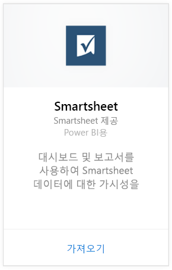
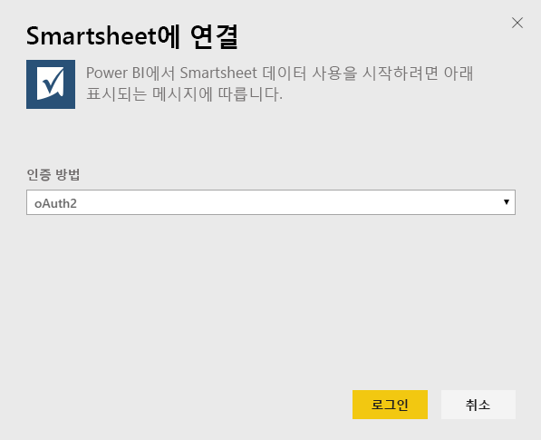
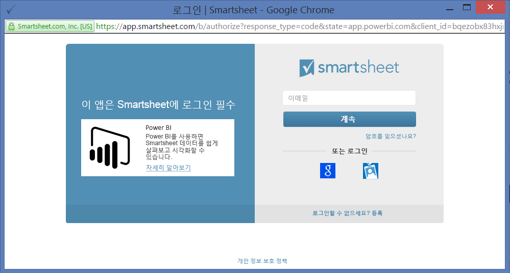
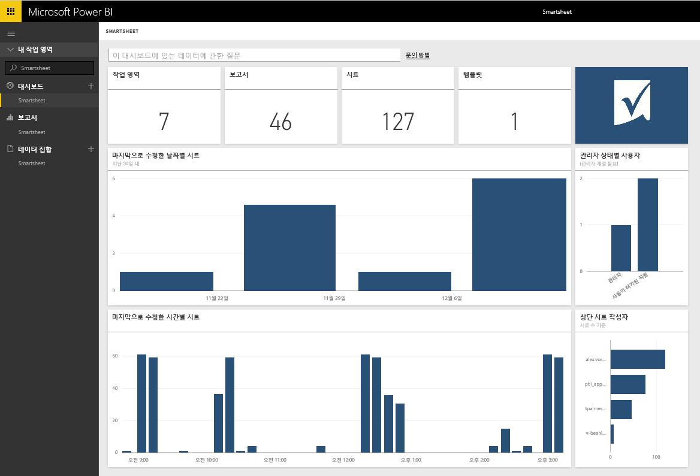

# Power BI로 Smartsheet에 연결
Smartsheet는 간편하게 공동으로 작업하고 파일을 공유할 수 있는 플랫폼을 제공합니다. Power BI용 Smartsheet 콘텐츠 팩은 Smartsheet 계정의 개요를 보여 주는 대시보드, 보고서 및 데이터 집합을 제공합니다. [Power BI Desktop](desktop-connect-to-data.md)을 사용하여 계정의 개별 시트에 직접 연결할 수도 있습니다. 

Power BI용 [Smartsheet 콘텐츠 팩](https://app.powerbi.com/groups/me/getdata/services/smartsheet)에 연결합니다.

>[!NOTE]
>Power BI 콘텐츠 팩을 로드할 때에는 추가 액세스 권한이 있는 Smartsheet 관리자 계정을 사용하는 것이 좋습니다.

## 연결 방법
1. 왼쪽 탐색 창의 맨 아래에 있는 **데이터 가져오기** 를 선택합니다.
   
   
2. **서비스** 상자에서 **가져오기**를 선택합니다.
   
    
3. **Smartsheet \> 가져오기**를 선택합니다.
   
   
4. 인증 방법에 대해 **oAuth2 \> 로그인**을 선택합니다.
   
   메시지가 표시되면 Smartsheet 자격 증명을 입력하고 인증 프로세스를 따릅니다.
   
   
   
   
5. Power BI가 데이터를 가져오면 왼쪽 탐색 창에 새 대시보드, 보고서 및 데이터 집합이 표시됩니다. 새 항목은 노란색 별표 \*가 표시됩니다. Smartsheet 항목을 선택하세요.
   
   

**다음 단계**

* 대시보드 맨 위에 있는 [질문 및 답변 상자에 질문](power-bi-q-and-a.md)합니다.
* 대시보드에서 [타일을 변경](service-dashboard-edit-tile.md)합니다.
* [타일을 선택](service-dashboard-tiles.md)하여 원본 보고서를 엽니다.
* 데이터 집합을 매일 새로 고치도록 예약하는 경우 새로 고침 일정을 변경하거나 **지금 새로 고침**을 사용하여 필요할 때 새로 고칠 수 있습니다.

## 포함된 내용
Power BI용 Smartsheet 콘텐츠 팩은 수정되는 경우 보유한 작업 영역, 보고서 및 시트의 수와 같은 Smartsheet 계정의 개요를 포함합니다. 또한 관리자 사용자는 위쪽 시트 작성자 등 해당 시스템에서 사용자에 대한 정보 일부를 확인합니다.  

계정의 개별 시트에 직접 연결하려면 [Power BI Desktop](desktop-connect-to-data.md)에서 Smartsheet 커넥터를 사용할 수 있습니다.  

## 다음 단계:

[Power BI 시작](service-get-started.md)

[Power BI에 대한 데이터 가져오기](service-get-data.md)