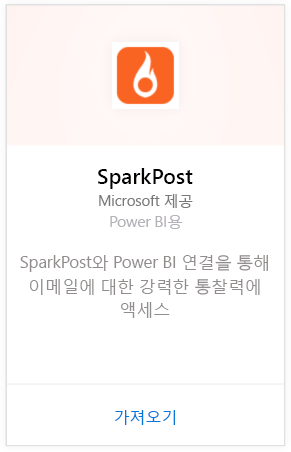
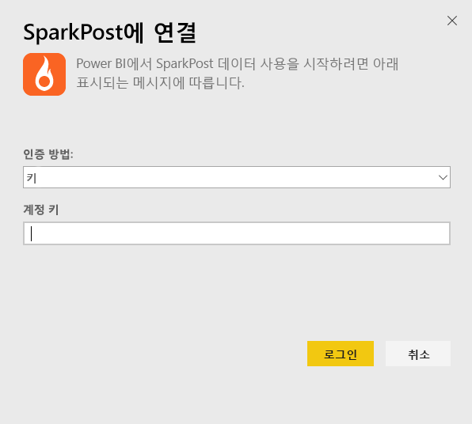
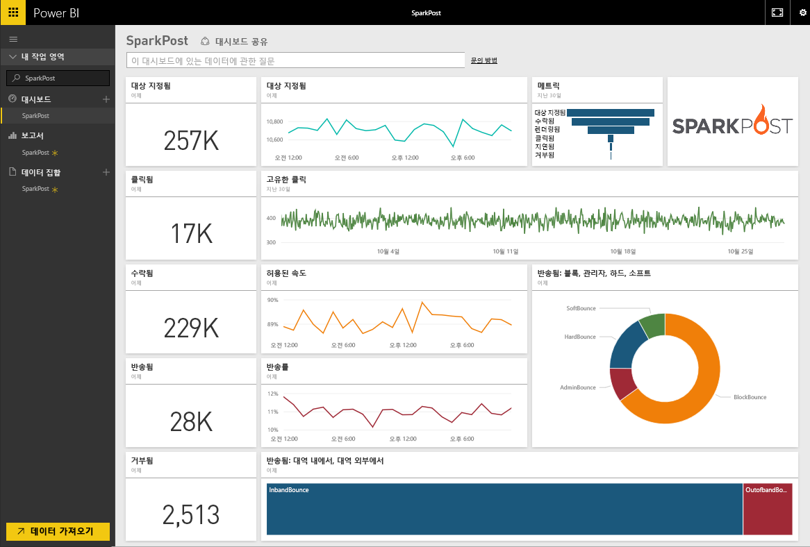
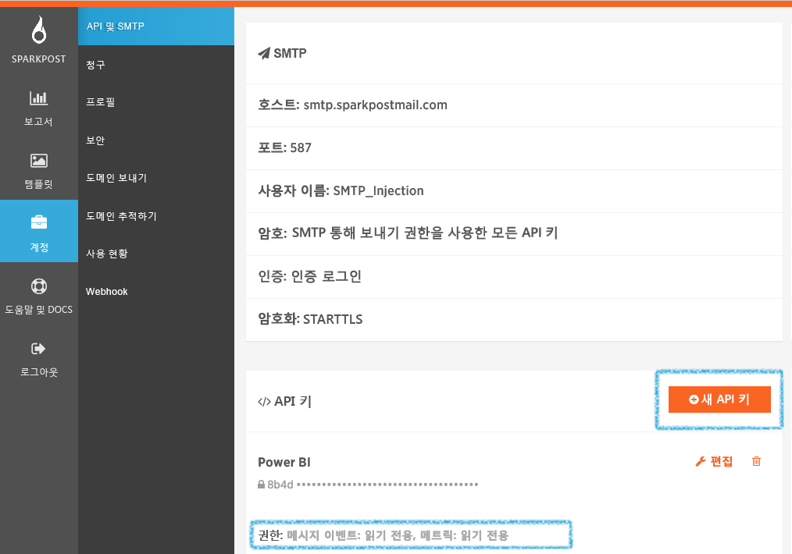

# Power BI로 SparkPost에 연결
SparkPost용 Power BI 콘텐츠 팩을 사용하면 SparkPost 계정에서 하나의 통찰력 대시보드에 중요한 데이터 세트를 추출할 수 있습니다. SparkPost 콘텐츠 팩을 사용하여 도메인, 캠페인 및 ISP에 의한 참여를 포함하는 전체 전자 메일 통계를 시각화할 수 있습니다.

[Power BI용 SparkPost 콘텐츠 팩](https://app.powerbi.com/getdata/services/spark-post)에 연결합니다.

## 연결 방법
1. 왼쪽 탐색 창의 맨 아래에 있는 **데이터 가져오기** 를 선택합니다.
   
   
2. **서비스** 상자에서 **가져오기**를 선택합니다.
   
   
3. **SparkPost** 콘텐츠 팩을 선택하고 **가져오기**를 클릭합니다. 
   
   
4. 대화 상자가 나타나면 SparkPost API 키를 입력하고 로그인을 선택합니다. 아래에서 [이러한 매개 변수 찾기](#FindingParams)에 대한 세부 정보를 참조하세요.
   
   
5. 데이터는 로드하기 시작하며 계정의 크기에 따라 약간의 시간이 걸릴 수 있습니다. Power BI가 데이터를 가져오면 왼쪽 탐색 창에 지난 90일간의 이메일 통계가 채워진 기본 대시보드, 보고서 및 데이터 세트가 표시됩니다. 새 항목은 노란색 별표 \*로 표시됩니다.
   
   

**다음 단계**

* 대시보드 맨 위에 있는 [질문 및 답변 상자에 질문](consumer/end-user-q-and-a.md)합니다.
* 대시보드에서 [타일을 변경](service-dashboard-edit-tile.md)합니다.
* [타일을 선택](consumer/end-user-tiles.md)하여 원본 보고서를 엽니다.
* 데이터 세트을 매일 새로 고치도록 예약하는 경우 새로 고침 일정을 변경하거나 **지금 새로 고침**을 사용하여 필요할 때 새로 고칠 수 있습니다.

## 포함된 내용
Power BI용 SparkPost 콘텐츠 팩에는 고유한 클릭, 허용된 속도, 반송 속도, 지연된 속도, 거부 속도 등을 비롯한 정보를 포함합니다.

## 매개 변수 찾기
콘텐츠 팩은 SparkPost 계정을 Power BI에 연결하는 데 API 키를 사용합니다. 계정 \> API & SMTP에서 계정에 있는 API 키를 찾을 수 있습니다([여기](https://support.sparkpost.com/customer/portal/articles/1933377-create-api-keys)에 자세한 정보가 있음). `Message Events: Read-only ` 및 `Metrics: Read-only`에 대한 권한이 있는 API 키를 사용하는 것이 좋습니다

