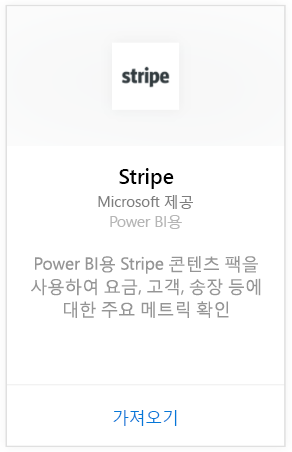
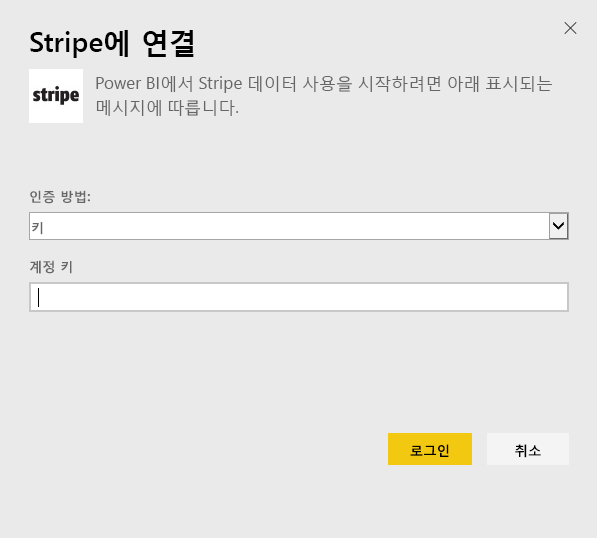

# Power BI로 Stripe에 연결
Power BI 콘텐츠 팩을 사용하여 Power BI에서 Stripe 데이터를 시각화하고 탐색합니다. Power BI Stripe 콘텐츠 팩은 고객, 요금, 이벤트 및 송장에 대한 데이터를 끌어옵니다. 이 데이터에는 가장 최근 이벤트 10,000개와 지난 30일 동안의 요금 5,000개가 포함됩니다. 콘텐츠는 사용자가 제어하는 일정에 따라 매일 한 번 자동으로 새로 고쳐집니다. 

[Power BI용 Stripe 콘텐츠 팩](https://app.powerbi.com/getdata/services/stripe)에 연결합니다.

## 연결 방법
1. 왼쪽 탐색 창의 맨 아래에 있는 데이터 가져오기를 선택합니다.  
   
    
2. **서비스** 상자에서 **가져오기**를 선택합니다.  
   
      
3. **Stripe** &gt; **가져오기**를 선택합니다.  
   
      
4. 연결할 Stripe [API 키](https://dashboard.stripe.com/account/apikeys)를 제공합니다.  
   
    
5. 가져오기 프로세스가 자동으로 시작됩니다. 완료되면 별표로 표시된 새 대시보드, 보고서 및 모델이 탐색 창에 나타납니다. 대시보드를 선택하여 가져온 데이터를 표시합니다.
   
    

**다음 단계**

* 대시보드 맨 위에 있는 [질문 및 답변 상자에 질문](power-bi-q-and-a.md)합니다.
* 대시보드에서 [타일을 변경](service-dashboard-edit-tile.md)합니다.
* [타일을 선택](service-dashboard-tiles.md)하여 원본 보고서를 엽니다.
* 데이터 집합을 매일 새로 고치도록 예약하는 경우 새로 고침 일정을 변경하거나 **지금 새로 고침**을 사용하여 필요할 때 새로 고칠 수 있습니다.

## 다음 단계
[Power BI 시작](service-get-started.md)

[Power BI에 대한 데이터 가져오기](service-get-data.md)

