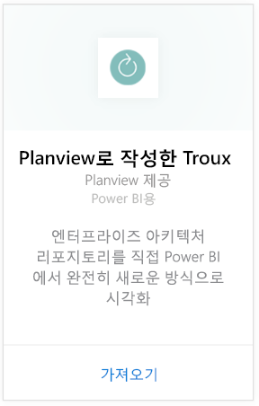
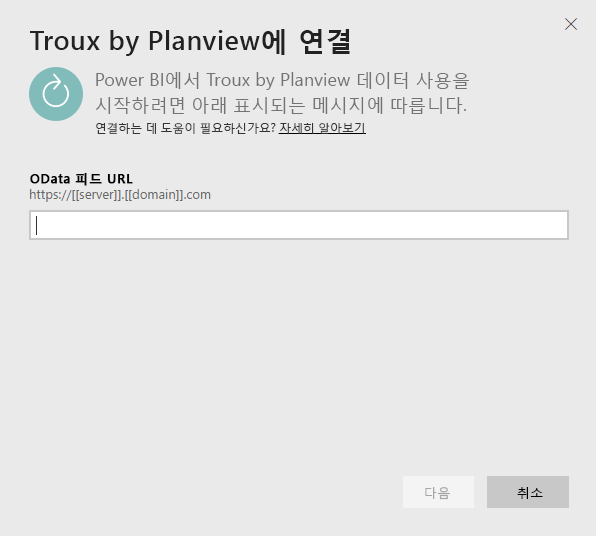
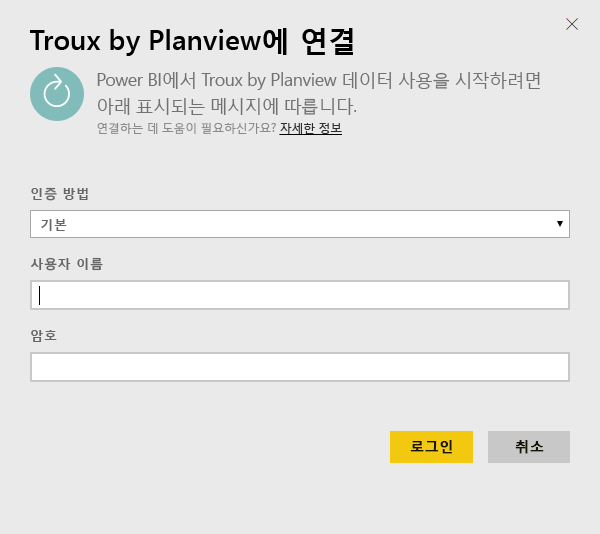
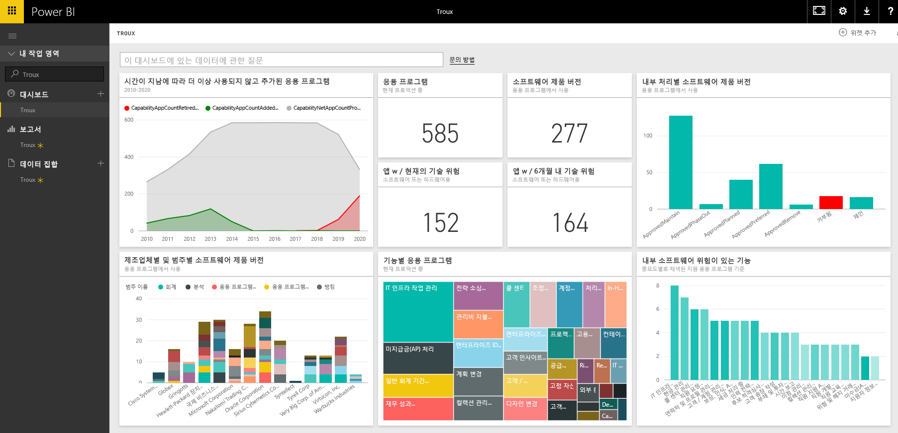

# Power BI용 Troux에 연결
Troux 콘텐츠 팩을 사용하여 엔터프라이즈 아키텍처 리포지토리를 직접 Power BI에서 완전히 새로운 방식으로 시각화할 수 있습니다. 이 콘텐츠 팩은 비즈니스 기능에 대한 일련의 통찰력, 이러한 기능을 제공하는 응용 프로그램, 그리고 Power BI를 사용하여 완벽하게 사용자 지정할 수 있는 이러한 응용 프로그램을 지원하는 기술을 제공합니다.

Power BI용 [Troux 콘텐츠 팩](https://app.powerbi.com/getdata/services/troux)에 연결하세요.

## 연결 방법
1. 왼쪽 탐색 창의 맨 아래에 있는 **데이터 가져오기** 를 선택합니다.
   
   
2. **서비스** 상자에서 **가져오기**를 선택합니다.
   
   
3. **Troux** \>  **가져오기**를 선택합니다.
   
   
4. Troux OData URL을 지정합니다. 아래 [이러한 매개 변수 찾기](#FindingParams)에서 세부 정보를 참조하세요.
   
   
5. **인증 방법**에 대해 **기본** 을 선택하고, 사용자 이름 및 암호(대/소문자 구분)를 제공한 다음 **로그인**을 선택합니다.
   
    
6. 승인되면 가져오기 프로세스가 자동으로 시작됩니다. 완료되면 새 대시보드, 보고서 및 모델이 탐색 창에 나타납니다. 대시보드를 선택하여 가져온 데이터를 표시합니다.
   
     

**다음 단계**

* 대시보드 맨 위에 있는 [질문 및 답변 상자에 질문](power-bi-q-and-a.md)합니다.
* 대시보드에서 [타일을 변경](service-dashboard-edit-tile.md)합니다.
* [타일을 선택](service-dashboard-tiles.md)하여 원본 보고서를 엽니다.
* 데이터 집합을 매일 새로 고치도록 예약하는 경우 새로 고침 일정을 변경하거나 **지금 새로 고침**을 사용하여 필요할 때 새로 고칠 수 있습니다.

## 시스템 요구 사항
Troux OData 피드에 액세스하려면 Troux 9.5.1 이상이 필요합니다.

## 매개 변수 찾기
고객 관리 팀에서 고유한 Troux OData 피드 URL을 제공할 수 있습니다.

## 문제 해결
자격 증명을 제공한 후 시간 초과 오류가 표시되는 경우 다시 연결을 시도해 보세요.

## 다음 단계
[Power BI에서 시작](service-get-started.md)

[Power BI에서 데이터 가져오기](service-get-data.md)

