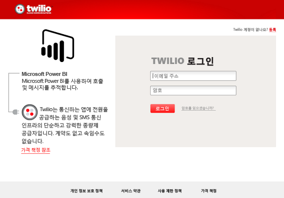
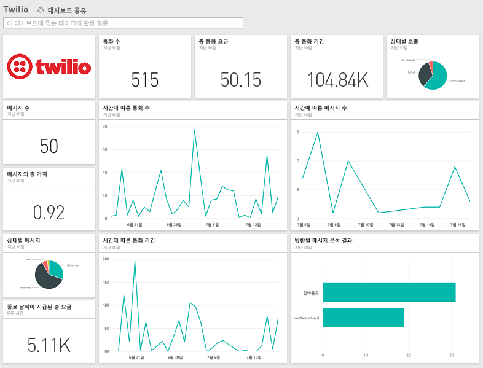

# Power BI로 Twilio에 연결
Power BI용 Microsoft Twilio 콘텐츠 팩은 Power BI로 데이터를 끌어올 수 있도록 하며 데이터에 대한 통찰력을 보여 주는 기본 [Twilio 대시보드](https://powerbi.microsoft.com/integrations/twilio) 및 보고서를 만듭니다. Power BI가 만든 데이터 집합에 대해 사용자 지정 보고서 및 대시보드를 만들 수도 있습니다. 하루에 한 번 데이터가 새로 고쳐지므로 항상 최신 데이터가 표시됩니다.

Power BI용 [Twilio 콘텐츠 팩](https://app.powerbi.com/getdata/services/twilio)에 연결합니다.

## 연결 방법
1. 왼쪽 탐색 창의 맨 아래에 있는 **데이터 가져오기** 를 선택합니다.
   
    
2. **서비스** 상자에서 **가져오기**를 선택합니다.
   
    
3. **Twilio** \> **가져오기**를 선택합니다.
   
   
4. **인증 방법**에 대해 **oAuth2** \> 로그인을 선택합니다. 메시지가 표시되면 Twilio 자격 증명을 제공하고 데이터에 액세스할 수 권한을 Power BI 응용 프로그램에 부여합니다.
   
   
5. 이렇게 하면 Twilio 계정에서 데이터 가져오기가 시작되며, 지난 30일간의 통화 및 메시지 사용 현황이 대시보드에 채워집니다. 
   
   

**다음 단계**

* 대시보드 맨 위에 있는 [질문 및 답변 상자에 질문](power-bi-q-and-a.md)합니다.
* 대시보드에서 [타일을 변경](service-dashboard-edit-tile.md)합니다.
* [타일을 선택](service-dashboard-tiles.md)하여 원본 보고서를 엽니다.
* 데이터 집합을 매일 새로 고치도록 예약하는 경우 새로 고침 일정을 변경하거나 **지금 새로 고침**을 사용하여 필요할 때 새로 고칠 수 있습니다.

## 포함된 내용
지난 30일간의 모든 통화 및 메시지 트랜잭션에 대한 세부 정보. 이 데이터에 대해 모든 종류의 분석 및 집계를 수행할 수 있습니다.

예의 주시하려는 이미 집계된 통계 집합. 이 집합에는 다음이 포함됩니다.

        All Time Calls Count  
        All Time Calls Duration  
        All Time Calls Price  
        All Time Messages Price  
        All Time Messages Count  
        All Time Count of Phone Numbers  
        All Time Price of Phone Numbers  
        All Time Twilio Client Calls Price  
        All Time Twilio Client Calls Duration  
        All Time Twilio Client Calls Count  
        All Time Total Price  
        All Time Inbound Calls Price  
        All Time Inbound Calls Duration  
        All Time Inbound Calls Count  
        All Time Outbound Calls Price  
        All Time Outbound Calls Duration  
        All Time Outbound Calls Count  
        This Month Calls Price  
        This Month Calls Duration  
        This Month Calls Count  
        This Month Messages Count  
        This Month Messages Price  
        This Month Count of Phone Numbers  
        This Month Price of Phone Numbers  
        This Month Twilio Client Calls Price  
        This Month Twilio Client Calls Duration  
        This Month Twilio Client Calls Count  
        This Month Total Price  
        This Month Inbound Calls Price  
        This Month Inbound Calls Duration  
        This Month Inbound Calls Count  
        This Month Outbound Calls Price  
        This Month Outbound Calls Duration  
        This Month Outbound Calls Count  
        This Month Inbound Messages Price  
        This Month Inbound Messages Count  
        This Month Outbound Messages Price  
        This Month Outbound Messages Count

## 문제 해결
지난 30일간 많은 양의 데이터가 있는 경우(수십만 개의 트랜잭션) 데이터 검색 단계가 실패할 수 있습니다. 문제를 알고 있으며 해결을 위해 작업 중입니다. 그 동안 이 문제가 발생할 경우 Power BI 페이지의 맨 위에 있는 지원 링크를 사용하여 알려주시면 추가 조사를 위해 연락 드리겠습니다.

## 다음 단계
[Power BI에서 시작](service-get-started.md)

[Power BI에서 데이터 가져오기](service-get-data.md)

