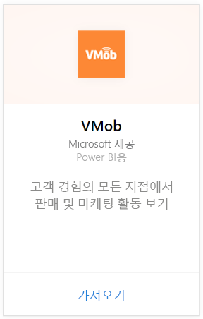
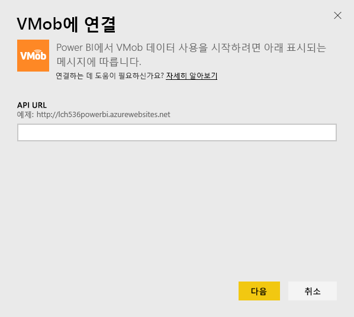
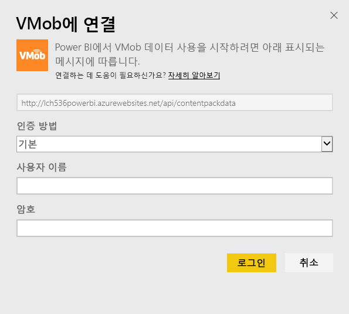
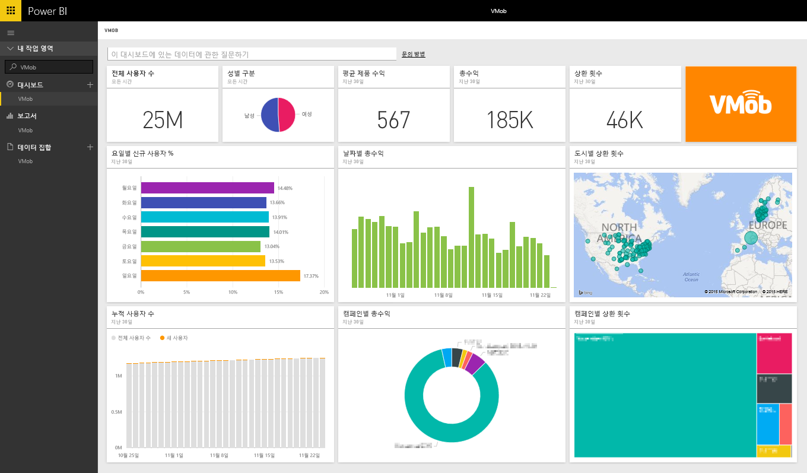

# Power BI로 VMob에 연결
Power BI 및 VMob 콘텐츠 팩에서 VMob 데이터 추적 및 탐색이 쉽습니다. Power BI는 다음 데이터를 검색합니다. 전체 시간 및 지난 30일에 대한 사용자 통계, 지난 30일에 대한 정품 KPI 및 지난 30일 동안의 캠페인 성능.

Power BI용 [VMob 콘텐츠 팩](https://app.powerbi.com/getdata/services/vmob)에 연결합니다.

## 연결 방법
1. 왼쪽 탐색 창의 맨 아래에 있는 **데이터 가져오기** 를 선택합니다.
   
    
2. **서비스** 상자에서 **가져오기**를 선택합니다.
   
   
3. **VMob** \> **가져오기**를 선택합니다.
   
   
4. 메시지가 표시되면 VMob URL을 입력하고 다음 단추를 클릭합니다. 이 URL은 VMob 별도로 제공됩니다.
   
    
5. 인증 방법 드롭다운에서 **기본** 옵션을 선택하고 VMob 사용자 이름 및 암호를 입력한 다음 **로그인** 단추를 클릭합니다.
   
    
6. 가져오기 프로세스가 자동으로 시작되고 Power BI가 VMob 데이터를 검색하여 즉시 사용 가능한 대시보드 및 보고서를 만듭니다.
   
   

**다음 단계**

* 대시보드 맨 위에 있는 [질문 및 답변 상자에 질문](consumer/end-user-q-and-a.md)합니다.
* 대시보드에서 [타일을 변경](service-dashboard-edit-tile.md)합니다.
* [타일을 선택](consumer/end-user-tiles.md)하여 원본 보고서를 엽니다.
* 데이터 세트을 매일 새로 고치도록 예약하는 경우 새로 고침 일정을 변경하거나 **지금 새로 고침**을 사용하여 필요할 때 새로 고칠 수 있습니다.

## 다음 단계
[Power BI에서 시작](service-get-started.md)

[Power BI에서 데이터 가져오기](service-get-data.md)

