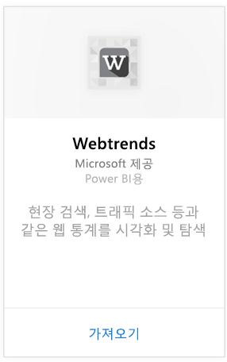
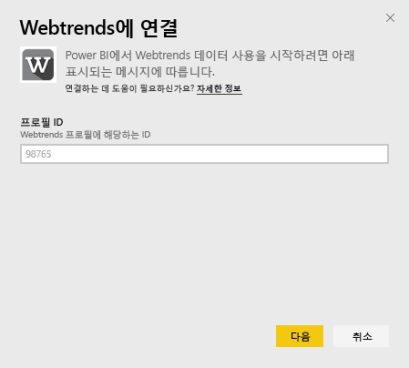
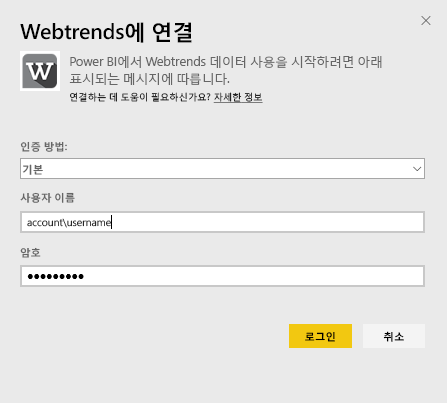
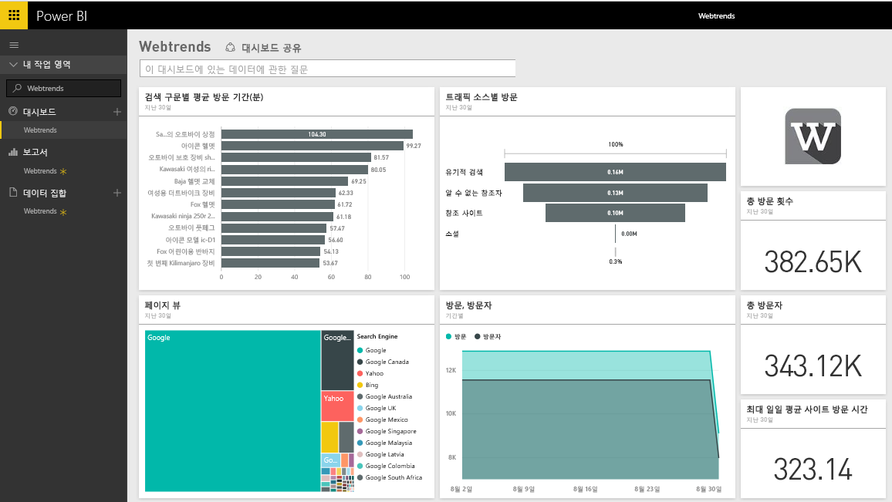
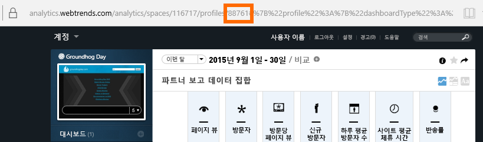
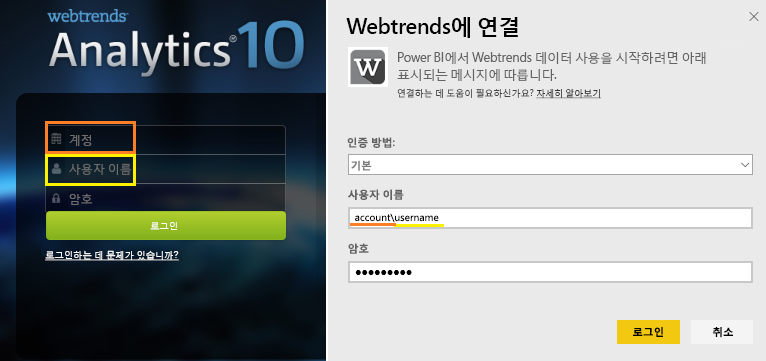

# Power BI로 Webtrends에 연결
Power BI용 Webtrends 콘텐츠 팩에는 트래픽 소스별 총 페이지 보기 및 방문 횟수와 같은 다양한 기본 메트릭이 포함되어 있습니다. Webtrends 계정에 연결하여 Power BI에서 Webtrends 데이터를 시각화합니다. 제공된 대시보드 및 보고서를 사용하거나, 가장 관심 있는 정보를 강조 표시하도록 사용자 지정할 수 있습니다.  하루에 한 번 자동으로 데이터가 새로 고쳐집니다.

[Power BI용 Webtrends 콘텐츠 팩](https://app.powerbi.com/getdata/services/webtrends)에 연결합니다.

## 연결 방법
1. 왼쪽 탐색 창의 맨 아래에 있는 **데이터 가져오기** 를 선택합니다.
   
   
2. **서비스** 상자에서 **가져오기**를 선택합니다.
   
   
3. **Webtrends** \> **가져오기**를 선택합니다.
   
   
4. 콘텐츠 팩이 특정 Webtrends 프로필 ID에 연결합니다. 아래 [매개 변수 찾기](#FindingParams)에서 세부 정보를 참조하세요.
   
   
5. 연결할 Webtrends 자격 증명을 제공합니다. 계정 필드에 사용자 계정과 사용자 이름을 제공합니다. 아래 [세부 정보](#FindingParams)를 참조하세요.
   
   
6. 승인되면 가져오기 프로세스가 자동으로 시작됩니다. 완료되면 새 대시보드, 보고서 및 모델이 탐색 창에 나타납니다. 대시보드를 선택하여 가져온 데이터를 표시합니다.
   
   

**다음 단계**

* 대시보드 맨 위에 있는 [질문 및 답변 상자에 질문](consumer/end-user-q-and-a.md)합니다.
* 대시보드에서 [타일을 변경](service-dashboard-edit-tile.md)합니다.
* [타일을 선택](consumer/end-user-tiles.md)하여 원본 보고서를 엽니다.
* 데이터 세트를 매일 새로 고치도록 예약하는 경우 새로 고침 일정을 변경하거나 **지금 새로 고침**을 사용하여 필요할 때 새로 고칠 수 있습니다.

## 포함된 내용

Webtrends 콘텐츠 팩은 다음 보고서에서 데이터를 끌어옵니다.  

| 보고서 이름 | 보고서 ID |
| --- | --- |
| 주요 메트릭 | |
| 현장 검색 |34awBVEP0P6 |
| 페이지 종료 |7FshY8eP0P6 |
| 다음 페이지 |CTd5rpeP0P6 |
| 이전 페이지 |aSdOeaUgnP6 |
| 사이트 페이지 |oOEWQj3sUo6 |
| 현장 광고 클릭 방문 |41df19b6d9f |
| 도시 |aUuHskcP0P6 |
| Countries |JHWXJNcP0P6 |
| 방문자 |xPcmTDDP0P6 |
| 방문 기간 |U5KAyqdP0P6 |
| 검색 구문 |IKYEDxIP0P6 |
| 트래픽 소스 |JmttAoIP0P6 |
| 검색 엔진 |yGz3gAGP0P6 |
| 항목 페이지 |i6LrkNVRUo6 |

>[!NOTE]
>SharePoint 프로필의 경우 메트릭 이름이 Webtrends UI에 표시된 것과 조금 다를 수도 있습니다. SharePoint 및 웹 프로필 간의 일관성을 유지하기 위해 다음 매핑이 수행됩니다.   

    - 세션 = 방문  
    - 새 사용자 = 새 방문자  
    - 세션당 뷰 = 방문 당 페이지 뷰  
    - 일간 평균 사용자 접속 기간 = 방문자 당 사이트 접속 평균 시간  

## 시스템 요구 사항
콘텐츠 팩은 [보고서 집합 수정](#Included)을 사용하도록 설정한 Webtrends 프로필에 대한 액세스가 필요합니다.

## 매개 변수 찾기
Webtrends 프로필 ID를 선택한 후에 URL에서 사용자 Webtrends 프로필 ID를 찾을 수 있습니다.

사용자의 자격 증명이 Webtrends에 로그인할 때 입력한 것과 동일하지만, 같은 줄에서 계정 및 사용자 이름이 백슬래시로 구분됩니다.

## 문제 해결
자격 증명을 제공한 후에 콘텐츠 팩이 로드되는 동안 문제가 발생할 수 있습니다. 로드하는 동안 "Oops" 메시지를 확인하는 경우 아래의 문제 해결 제안을 검토합니다. 문제가 있는 경우 https://support.powerbi.com 에 지원 티켓을 제출합니다.

1. 올바른 프로필 ID을 사용하는 것에 대한 자세한 내용은 [매개 변수 찾기](#FindingParams)를 참조하세요.
2. 사용자는 ["포함된 내용"](#Included) 섹션에 나열된 보고서에 대한 액세스 권한이 있습니다.

## 다음 단계
[Power BI란?](power-bi-overview.md)

[Power BI - 기본 개념](consumer/end-user-basic-concepts.md)

