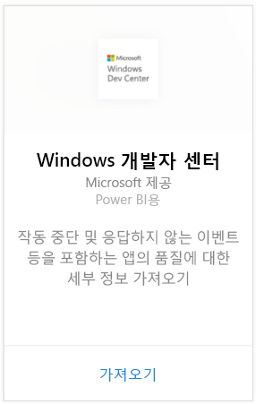
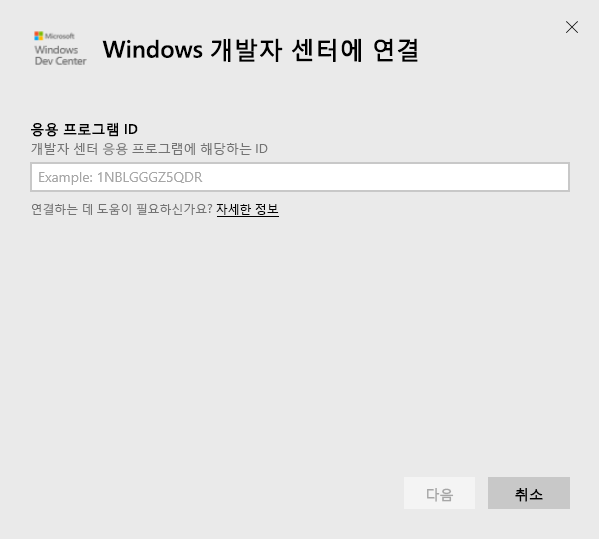
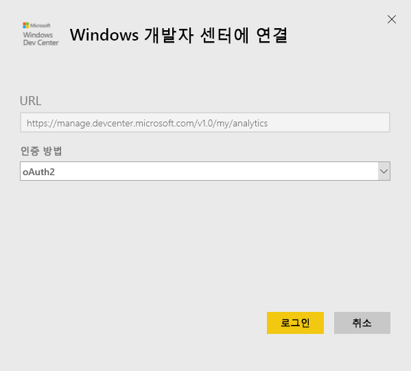
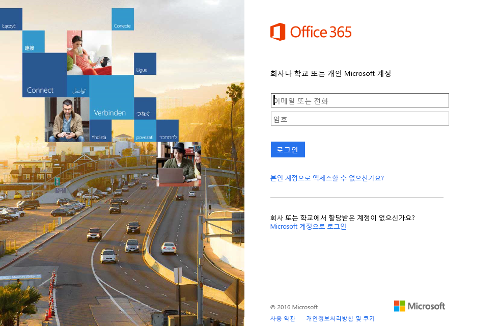
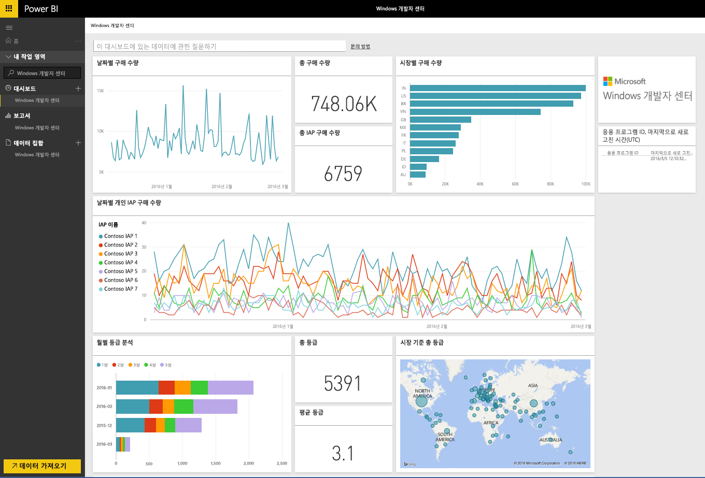
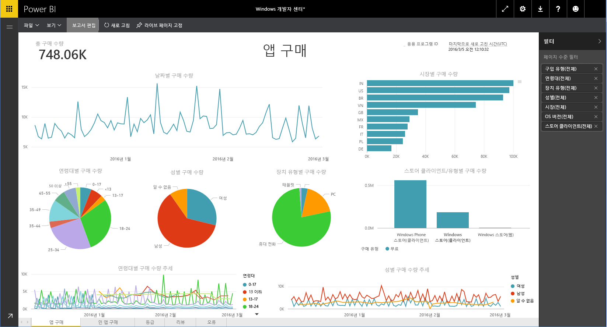

# Power BI로 Windows 개발자 센터에 연결
Power BI 콘텐츠 팩을 사용하여 Power BI에서 Windows 개발자 센터 앱을 탐색하고 모니터링합니다. 하루에 한 번 자동으로 데이터가 새로 고쳐집니다.

Power BI용 [Windows 개발자 센터 콘텐츠 팩](https://app.powerbi.com/getdata/services/devcenter)에 연결합니다.

## 연결 방법
1. 왼쪽 탐색 창의 맨 아래에 있는 **데이터 가져오기** 를 선택합니다.
   
   
2. **서비스** 상자에서 **가져오기**를 선택합니다.
   
   
3. **Windows 개발자 센터** \> **가져오기**를 선택합니다.
   
   
4. 소유한 앱의 응용 프로그램 ID를 입력하고 다음을 클릭합니다. 아래 [이러한 매개 변수 찾기](#FindingParams)에서 세부 정보를 참조하세요.
   
   
5. **인증 방법**에 대해 **oAuth2** \> **로그인**을 선택합니다. 대화 상자가 나타나면 Windows 개발자 센터 계정에 연결된 Azure Active Directory 자격 증명을 입력합니다(자세한 내용은 [시스템 요구 사항](#Requirements) 참조).
   
    
   
    
6. 승인되면 가져오기 프로세스가 자동으로 시작됩니다. 완료되면 새 대시보드, 보고서 및 모델이 탐색 창에 나타납니다. 대시보드를 선택하여 가져온 데이터를 확인하고 타일을 선택하여 기본 보고서를 탐색합니다.
   
    
   
    

**다음 단계**

* 대시보드 맨 위에 있는 [질문 및 답변 상자에 질문](power-bi-q-and-a.md)합니다.
* 대시보드에서 [타일을 변경](service-dashboard-edit-tile.md)합니다.
* [타일을 선택](service-dashboard-tiles.md)하여 원본 보고서를 엽니다.
* 데이터 집합을 매일 새로 고치도록 예약하는 경우 새로 고침 일정을 변경하거나 **지금 새로 고침**을 사용하여 필요할 때 새로 고칠 수 있습니다.

## 포함된 내용
개발자 센터 Power BI 콘텐츠 팩에는 앱 및 IAP 합병, 등급, 검토 및 앱 상태에 대한 분석 데이터가 포함됩니다. 데이터는 최근 3개월로 제한되고 변동되는 기간이므로 포함되는 날짜는 데이터 집합을 새로 고치면 업데이트됩니다.

## 시스템 요구 사항
이 콘텐츠 팩은 Windows 스토어 및 Windows 개발자 센터 계정에 게시된 하나 이상의 앱이 필요합니다(자세한 내용은 [여기](https://msdn.microsoft.com/windows/uwp/publish/manage-account-users) 참조).

## 매개 변수 찾기
앱 관리의 앱 ID 페이지로 이동하여 앱에 대한 응용 프로그램 ID를 찾을 수 있습니다.

응용 프로그램 ID는 Windows 10 스토어에 대한 URL의 끝인 https://www.microsoft.com/store/apps/ **{applicationId}**에 있습니다.

## 다음 단계
[Power BI에서 시작](service-get-started.md)

[Power BI에서 데이터 가져오기](service-get-data.md)

