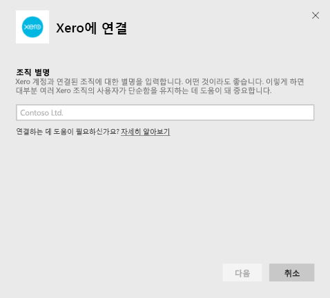
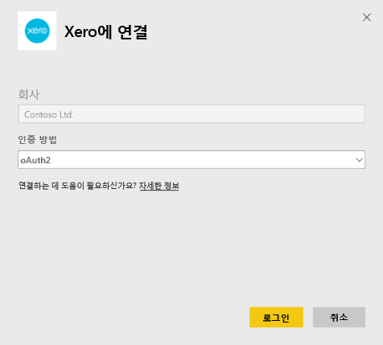
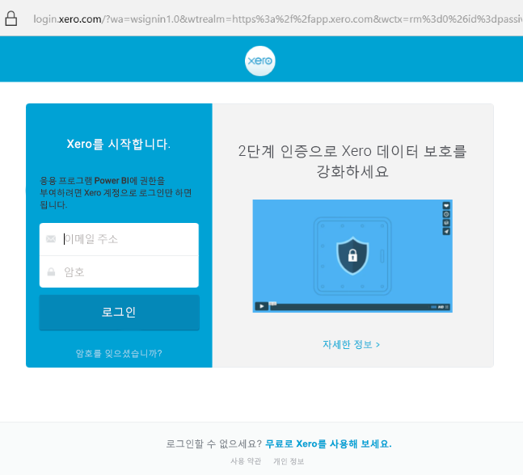
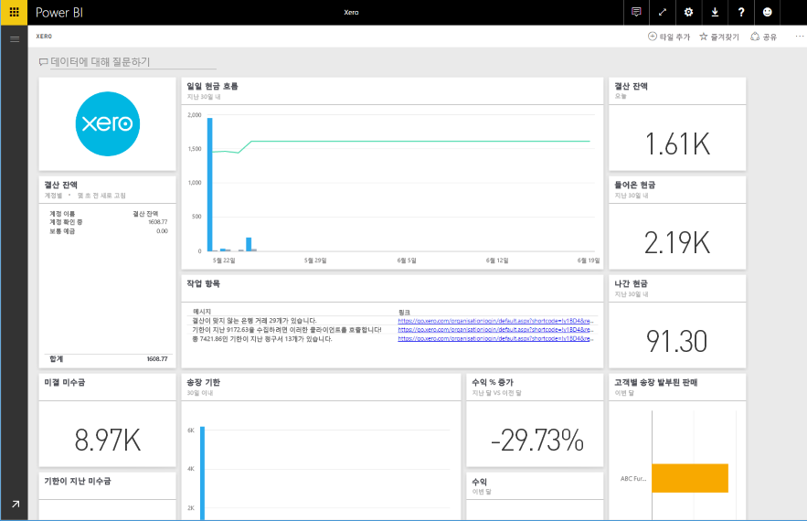

# Power BI로 Xero에 연결
Xero는 중소기업을 위해 특별히 설계된 사용이 용이한 온라인 계정 소프트웨어입니다. 이 Power BI 콘텐츠 팩으로 Xero 재무를 기반으로 하여 매력적인 시각화 개체를 만들어 보세요. 기본 대시보드에는 현금 보유 현황, 수익과 지출 비교, 손익 추세, 대금 결제 기간, 투자 수익률 등 다양한 중소기업 메트릭이 포함됩니다.

Power BI용 [Xero 콘텐츠 팩](https://app.powerbi.com/getdata/services/xero)에 연결하거나 [Xero 및 Power BI](https://help.xero.com/Power-BI) 통합에 대해 자세히 알아보세요.

## 연결 방법
1. 왼쪽 탐색 창의 맨 아래에 있는 **데이터 가져오기** 를 선택합니다.
   
   
2. **서비스** 상자에서 **가져오기**를 선택합니다.
   
   
3. **Xero** \>  **가져오기**를 선택합니다.
   
   
4. Xero 계정과 연결된 조직에 대한 별명을 입력합니다. 어떤 것이라도 좋으며 이렇게 하면 대부분 여러 Xero 조직의 사용자가 단순함을 유지하는 데 도움이 됩니다. [아래](#FindingParams) 세부 정보를 참조하세요.
   
   
5. **인증 방법**으로 **OAuth**를 선택하고 Xero 계정에 로그인하라는 메시지가 표시되면 연결할 조직을 선택합니다. 로그인이 완료되면 **로그인**을 선택하여 로딩 프로세스를 시작합니다.
   
    
   
    
6. 승인되면 가져오기 프로세스가 자동으로 시작됩니다. 완료되면 새 대시보드, 보고서 및 모델이 탐색 창에 나타납니다. 대시보드를 선택하여 가져온 데이터를 표시합니다.
   
     

**다음 단계**

* 대시보드 맨 위에 있는 [질문 및 답변 상자에 질문](service-q-and-a.md)합니다.
* 대시보드에서 [타일을 변경](service-dashboard-edit-tile.md)합니다.
* [타일을 선택](service-dashboard-tiles.md)하여 원본 보고서를 엽니다.
* 데이터 집합을 매일 새로 고치도록 예약하는 경우 새로 고침 일정을 변경하거나 **지금 새로 고침**을 사용하여 필요할 때 새로 고칠 수 있습니다.

## 포함된 내용
콘텐츠 팩 대시보드에는 다양한 영역을, 이에 대한 자세한 내용이 있는 해당 보고서와 함께 포괄하는 타일 및 메트릭이 포함됩니다.  

| 영역 | 대시보드 타일 | 보고서 |
| --- | --- | --- |
| 현금 |일일 현금 흐름  들어온 현금  나간 현금  계정별 결산 잔액  오늘 결산 잔액 |은행 계좌 |
| 고객 |송장 발부된 판매  고객별 송장 발부된 판매  송장 발부된 판매 급수 추세  송장 기한  미결 미수금  기한이 지난 미수금 |고객  재고 |
| 공급업체 |청구된 구매  공급업체별 청구된 구매  청구된 구매 급수 추세   만기 어음  미결 매입금  만기 매입금 |공급업체  재고 |
| 재고 |제품별 월간 판매량 |재고 |
| 손익 |월간 손익  순이익 당 회계 년도  순이익 당월  상위 비용 계정 |손익 |
| 대차대조표 |총 자산  총 부채  지분 |대차대조표 |
| 건강 |현재 비율  매출 총이익 백분율   총 자산 이익률  총 부채 대 자산 비율 |건강  용어 및 기술 참고 사항 |

데이터 집합은 보고서 및 대시보드를 사용자 지정하는 다음 테이블을 포함합니다.  

* 주소  
* 경고  
* 은행 거래 내역서 일일 잔고  
* 은행 거래 내역서  
* 연락처  
* 비용 청구서  
* 송장 품목  
* 송장  
* 항목  
* 월말  
* 조직  
* 시산표  
* Xero 계정

## 시스템 요구 사항
Xero 콘텐츠 팩에 액세스하려면 "Standard + Reports" 또는 "Advisor" 역할이 필요합니다.

## 매개 변수 찾기
Power BI에서 추적할 조직 이름을 제공합니다. 이를 통해 여러 서로 다른 조직에 연결할 수 있습니다. 예약된 새로 고침에 영향을 주므로 동일한 조직에 여러 번 연결할 수 없습니다.   

## 문제 해결
* Xero 사용자는 Power BI용 Xero 콘텐츠 팩에 액세스하려면 "Standard + Reports" 또는 "Advisor" 역할을 보유해야 합니다. 콘텐츠 팩은 Power BI를 통해 보고 데이터에 액세스하는 데 사용자 기반 권한을 사용합니다.  
* 얼마 동안 로드한 후 오류가 표시되면, 오류 메시지가 표시되기 까지 소요된 시간을 확인하세요. Xero에서 제공하는 액세스 토큰은 30분 동안만 유효하기 때문에 그 시간 안에 로드될 수 있는 것보다 많은 데이터가 있는 계정은 실패하게 됩니다. 이를 개선하기 위해 적극적으로 노력하고 있습니다.
* 로드하는 동안 대시보드의 타일은 일반 로딩 상태가 유지됩니다. 이것은 전체 로드가 완료될 때까지 변경되지 않습니다. 로드가 완료되었다는 알림을 받았는데 타일이 아직 로드 중이면, 대시보드 오른쪽 위에 있는 ...를 사용하여 대시보드 타일을 새로 고쳐 보세요.
* 콘텐츠 팩을 새로 고칠 수 없는 경우 Power BI에서 동일한 조직에 두 번 이상 연결했는지 확인하세요. Xero에서는 조직에 대한 단일 활성 연결만 허용하며 동일한 조직에 두 번 이상 연결하는 경우 자격 증명이 유효하지 않음을 나타내는 오류가 표시될 수 있습니다.  
* 오류 메시지 또는 매우 느린 로드 시간처럼 Power BI용 Xero 콘텐츠 팩에 연결하는 문제의 경우 먼저 캐시/쿠키를 지우고 브라우저를 다시 시작한 후 Power BI에 다시 연결합니다.  

다른 문제의 경우 문제가 지속되면 http://support.powerbi.com에 티켓을 제출합니다.

## 다음 단계
[Power BI에서 시작](service-get-started.md)

[Power BI에서 데이터 가져오기](service-get-data.md)

