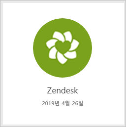
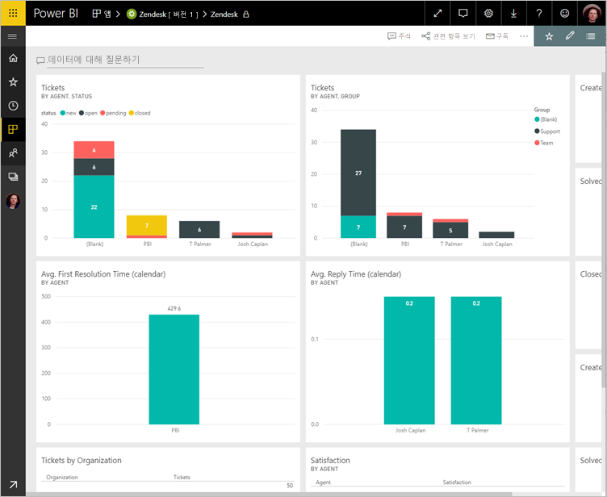
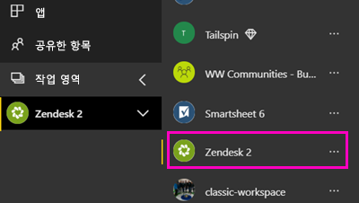
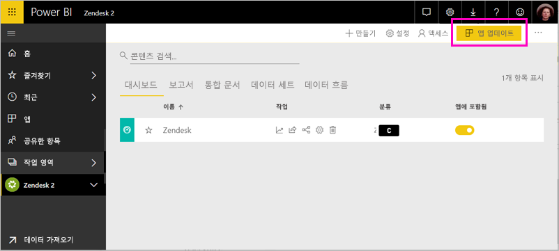

# Power BI로 Zendesk에 연결

이 문서에서는 Power BI 템플릿 앱을 사용하여 Zendesk 계정에서 데이터를 가져오는 방법을 안내합니다. Zendesk 앱에는 티켓 볼륨 및 에이전트 성능에 대한 정보를 제공하는 Power BI 보고서 집합과 하나의 대시보드를 제공합니다. 하루에 한 번 자동으로 데이터가 새로 고쳐집니다. 

템플릿 앱을 설치한 후, 가장 중요한 정보를 강조 표시하기 위해 대시보드 및 보고서를 사용자 지정할 수 있습니다. 그런 다음 조직의 동료에게 앱으로 배포할 수 있습니다.

[Zendesk 콘텐츠 팩](https://app.powerbi.com/getdata/services/zendesk)에 연결하거나 Power BI와의 [Zendesk 통합](https://powerbi.microsoft.com/integrations/zendesk)에 대해 자세히 알아보세요.

템플릿 앱을 설치한 후에 대시보드 및 보고서를 변경할 수 있습니다. 그런 다음 조직의 동료에게 앱으로 배포할 수 있습니다.

>[!NOTE]
>연결 하려면 Zendesk 관리자 계정이 필요 합니다. [요구 사항](#system-requirements)에 대한 자세한 내용은 아래에 나와 있습니다.

## 연결 방법

[!INCLUDE [powerbi-service-apps-get-more-apps](./includes/powerbi-service-apps-get-more-apps.md)]

3. **Zendesk** \> **지금 받기**를 선택합니다.
4. **Power BI 앱 설치?**에서 **설치**를 선택합니다.

4. **앱** 창에서 **Zendesk** 타일을 선택합니다.

    

6. **새 앱을 시작하세요**에서 **연결**을 선택합니다.

    

4. 계정과 연결된 URL을 제공합니다. URL의 형식은 **https://company.zendesk.com**입니다. 아래에서 [해당 매개 변수 찾기](#finding-parameters)에 대한 세부 정보를 참조하세요.
   
   

5. 메시지가 표시되면 Zendesk 자격 증명을 입력합니다. **oAuth 2**를 인증 메커니즘으로 선택하고 **로그인**을 클릭합니다. Zendesk 인증 흐름을 따릅니다. (이미 브라우저에서 Zendesk에 로그인한 경우, 자격 증명에 대해 묻지 않을 수 있습니다.)

   
   > [!NOTE]
   > 이 콘텐츠 팩은 Zendesk 관리자 계정으로 연결해야 합니다. 
   > 
   
   
6. **허용**을 클릭하여 Power BI가 Zendesk 데이터에 액세스할 수 있도록 합니다.
   
   
7. **연결**을 클릭하여 가져오기 프로세스를 시작합니다. 
8. Power BI가 데이터를 가져오면, Zendesk 앱에 대한 콘텐츠 목록이 표시됩니다: 새 대시보드, 보고서 및 데이터 집합.
9. 탐색 프로세스를 시작 하려면 대시보드를 선택 합니다.

    
   
## 수정, 앱 배포

Zendesk 템플릿 앱을 설치했습니다. 즉, Zendesk 앱 작업 영역도 만들었습니다. 작업 영역에서 보고서 및 대시보드를 변경한 다음, 조직의 동료에게 *앱*으로 배포합니다. 

1. 새 Zendesk 작업 영역의 모든 콘텐츠를 보려면 왼쪽 탐색 모음에서 **작업 영역** > **Zendesk**를 선택합니다. 

    

    이 보기는 작업 영역 콘텐츠 목록입니다. 오른쪽 위 모서리에 **앱 업데이트**가 표시됩니다. 동료에게 앱을 배포할 준비가 된 경우 시작할 수 있습니다. 

    

2. **보고서**와 **데이터 세트**를 선택하여 작업 영역에서 다른 요소를 확인합니다.

    동료에게 [앱 배포](service-create-distribute-apps.md)를 읽어보세요.

## 시스템 요구 사항
Zendesk 콘텐츠 팩에 액세스하려면 Zendesk 관리자 계정이 필요합니다. 에이전트 또는 최종 사용자이고 Zendesk 데이터를 보는 것에 관심이 있다면 제안 사항을 추가하고 [Power BI Desktop](desktop-connect-to-data.md)의 Zendesk 커넥터를 검토합니다.

## 매개 변수 찾기
Zendesk URL은 Zendesk 계정에 로그인하는 데 사용하는 URL과 동일합니다. Zendesk URL을 잘 모를 경우 Zendesk [로그인 도움말](https://www.zendesk.com/login/)을 사용할 수 있습니다.

## 문제 해결
연결하는 데 문제가 있는 경우, Zendesk URL을 확인하고 Zendesk 관리자 계정을 사용하는지 확인합니다.

## 다음 단계

* [Power BI에서 새 작업 영역 만들기](service-create-the-new-workspaces.md)
* [Power BI에서 앱 설치 및 사용](consumer/end-user-apps.md)
* [외부 서비스용 Power BI 앱에 연결](service-connect-to-services.md)
* 궁금한 점이 더 있나요? [Power BI 커뮤니티에 질문합니다.](http://community.powerbi.com/)

