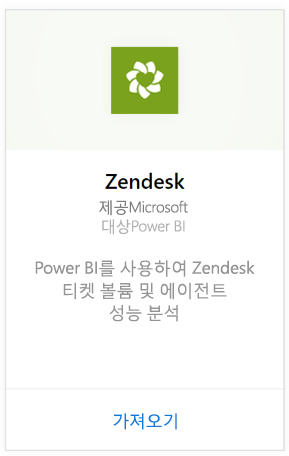
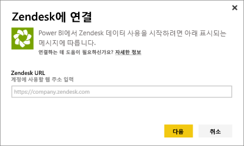
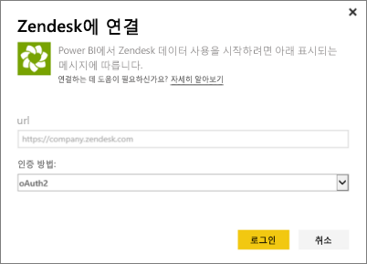
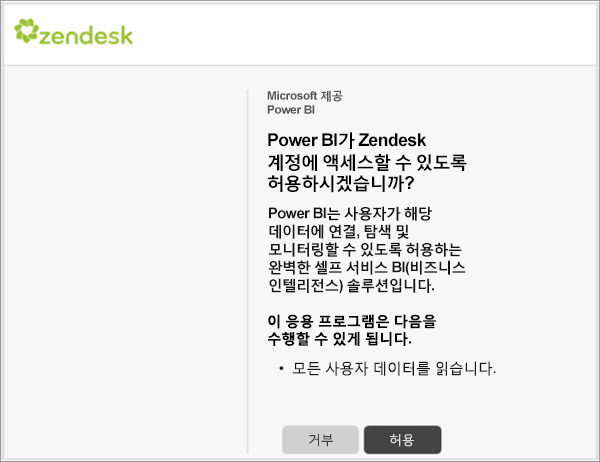

# Power BI로 Zendesk에 연결
Zendesk 콘텐츠 팩은 티켓 볼륨 및 에이전트 성능에 대한 통찰력을 제공하는 Power BI 대시보드 및 Power BI 보고서 집합을 제공합니다. 제공된 대시보드 및 보고서를 사용하거나, 가장 관심 있는 정보를 강조 표시하도록 사용자 지정할 수 있습니다.  하루에 한 번 자동으로 데이터가 새로 고쳐집니다. 

[Zendesk 콘텐츠 팩](https://app.powerbi.com/getdata/services/zendesk)에 연결하거나 Power BI와의 [Zendesk 통합](https://powerbi.microsoft.com/integrations/zendesk)에 대해 자세히 알아보세요.

>[!NOTE]
>연결하려면 Zendesk 관리자 계정이 필요합니다. [요구 사항](#Requirements)에 대한 자세한 내용은 아래에 나와 있습니다.

## 연결 방법
1. 왼쪽 탐색 창의 맨 아래에 있는 **데이터 가져오기** 를 선택합니다.
   
   
2. **서비스** 상자에서 **가져오기**를 선택합니다.
   
    
3. **Zendesk** \> **가져오기**를 선택합니다.
   
   
4. 계정과 연결된 URL을 제공합니다. **https://company.zendesk.com** 형태를 갖습니다. 아래에서 [해당 매개 변수 찾기](#FindingParams)에 대한 세부 정보를 참조하세요.
   
   
5. 메시지가 표시되면 Zendesk 자격 증명을 입력합니다.  **oAuth 2** 를 인증 메커니즘으로 선택하고 **로그인**을 클릭합니다. Zendesk 인증 흐름을 따릅니다. 브라우저에서 Zendesk에 이미 로그인한 경우 자격 증명을 묻는 메시지가 표시되지 않을 수도 있습니다.
   
   > [!NOTE]
   > 이 콘텐츠 팩은 Zendesk 관리자 계정으로 연결해야 합니다. 
   > 
   > 
   
   
6. **허용** 을 클릭하여 Power BI가 Zendesk 데이터에 액세스할 수 있도록 합니다.
   
   
7. **연결** 을 클릭하여 가져오기 프로세스를 시작합니다. Power BI가 데이터를 가져오면 왼쪽 탐색 창에 새 대시보드, 보고서 및 데이터 세트가 표시됩니다. 새 항목은 노란색 별표 \*로 표시됩니다.
   
   

**다음 단계**

* 대시보드 맨 위에 있는 [질문 및 답변 상자에 질문](consumer/end-user-q-and-a.md)합니다.
* 대시보드에서 [타일을 변경](service-dashboard-edit-tile.md)합니다.
* [타일을 선택](consumer/end-user-tiles.md)하여 원본 보고서를 엽니다.
* 데이터 세트를 매일 새로 고치도록 예약하는 경우 새로 고침 일정을 변경하거나 **지금 새로 고침**을 사용하여 필요할 때 새로 고칠 수 있습니다.

## 포함된 내용
Power BI 콘텐츠 팩은 다음에 데이터를 포함합니다.  

* 사용자(최종 사용자 및 에이전트)  
* 조직  
* 그룹  
* 티켓  

평균 대기 시간 및 지난 7일 동안 해결된 티켓 등과 같이 계산된 측정값 모음도 있습니다. 콘텐츠 팩에 전체 목록이 포함되어 있습니다.

## 시스템 요구 사항
Zendesk 콘텐츠 팩에 액세스하려면 Zendesk 관리자 계정이 필요합니다. Zendesk 데이터를 보려고 하는 에이전트 또는 최종 사용자는 [Power BI Desktop](desktop-connect-to-data.md)에서 제안 사항을 추가하고 Zendesk 커넥터를 검토하세요.

## 매개 변수 찾기
Zendesk URL은 Zendesk 계정에 로그인하는 데 사용하는 URL과 동일합니다. Zendesk URL을 잘 모를 경우 Zendesk [로그인 도움말](https://www.zendesk.com/login/)을 사용할 수 있습니다.

## 문제 해결
연결 문제가 발생하는 경우 Zendesk URL을 확인하고 Zendesk 관리자 계정을 사용하고 있는지 확인합니다.

## 다음 단계
* [Power BI란?](power-bi-overview.md)
* [데이터 가져오기](service-get-data.md)

